<div align="center">

# Curio — Master Documentation

### A knowledge base that improves itself.

*Ask. Answer. Resolve. Promote. — the full knowledge lifecycle in one MERN platform.*

</div>

---

## About this page

This is the **master wiki page** for **Curio**, the self-improving community knowledge platform. It brings together all six documentation elements into a single, top-to-bottom reference, ordered so you can read it like a book — from the foundations of the stack up through each product pillar.

Each part below is also maintained as its own standalone wiki page; this page is the consolidated, all-in-one view.

### What is Curio?

**Curio** is a self-contained community knowledge platform that unifies everything a team needs to capture and grow its collective knowledge:

- a **curated FAQ** fronted by an **AI chatbot**,
- a **structured query intake** that gates out noise before it ever reaches the community,
- a **Q&A forum** where members answer each other, vote, and discuss, and
- a **reputation + governance layer** that rewards good contributors and keeps the knowledge base clean automatically.

The big idea: instead of a wiki that **decays** as it ages, Curio is a knowledge base that **improves itself over time** — the best community answers are promoted back into the canonical FAQ, duplicates are merged, stale content is flagged, and unused threads are archived, all without manual gardening. It is built to run on **zero paid infrastructure**, with the external dependencies (AI model, database, hosting) isolated behind swappable modules so production infrastructure drops in as a config change.

---

## Documentation Map

| Part | Element | Scope |
|------|---------|-------|
| **I** | [Architecture, Setup & DevOps](#architecture-setup--devops) | MERN/ESM stack, monorepo layout, swappable boundaries, env config, testing, CI, Docker |
| **II** | [Authentication & User Accounts](#authentication--user-accounts) | JWT auth, refresh rotation, roles, profiles, ban lifecycle |
| **III** | [Ask a Query & Forum Engine](#ask-a-query--forum-engine) | Query intake, quality gates, answers, comments, voting, resolution |
| **IV** | [Reputation, Badges & Moderation](#reputation-badges--moderation) | Points, badge tiers, negative badges, moderators, escalation queues |
| **V** | [FAQ Knowledge Base & AI Chatbot](#faq-knowledge-base--ai-chatbot) | Semantic FAQ search, Q&A promotion, tiered grounded RAG chatbot |
| **VI** | [Admin Dashboard & Maintenance](#admin-dashboard--maintenance) | Admin console, moderation/attention queues, taxonomy, audit, cron jobs |

---

## System at a Glance

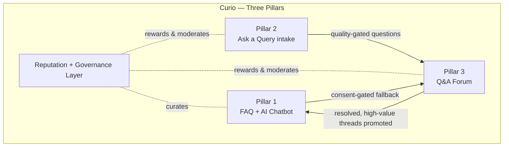

---


# Architecture, Setup & DevOps

This page is the architectural landing page for **Curio** — the entry point for anyone who wants to understand how the system is built, how to run it, and how code gets from a developer's machine into a deployable state. It covers the MERN stack and its ESM foundation, the monorepo layout, the two swappable infrastructure boundaries that make production migration painless, environment configuration, local development with MongoDB, the testing infrastructure, the CI pipeline, containerisation, and the conventions the team follows for commits and pull requests.

---

## 1. Technology Stack

Curio is a full-stack JavaScript application built on the MERN stack (MongoDB, Express, React, Node.js). The entire codebase — server, client, configuration, tests, tooling — uses **native ECMAScript Modules** (`"type": "module"` in every `package.json`). There are no CommonJS `require()` calls anywhere. This means top-level `await`, standard `import`/`export` syntax, and `import.meta.url` for file-path resolution are used consistently throughout.

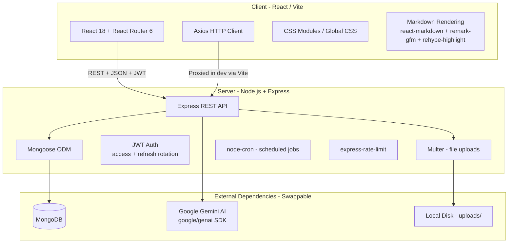

The technology choices and their rationale:

| Layer | Technology | Rationale |
|---|---|---|
| Frontend | React 18 (Vite), React Router 6, Axios | Fast HMR during development, component-based architecture, scoped styles via CSS Modules |
| Backend | Node.js 20+, Express 4 (REST) | Simple, widely understood, matches team skills, ESM-native |
| Database | MongoDB 7+ with Mongoose 8 | Flexible document schema, easy parity between local and managed instances |
| AI / LLM | Google Gemini free tier via `@google/genai` | `gemini-2.5-flash` for chat, `gemini-2.5-flash-lite` for cheap high-volume checks, `gemini-embedding-001` (768 dimensions) for embeddings |
| Vector search | In-app cosine similarity | Zero extra infrastructure; correct for the MVP-scale corpus (hundreds to low thousands of documents) |
| File storage | Multer → local `uploads/` directory | No object-store dependency; files are served as static assets by Express |
| Scheduling | `node-cron` with manual admin triggers | Works on any always-on server; each job is also callable on demand from the admin panel |
| Auth | JWT (short-lived access + revocable refresh) + bcrypt | Stateless request validation combined with real logout and session invalidation |
| Real-time | Polling | Removes the requirement for persistent WebSocket connections; trivial to host |
| Testing | Jest 29, Supertest 7, `mongodb-memory-server` 10 | In-memory database for isolated tests, HTTP-level integration testing, no external services required |
| Linting | ESLint 9 (flat config) | Shared root config extended by workspace-level overrides |
| CI/CD | GitHub Actions | Required by the project constraints; lint → test → build on every push and PR |
| Orchestration | Docker Compose | One-command reproducible run for reviewers and demos |

---

## 2. Monorepo Structure

The project is organised as an **npm-workspaces monorepo**. The root `package.json` declares two workspaces — `server` and `client` — and provides unified scripts that delegate to the appropriate workspace. A single `npm install` at the root installs dependencies for both workspaces, each into its own local `node_modules`. There is nothing installed globally.

```
.
├── package.json                  # root: workspaces, unified scripts, shared dev deps
├── package-lock.json             # single lockfile for the entire repo
├── eslint.config.js              # shared flat ESLint config (base rules)
├── docker-compose.yml            # one-command local orchestration
├── .env.example                  # documented env vars with safe defaults
│
├── client/                       # @faq-platform/client workspace
│   ├── package.json
│   ├── vite.config.js            # dev proxy for /api and /uploads → :5000
│   ├── index.html
│   ├── eslint.config.js          # extends root + React/hooks plugins
│   └── src/
│       ├── main.jsx              # React DOM entry
│       ├── App.jsx               # router, AuthContext, app shell
│       ├── styles.css            # global design system
│       ├── api/                  # Axios wrappers (client.js, auth.js, queries.js, …)
│       ├── context/              # AuthContext (token state, refresh interceptor)
│       ├── components/           # AppShell, Sidebar, Topbar, Chatbot, Markdown, …
│       ├── pages/                # Login, Register, Home, QueryList, QueryDetail, Faq, …
│       │   └── admin/            # Admin-only pages (dashboard, moderation, users, …)
│       └── lib/                  # Pure utilities (reputation calculations, etc.)
│
├── server/                       # @faq-platform/server workspace
│   ├── package.json
│   ├── Dockerfile                # Express API container image
│   ├── server.js                 # entry: connect DB → create app → schedule jobs → listen
│   ├── app.js                    # Express app factory (no network binding — testable)
│   ├── eslint.config.js          # extends root + Jest globals for test files
│   ├── jest.config.js            # ESM-native Jest, 30s timeout, verbose
│   ├── config/
│   │   ├── env.js                # centralized env loading (typed, defaulted, frozen)
│   │   ├── db.js                 # swappable boundary — database connection
│   │   ├── ai.js                 # swappable boundary — AI provider + queue + backoff
│   │   └── constants.js          # all tunable thresholds, enums, badge defs
│   ├── models/                   # 14 Mongoose schemas (User, Query, Answer, FaqEntry, …)
│   ├── routes/                   # Express routers (auth, queries, answers, admin, faq, …)
│   ├── controllers/              # request → response glue (thin; delegates to services)
│   ├── services/                 # business logic (queryService, answerService, chatbot, …)
│   ├── middleware/               # auth, admin, banCheck, rateLimit, upload, error
│   ├── jobs/                     # 8 scheduled maintenance jobs + registry + cron setup
│   ├── seed/                     # seed.js + data/ (curated FAQ JSON with offline embeddings)
│   ├── uploads/                  # Multer local disk storage (gitignored)
│   └── tests/                    # 11 test suites + helpers.js
│       └── helpers.js            # setupTestDB / teardownTestDB / clearDB
│
├── .github/
│   ├── workflows/
│   │   ├── ci.yml                # lint → test → build on push/PR to main
│   │   └── deploy.yml            # verify gate + commented deploy block
│   ├── ISSUE_TEMPLATE/
│   │   ├── bug_report.md
│   │   └── feature_request.md
│   └── PULL_REQUEST_TEMPLATE.md
│
├── PLANNING.md                   # single source of truth: vision, architecture, decisions
├── TASK.md                       # milestone tracker
├── CONTRIBUTING.md               # setup, commit conventions, PR process
├── LICENSE                       # MIT
└── README.md                     # project overview, feature list, run instructions
```

The **root scripts** in `package.json` are the primary interface for developers:

| Script | What it does |
|---|---|
| `npm run dev` | Starts both server (Express on `:5000` with `--watch`) and client (Vite on `:5173`) concurrently via `concurrently` |
| `npm run dev:server` | Server only, with Node's built-in watch mode for auto-restart |
| `npm run dev:client` | Client only (Vite dev server with HMR) |
| `npm run lint` | Runs ESLint across both workspaces sequentially |
| `npm test` | Runs Jest in the server workspace (in-memory Mongo, mocked AI) |
| `npm run build` | Production build of the client via `vite build` |
| `npm run seed` | Populates MongoDB with the admin account and curated FAQ set |
| `npm start` | Starts the server in production mode (`node server.js`) |

Vite's dev server is configured to proxy `/api` and `/uploads` requests to `http://localhost:5000`, so the client uses same-origin relative URLs during development and never needs to know the backend's port directly.

---

## 3. The Two Swappable Boundaries

This is the most important architectural decision in Curio. The platform was built as an internship MVP running entirely on free infrastructure (local MongoDB, Gemini free tier, local disk for files). But it was designed from day one so that migrating to production infrastructure — the company's own managed database, its own AI keys, its own object storage — is a **configuration change, not a refactor**.

This is achieved through two gateway modules. Every database call in the entire application flows through `server/config/db.js`. Every AI call flows through `server/config/ai.js`. No other file in the codebase imports the Mongoose connection logic or the Gemini SDK directly. This invariant is enforced by code review, the PR checklist, and convention.

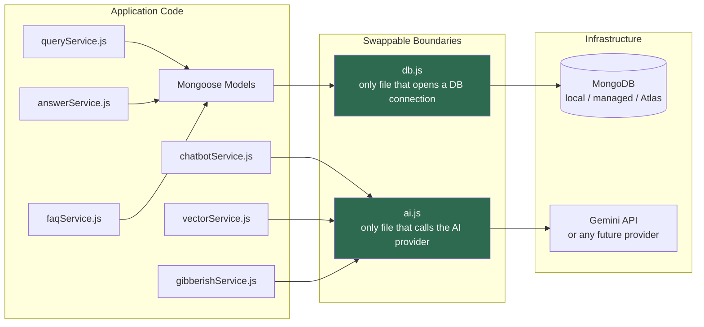

### A. `server/config/db.js` — the database boundary

This module is the sole location that calls `mongoose.connect()`. It exports three things: `connectDB(uri?)`, `disconnectDB()`, and the `mongoose` instance itself (so models can import the same Mongoose without requiring a separate import). The `connectDB` function accepts an optional URI override, which is how the test infrastructure injects the `mongodb-memory-server` URI without touching the production connection string.

The function is idempotent — it tracks whether a connection has already been established and skips reconnection. To swap to a company-managed MongoDB instance (Atlas, self-hosted replica set, or anything else Mongoose supports), you change the `MONGODB_URI` environment variable and nothing else.

### B. `server/config/ai.js` — the AI boundary

This is the single module that calls the Google Gemini SDK (`@google/genai`). It exposes a clean public API with three methods:

- **`ai.embed(text)`** — returns a 768-dimensional embedding vector for a single string.
- **`ai.embedBatch(texts)`** — embeds multiple strings (currently parallelised per-item).
- **`ai.cheapJson(prompt, mockResult)`** — sends a structured prompt to `gemini-2.5-flash-lite` and parses the JSON response. Used for gibberish detection and auto-correction checks.
- **`ai.chat(prompt, mockText)`** — sends a prompt to `gemini-2.5-flash` and returns the text response. Used by the RAG chatbot.

The module also encapsulates all rate-limit resilience: a **serial request queue** ensures only one live API call is in flight at a time across the entire application, and an **exponential backoff** mechanism (up to 4 retries, starting at 500ms with jitter) handles HTTP 429 responses gracefully.

**Mock mode** is the default and is central to the development experience. When the `AI_API_KEY` environment variable is empty (or unset), every method returns a deterministic offline result instead of making a network call. The `embed()` mock uses a hash-based vector generator that produces stable, L2-normalised vectors — not semantically meaningful, but sufficient for cosine similarity to work consistently in dev/test/CI. The `cheapJson()` mock returns a permissive default (gibberish detection passes, auto-correct returns no changes). The `chat()` mock returns a canned offline message. This means `npm run dev`, `npm test`, and the entire CI pipeline all work without an API key, without quota burn, and without network access.

---

## 4. Environment Variables

All environment configuration is loaded and centralised in `server/config/env.js`. This module reads `process.env` exactly once at startup, applies defaults, and exports a frozen `config` object. No other file in the codebase touches `process.env` directly.

The `.env.example` file documents every variable:

```
# ─── Server ──────────────────────────────────────────────────────────────────
NODE_ENV=development
PORT=5000

# MongoDB connection string (swappable boundary — only db.js reads this)
MONGODB_URI=mongodb://localhost:27017/faq_platform

# JWT secrets — generate strong random values in production
JWT_ACCESS_SECRET=change-me-access-secret
JWT_REFRESH_SECRET=change-me-refresh-secret
JWT_ACCESS_TTL=15m
JWT_REFRESH_TTL=7d

# AI provider (swappable boundary — only ai.js reads this).
# Leave AI_API_KEY empty to run in mock mode (no live calls, no quota burn).
AI_API_KEY=
AI_CHAT_MODEL=gemini-2.5-flash
AI_CHEAP_MODEL=gemini-2.5-flash-lite
AI_EMBED_MODEL=gemini-embedding-001
AI_EMBED_DIMS=768

# Uploads
UPLOAD_DIR=uploads
MAX_UPLOAD_MB=5

# CORS / client origin
CLIENT_ORIGIN=http://localhost:5173

# ─── Client (Vite) ───────────────────────────────────────────────────────────
# Prefix client-exposed vars with VITE_
VITE_API_BASE_URL=http://localhost:5000/api
```

There is also a **production safety guard**: if `NODE_ENV=production` and the JWT secrets are still set to their well-known dev defaults (or missing entirely), `env.js` throws immediately and refuses to start the server. This prevents a public repo's placeholder secrets from silently securing a real deployment.

Additional variables handled by `env.js` that are not in `.env.example` but can be set:

| Variable | Purpose |
|---|---|
| `TRUST_PROXY` | Configures Express's `trust proxy` setting for `X-Forwarded-For` header parsing behind reverse proxies. Accepts a number (hops to trust), `"true"`, or left unset for direct connections. |
| `DISABLE_RATE_LIMIT` | Set to `"true"` to bypass all `express-rate-limit` middleware — useful for shared-IP demo environments behind a tunnel where all visitors would collapse into a single rate-limit bucket. |

---

## 5. Local Development Setup

### A. Prerequisites

- **Node.js ≥ 20** (the `engines` field enforces this)
- **MongoDB** running locally on `localhost:27017`, or provided via the bundled Docker Compose

### B. Step-by-step

```bash
# 1. Clone the repository
git clone <repo-url>
cd <repo-name>

# 2. Install all dependencies (root + both workspaces)
npm install

# 3. Create your local environment file
cp .env.example .env
# The defaults work out of the box. Leave AI_API_KEY empty for mock mode.

# 4. Seed the database with the admin account and curated FAQ set
npm run seed

# 5. Start the development servers
npm run dev
```

After step 5, Express is listening on `http://localhost:5000` and Vite is serving the React app on `http://localhost:5173`. Vite proxies API and upload requests to Express, so you interact with the app at `http://localhost:5173`.

The seed script creates a single admin account (`admin@example.com` / `admin12345`) and imports the full curated FAQ set with pre-computed embeddings. Search, duplicate detection, and the RAG chatbot all work immediately in mock mode because the FAQ embeddings were generated offline and stored in the seed JSON — zero live AI calls are needed.

### C. Server startup sequence

When `npm run dev` starts the server, the following happens in `server.js`:

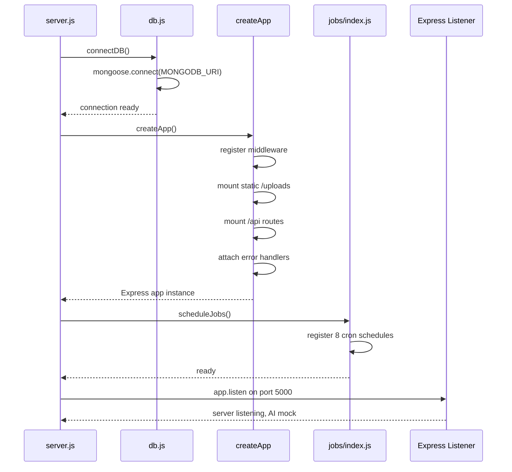

The `createApp()` function in `app.js` is deliberately separated from `server.js`. It creates and configures the Express app **without binding to a network port**, which allows test suites to import the same app directly and pass it to Supertest for HTTP-level testing without spinning up a real server.

---

## 6. Testing Infrastructure

Curio's test suite is built for speed, isolation, and reliability. Tests run in CI without needing a running MongoDB instance, without AI API keys, and without any network access.

### A. Tools

| Tool | Role |
|---|---|
| **Jest 29** | Test runner, configured for native ESM via `--experimental-vm-modules` (set in the server's `package.json` test script through `cross-env` and `NODE_OPTIONS`) |
| **Supertest 7** | HTTP-level integration testing — sends real HTTP requests to the Express app without a running server |
| **mongodb-memory-server 10** | Spins up an ephemeral, in-memory MongoDB instance per test suite — no external database needed |

### B. How tests are structured

The test helper in `server/tests/helpers.js` provides three functions that every test suite uses:

- **`setupTestDB()`** — called in `beforeAll`. Starts a `MongoMemoryServer` instance and connects Mongoose to its URI.
- **`teardownTestDB()`** — called in `afterAll`. Disconnects Mongoose and stops the in-memory server.
- **`clearDB()`** — called in `afterEach`. Wipes every collection between test cases for full isolation.

A typical test file looks like this:

```javascript
import request from 'supertest';
import { createApp } from '../app.js';
import { setupTestDB, teardownTestDB, clearDB } from './helpers.js';

const app = createApp();

beforeAll(async () => { await setupTestDB(); });
afterAll(async () => { await teardownTestDB(); });
afterEach(async () => { await clearDB(); });

describe('auth flow', () => {
  test('register returns user + tokens, hides password_hash', async () => {
    const res = await request(app)
      .post('/api/auth/register')
      .send({ name: 'Ada', email: 'ada@example.com', password: 'supersecret1' });
    expect(res.status).toBe(201);
    expect(res.body.user.password_hash).toBeUndefined();
    expect(res.body.accessToken).toBeTruthy();
  });
});
```

The key pattern here is that `createApp()` returns the Express app without calling `listen()`, and Supertest binds to it internally. The AI layer is automatically in mock mode because `AI_API_KEY` is never set in the test environment — no mocking library is needed for the AI layer because the `ai.js` module handles it natively.

### C. Jest configuration

The Jest config in `server/jest.config.js` is minimal:

```javascript
export default {
  testEnvironment: 'node',
  transform: {},                          // no Babel — native ESM
  testMatch: ['**/tests/**/*.test.js'],   // all test files under tests/
  testTimeout: 30_000,                    // 30s per test (mongodb-memory-server startup)
  verbose: true,
};
```

The `transform: {}` setting disables all code transforms, letting Node handle ESM natively. The 30-second timeout accounts for the time `mongodb-memory-server` takes to download and start the MongoDB binary on first run.

Tests are run with `--runInBand` (serial execution) to prevent concurrent in-memory MongoDB instances from interfering with each other, specified in the server's `package.json` test script:

```
"test": "cross-env NODE_ENV=test NODE_OPTIONS=--experimental-vm-modules jest --runInBand"
```

### D. Test suites

The 11 test suites cover the application end-to-end:

| Suite | Coverage |
|---|---|
| `auth.test.js` | Registration, login, token rotation, logout, credential validation |
| `query.test.js` | Query creation, retrieval, search, status transitions |
| `forum.test.js` | Answering, thread lifecycle, restrictions (can't answer own question) |
| `engagement.test.js` | Voting, bookmarks, likes, comments |
| `social.test.js` | Notifications, user-to-user interactions |
| `faq.test.js` | FAQ CRUD, duplicate guard, promotion from Q&A |
| `badges.test.js` | Point awards, badge tier unlocking, badge recalculation |
| `admin.test.js` | Admin dashboard, moderation queue, user management |
| `adminfixes.test.js` | Admin-specific edge cases, rollback, taxonomy control |
| `security.test.js` | Authorization gates, ban enforcement, rate limiting, self-mod guards |
| `maintenance.test.js` | Scheduled jobs (LRU eviction, staleness, orphan cleanup, soft-delete purge) |

Running the full suite:

```bash
npm test
```

---

## 7. CI Pipeline

Curio has two GitHub Actions workflows, both defined in `.github/workflows/`.

### A. `ci.yml` — the gatekeeper

This workflow runs on every push to `main` and on every pull request targeting `main`. It is the primary quality gate — no code merges until this is green.

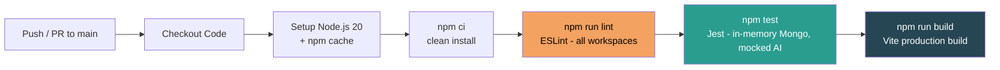

The workflow runs on `ubuntu-latest` with Node.js 20 and uses npm's built-in cache for dependency restoration. The three steps are always sequential — lint must pass before tests run, and tests must pass before the client build is attempted.

The test step sets `NODE_ENV=test`, which triggers three behaviors in the application code: `morgan` logging is suppressed, rate limiting is skipped (determinism), and the AI layer operates in mock mode (no key is set in CI). The server tests use `mongodb-memory-server`, so no MongoDB service container is needed in the workflow — the runner downloads and starts a local MongoDB binary automatically.

### B. `deploy.yml` — the deployment gate

This workflow runs on pushes to `main` and can also be triggered manually (`workflow_dispatch`). It re-runs the full verify gate (lint + test + build) to confirm `main` is always in a deployable state.

The actual deployment step is **intentionally commented out**. The MVP runs on zero paid infrastructure — GitHub Actions is the pipeline, not the host. It cannot run an always-on server, a persistent database, or persistent file storage. The commented block contains a template for building a Docker image and pushing it to a registry, with placeholders for the repository secrets (`DEPLOY_TOKEN`, `MONGODB_URI`, `AI_API_KEY`, `JWT_ACCESS_SECRET`, `JWT_REFRESH_SECRET`) that would be filled in once the company provides its own hosting.

```yaml
# --- Enable deployment by uncommenting and configuring for your host ---
#
# - name: Build server image
#   run: docker build -t $REGISTRY/faq-platform-api:$GITHUB_SHA ./server
#
# - name: Deploy
#   env:
#     DEPLOY_TOKEN: ${{ secrets.DEPLOY_TOKEN }}
#     MONGODB_URI:  ${{ secrets.MONGODB_URI }}
#     AI_API_KEY:   ${{ secrets.AI_API_KEY }}
#     JWT_ACCESS_SECRET:  ${{ secrets.JWT_ACCESS_SECRET }}
#     JWT_REFRESH_SECRET: ${{ secrets.JWT_REFRESH_SECRET }}
#   run: |
#     echo "Push the image and roll out using your platform's CLI here,"
#     echo "e.g. fly deploy / render deploy / kubectl set image ..."
```

---

## 8. Docker & Deployment

### A. Docker Compose — local orchestration

The `docker-compose.yml` at the project root provides a **one-command, reproducible run** for any reviewer, interviewer, or team member. It spins up two services:

**`mongo`** — an official MongoDB 7 container with a named volume (`mongo_data`) for data persistence across restarts. Exposed on the standard port `27017`.

**`server`** — the Express API, built from `server/Dockerfile`. It depends on the `mongo` service, connects to `mongodb://mongo:27017/faq_platform` (the Docker-internal hostname), and uses dev-safe JWT secrets. `AI_API_KEY` is intentionally left empty so the server starts in mock mode. User uploads are persisted in a named volume (`uploads`).

```bash
docker compose up --build
```

This single command starts MongoDB and the API server. The Vite client is run separately via `npm run dev:client` during development because Vite's HMR is more useful outside a container.

### B. The Dockerfile

The server's `Dockerfile` (`server/Dockerfile`) produces a lean Alpine-based Node.js 20 image:

```dockerfile
FROM node:20-alpine

WORKDIR /app

# Install workspace deps (root manifest + server manifest) with a clean,
# reproducible install.
COPY package.json package-lock.json* ./
COPY server/package.json ./server/package.json
RUN npm install --omit=dev --workspace server || npm install --workspace server

COPY server ./server
COPY eslint.config.js ./

WORKDIR /app/server
EXPOSE 5000
CMD ["node", "server.js"]
```

The image copies only the root and server `package.json` files first (Docker layer caching — dependencies are only reinstalled when `package.json` changes), installs production dependencies for the server workspace, then copies the server source. Dev dependencies (Jest, Supertest, `mongodb-memory-server`) are omitted from the production image.

### C. Production deployment model

The production target is the company's own server — a persistent process that supports `node-cron` schedules, local file uploads, and a connection to a managed MongoDB instance. The deployment path:

1. The `deploy.yml` workflow verifies the code (lint, test, build).
2. A Docker image is built and tagged with the commit SHA.
3. The image is pushed to the company's container registry.
4. The platform's deployment CLI (Fly, Render, Kubernetes, or similar) rolls out the new image.

Environment variables (`MONGODB_URI`, `AI_API_KEY`, JWT secrets) are set as repository secrets in GitHub and injected at deploy time. The `env.js` production safety guard ensures the server refuses to start if JWT secrets are still set to their dev defaults.

### D. Health check endpoint

The Express API exposes `GET /api/health` that returns the application status, database connection state, AI mode (mock or live), and uptime. This is suitable for Docker healthchecks, load-balancer probes, and CI smoke tests:

```json
{
  "status": "ok",
  "db": "connected",
  "ai": "mock",
  "uptime_seconds": 42,
  "time": "2026-06-02T12:00:00.000Z"
}
```

---


<div align="right"><a href="#curio--master-documentation">↑ Back to top</a></div>

---


# Authentication & User Accounts

A detailed overview of Curio's identity layer: JWT-based authentication with refresh-token rotation, role-based authorization, user profiles and settings, and the ban lifecycle that gates write access across the platform.

---

## 1. Register & Login Flow

Curio implements a secure authentication model using JSON Web Tokens (JWT) backed by a stateful refresh-token store. The credential lifecycle is handled in `server/services/authService.js`.

- **Registration:** Validates credentials, hashes passwords using **bcrypt**, creates the user record, and starts a 1-day login streak. The `password_hash` is never returned over the API.
- **Login:** Verifies the supplied credentials against the bcrypt hash, updates the consecutive login streak, and returns an **access / refresh token pair**.

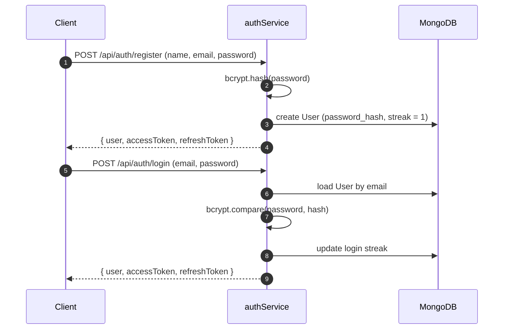

---

## 2. JWT Access & Refresh-Token Rotation

Authentication uses a two-token model: a short-lived access token for request authorization and a long-lived, single-use refresh token for silent re-authentication.

### A. Access Token

A short-lived JWT held in memory by the client, containing the user ID and role. It is sent on every protected request in the `Authorization: Bearer <token>` header.

### B. Refresh-Token Rotation

Refresh tokens are **one-time use**. Each refresh token is stored **hashed (SHA-256)** in the database so it can be revoked instantly on logout, and every refresh issues a brand-new token, invalidating the previous one. A random `jti` (token ID) is embedded so two tokens minted in the same second never collide on the unique hash index.

### C. Axios Interceptor (`client/src/api/client.js`)

The client's Axios layer transparently handles expiry: it catches `401` responses, executes a **single in-flight refresh** request (subsequent calls await the same promise), and replays the originally failed requests once a fresh access token is obtained.

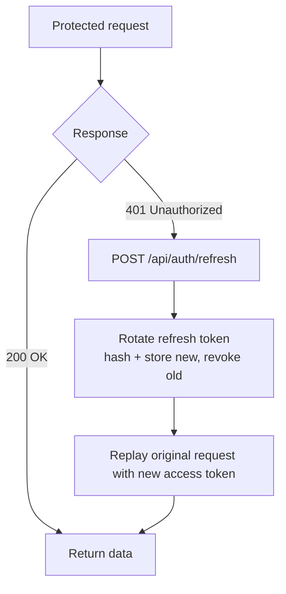

---

## 3. Roles & Authorization

Authorization is role-based, with three tiers defined in the `ROLES` constant (`server/config/constants.js`).

| Role | Capabilities |
|---|---|
| `user` | Standard member — ask, answer, vote, bookmark |
| `moderator` | Delete / regulate content, rate any answer, escalate, re-tag |
| `admin` | Global control — full dashboard, bans, roles, taxonomy, badges |

Enforcement lives in `server/middleware/auth.js`:

- **`auth`** — requires a valid access token; rejects unauthenticated requests.
- **`optionalAuth`** — attaches the user to the request context if a token is present, but allows anonymous access (used for public reads).
- **`admin`** — restricts a route to `admin`-role accounts. The middleware loads a fresh `User` document, so a role promoted in the database takes effect immediately, regardless of the (possibly stale) token claim.

---

## 4. User Profiles & Settings

- **Profiles (`server/services/userService.js`):** A public route returning a user's stats, reputation tier, and earned / custom badges via `getProfile`. Profiles surface query and answer counts, member-since date, and ban status.
- **Settings:** A form that lets a member update their display name and toggle notification preferences (answers, mentions, system) through `PATCH /users/me`.

---

## 5. Ban & Unban Flow

Bans are the enforcement mechanism that gates write access for misbehaving accounts.

- **Bans:** Admins ban users **temporarily** (an hourly duration) or **permanently**. Every ban writes an entry to the Audit Log and triggers a system notification to the affected user.
- **Ban enforcement:** The `banCheck` middleware blocks all write routes for banned users. Timed bans render a live countdown banner to the user; permanent bans lock the account out entirely.
- **Unban & expiry:** Admins can lift a ban manually (which also clears `requires_approval`). Expired time-limited bans are lifted automatically — both lazily on access via `banCheck` and proactively by an hourly `expire-bans` cron job.

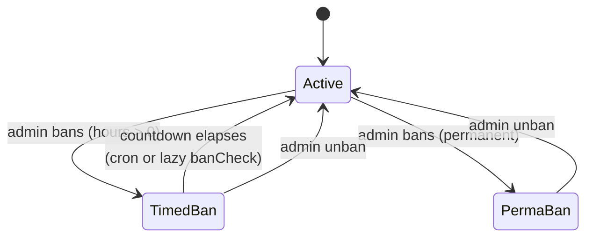


<div align="right"><a href="#curio--master-documentation">↑ Back to top</a></div>

---


# Ask a Query & Forum Engine

A structured community support system where users post questions, receive answers, participate in threaded discussions, vote and bookmark, and reach resolution — combining traditional forum mechanics with AI-assisted quality control, duplicate detection, and automated solution finalization.

---

## 1. Overview

The Ask a Query & Forum Engine provides a structured community support system where users can post questions, receive answers, participate in threaded discussions, vote on content, bookmark useful queries, and finalize solutions. The module combines traditional forum functionality with AI-assisted quality control, duplicate detection, and automated solution resolution workflows.

The implementation is distributed across frontend pages (`AskQuery.jsx`, `QueryList.jsx`, `QueryDetail.jsx`) and backend services (`queryService.js`, `answerService.js`, `solutionService.js`, `gibberishService.js`, `spamService.js`, and `vectorService.js`).

Key capabilities include:

- Structured query submission
- Category and tag taxonomy enforcement
- Screenshot attachments
- AI-assisted grammar correction
- Gibberish detection
- Spam prevention and penalty escalation
- Duplicate query detection using vector similarity
- Hybrid keyword and semantic search
- Answer management
- Threaded comments
- Voting and bookmarking
- Helpful answer selection
- Automated solution finalization

---

## 2. Architecture Overview

The Ask a Query module follows a layered architecture. Frontend pages drive REST endpoints, which delegate to the service layer where validation, moderation, duplicate prevention, and lifecycle management are enforced.

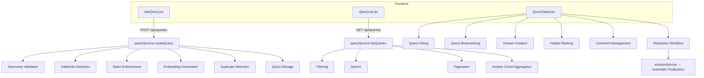

---

## 3. Question Posting Workflow

### A. Query Submission Interface

The query creation interface is implemented in `AskQuery.jsx`. Users are required to provide:

| Field         | Required |
| ------------- | -------- |
| Title         | Yes      |
| Body          | Yes      |
| Category      | Yes      |
| Tags          | Yes      |
| Joining Date  | Yes      |
| Contact Email | Yes      |
| Attachments   | Optional |

Anonymous posting is not supported. Any anonymous flag is ignored and forced to `false` on the server.

### B. Category Selection

Categories are loaded dynamically:

```http
GET /api/taxonomy?kind=category
```

The user must select a category from the administrator-maintained taxonomy list. No free-form categories are accepted.

### C. Tag Selection

Tags are loaded dynamically:

```http
GET /api/taxonomy?kind=tag
```

Tags are selected through predefined checkboxes. Custom user-generated tags are not permitted.

### D. Attachment Support

The query form supports multiple image uploads.

```html
<input
  type="file"
  multiple
  accept="image/*"
/>
```

Attachments are submitted using `multipart/form-data`. Uploaded attachments are displayed within the interface using a lightbox viewer. The query detail page allows users to view attachment counts and open images in a zoomable preview.

### E. Grammar Correction Workflow

Before submitting a query, users may optionally perform grammar correction.

```http
POST /api/queries/autocorrect
```

The API returns:

```json
{
  "corrected": "...",
  "changes": [...]
}
```

A diff modal presents the proposed corrections. The user may **accept all changes** or **keep the original content**. When corrections are accepted, both corrected content and original content are submitted.

### F. Query Creation Pipeline

Query creation is performed through `POST /api/queries`, routed as `queryController.createQuery()` → `queryService.createQuery()`. The service performs the following operations in order:

1. Input coercion
2. Taxonomy validation
3. Joining date validation
4. Contact email validation
5. Anonymous flag enforcement
6. Gibberish detection
7. Spam handling
8. Embedding generation
9. Duplicate detection
10. Query persistence

---

## 4. Taxonomy Management

The platform uses a controlled taxonomy model. Categories and tags are validated against records stored in the taxonomy collection. Validation occurs during:

- Query creation
- Query update
- Moderator re-categorization

Invalid values immediately generate validation failures. Example validation:

```text
Taxonomy.findOne({ kind, name })
```

Only administrator-approved taxonomy values may be used.

---

## 5. Gibberish Detection Pipeline

The system implements a two-layer content quality gate.

### A. Layer 1 — Heuristic Validation

Every submitted query body passes through heuristic analysis. Checks include:

- **Minimum length** — very short submissions are rejected immediately.
- **Repeated character detection** — e.g. `aaaaaaaaaaaa` or `!!!!!!!!!!!!`. The service calculates a repeated-character ratio and rejects excessive repetition.
- **Dictionary word ratio** — the service evaluates `recognized_words / total_words`; a low ratio indicates nonsensical content.

### B. Layer 1 Outcomes

| Outcome | Result |
|---|---|
| **Pass** | Content is considered valid. |
| **Fail** | Content is immediately rejected. |
| **Borderline** | Content is escalated to Layer 2 AI analysis. |

### C. Layer 2 — AI Evaluation

Borderline content triggers AI-based validation via `ai.js cheapCall()`. Expected response:

```json
{
  "isvalid": true,
  "confidence": 0.92,
  "reason": "..."
}
```

The AI determines whether the content appears meaningful.

### D. Fail-Open Strategy

If the AI service returns HTTP 429, times out, or encounters an error, the submission is treated as valid. This prevents legitimate users from being blocked during AI quota exhaustion.

---

## 6. Spam Prevention & Penalty System

Spam enforcement is handled by `spamService.js`. A user's spam history is tracked through `user.spamflagcount`. Spam flags are generated when gibberish detection fails.

### A. Penalty Escalation Levels

| Offense Count | Action                                         |
| ------------- | ---------------------------------------------- |
| 1             | Warning notification                           |
| 2             | Warning badge + 24-hour ban                    |
| 5             | Restricted badge + moderator approval required |
| 10            | Permanent suspension                           |

### B. Enforcement Flow

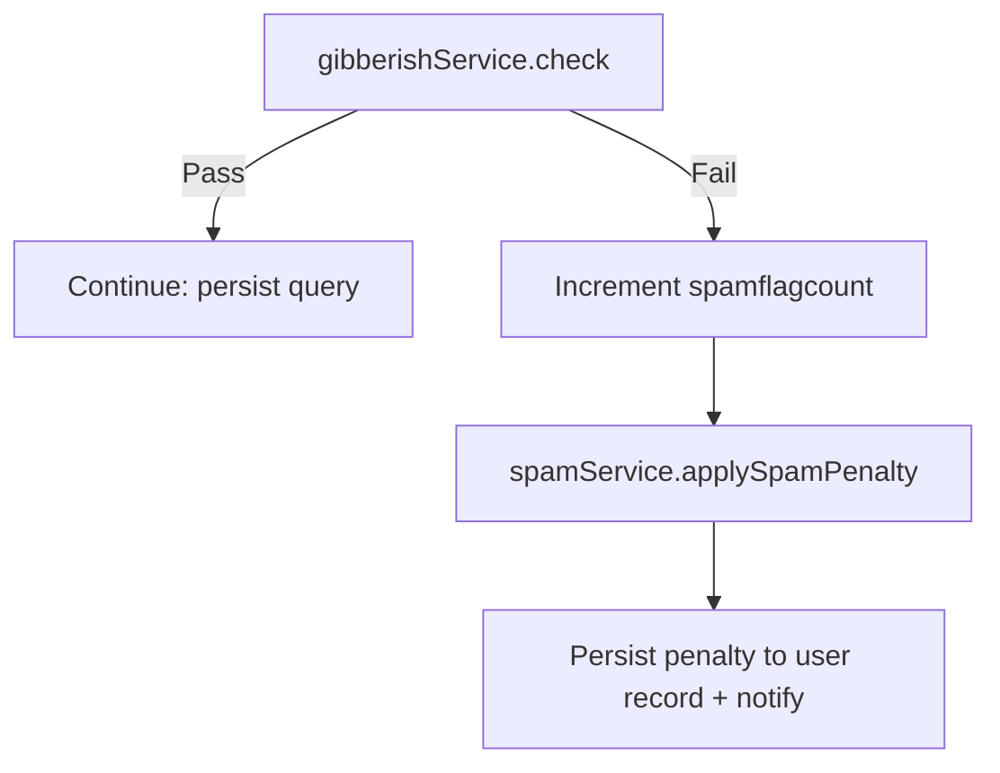

Each penalty update is persisted to the user record and generates appropriate notifications.

---

## 7. Duplicate Detection & Vector Search

The platform uses embedding-based similarity detection to identify duplicate questions.

### A. Embedding Generation

After content validation, `ai.js.embed(title + body)` generates an embedding vector stored with the query. The embedding becomes the basis for semantic search and duplicate detection.

### B. Similarity Search

Generated embeddings are compared against existing queries using `vectorService.findSimilarQueries()`, which:

1. Loads stored query embeddings
2. Computes cosine similarity (`computeCosineSimilarity()`)
3. Filters by threshold
4. Returns ranked matches

### C. Duplicate Detection Logic

When similarity exceeds the configured threshold (`similarity > 0.80`), the query is marked as a potential duplicate. Query fields updated:

```text
isflaggedduplicate
duplicateof
similarityscore
```

A moderation record is also created.

---

## 8. Query Discovery & Search

The query discovery system enables users to browse, search, and filter community questions through the `QueryList.jsx` interface and the query service layer.

### A. Query Listing

Queries are retrieved through `GET /api/queries`. The backend supports status filtering, category filtering, tag filtering, pagination, full-text search, and resolved-last ordering. All filter values received through request parameters are coerced to strings before entering MongoDB filters to prevent malformed query injection.

### B. Search Functionality

The platform supports two search mechanisms:

- **Full-text search** — MongoDB text indexes for keyword-based searching: `GET /api/queries?q=<search-term>`.
- **Semantic search** — embedding-based similarity search: `GET /api/queries/search`. Uses stored embeddings and cosine similarity to locate conceptually similar queries even when exact keywords differ.

### C. Pagination

Query listings support page-based navigation. Returned metadata includes `page`, `limit`, and `total`. The frontend renders navigation controls using these values.

### D. Query Ordering

Resolved queries are intentionally pushed toward the bottom of search results (newest queries top, resolved queries bottom). This ensures active discussions remain visible.

---

## 9. Answers & Threaded Comments

Answer management is implemented through `answerService.js` and rendered through `QueryDetail.jsx`.

### A. Answer Creation

Answers are submitted through `POST /api/queries/:id/answers`. Validation rules:

- User must not be banned.
- Query author cannot answer their own question.
- Query status must be Open or Answered.
- Resolved or Archived queries cannot receive new answers.

When an answer is successfully created: the answer document is saved, the query status changes from Open to Answered, and the query author receives a notification.

### B. Answer Editing

Answers may be edited only within a 15-minute window, by the answer author, a moderator, or an administrator. The original answer body is preserved when modifications occur.

### C. Answer Deletion

The platform uses soft deletion. Deleted answers receive `isdeleted`, `deletedat`, and `deletedby`. Status reconciliation is automatically performed:

- Removing an accepted answer clears the accepted answer reference.
- Queries never remain resolved without a valid accepted answer.
- If all answers are removed, the query returns to Open status.

### D. Threaded Comments — Permissions

Comments provide limited discussion under answers. Only two users may participate: the **query author** and the **answer author**. Any other user receives an authorization error.

### E. Comment Creation

```http
POST /api/answers/:id/comments
```

Workflow: permission validation → comment creation → notification sent to the other participant.

### F. Comment Deletion

Comments use soft deletion and may be removed by the comment author, a moderator, or an administrator.

---

## 10. Helpful Answer & Resolution Workflow

The platform follows a support-ticket-style resolution model.

### A. Mark Helpful

Authorized users (query author, moderator, or administrator) call:

```http
POST /api/queries/:id/answers/:answerId/helpful
```

Actions performed:

1. Answer marked as accepted.
2. Accepted answer ID stored on the query.
3. Query status changed to Resolved.
4. Thread closure enforced.
5. Answer author awarded reputation points.
6. Notification generated.

### B. Accepted Answer Display

Accepted answers appear with a `✓ Solution` marker and are always prioritized in thread ordering.

### C. Unmark Helpful

Authorized users may reopen discussions: remove the accepted answer association, clear the acceptance flag, and change query status back to Answered. Previously awarded points remain unchanged.

---

## 11. Voting & Bookmarking

The platform supports voting on both queries and answers.

### A. Query Voting

```http
POST /api/queries/:id/vote
```

Supports upvote, downvote, and self-vote prevention. Votes are stored separately and aggregated into a query vote score.

### B. Answer Voting

```http
POST /api/answers/:id/vote
```

Answer votes use signed values (`+1` = upvote, `-1` = downvote). Self-voting is blocked. Only positive votes contribute to reputation; downvotes are recorded but do not reduce reputation.

### C. Bookmarking

Users can save useful queries:

```http
POST   /api/queries/:id/save
DELETE /api/queries/:id/save
GET    /api/queries/bookmarks
```

Bookmarks are stored using a dedicated bookmark model.

---

## 12. Solution Finalization Engine

Automated solution resolution is implemented in `solutionService.js`.

### A. Finalization Trigger

The engine runs daily through cron scheduling and can be triggered manually through an administrative endpoint.

### B. Eligibility Rules

Queries become eligible when `Status = Answered` and `Age > 48 Hours`.

### C. Manual Resolution Path

If a query already contains an accepted answer: the accepted answer is retained, high-quality answers are retained, excess answers are pruned, the query is marked Resolved, and reputation is awarded.

### D. Automatic Resolution Path

If no accepted answer exists after 48 hours: the highest-voted answer is selected and marked accepted, the query is resolved automatically, and no reputation is awarded.

### E. Answer Pruning

To keep resolved discussions concise, accepted and high-value answers are retained and the remainder may be soft-deleted. A maximum of three answers are preserved.

### F. Audit Logging

Every finalization event creates an audit record containing the query identifier, resolution action, timestamp, and system activity metadata.

---

## 13. Frontend Responsibilities

| Component       | Responsibility                                                                 |
| --------------- | ------------------------------------------------------------------------------ |
| AskQuery.jsx    | Query submission, attachments, grammar correction, duplicate warnings          |
| QueryList.jsx   | Search, filtering, pagination, query discovery                                 |
| QueryDetail.jsx | Full thread view, voting, bookmarking, answers, comments, resolution workflows |

---

## 14. Service Layer Responsibilities

| Service          | Responsibility                                                        |
| ---------------- | --------------------------------------------------------------------- |
| queryService     | Query lifecycle, validation, duplicate detection, voting, bookmarking |
| answerService    | Answer management, comments, helpful workflow, verification           |
| solutionService  | Automatic solution finalization and cron execution                    |
| gibberishService | Content quality validation                                            |
| spamService      | Spam penalty enforcement                                              |
| vectorService    | Semantic similarity search and duplicate detection                    |

---

## 15. API Summary

| Method | Endpoint                                   | Purpose             |
| ------ | ------------------------------------------ | ------------------- |
| POST   | /api/queries                               | Create query        |
| GET    | /api/queries                               | List queries        |
| GET    | /api/queries/search                        | Hybrid search       |
| GET    | /api/queries/:id                           | Query details       |
| POST   | /api/queries/:id/vote                      | Vote on query       |
| POST   | /api/queries/:id/save                      | Save query          |
| POST   | /api/queries/:id/answers                   | Create answer       |
| POST   | /api/answers/:id/vote                      | Vote on answer      |
| POST   | /api/answers/:id/comments                  | Create comment      |
| POST   | /api/queries/:id/answers/:answerId/helpful | Mark helpful        |
| POST   | /api/admin/answers/:id/verify              | Verify answer       |
| POST   | /api/jobs/solution-finalization/run        | Manual finalization |

---

## 16. End-to-End Workflow

1. User opens AskQuery page.
2. Categories and tags are loaded from taxonomy endpoints.
3. User submits a query with required metadata and optional attachments.
4. Query passes taxonomy validation.
5. Query passes gibberish detection.
6. Spam penalties are applied if validation fails.
7. Embeddings are generated.
8. Duplicate detection is performed.
9. Query is stored.
10. Community members submit answers.
11. Eligible users participate in threaded comments.
12. Answers receive votes.
13. Users bookmark useful discussions.
14. Query author marks an answer as helpful, or the automated finalization engine resolves the query after 48 hours.
15. Query status becomes Resolved.
16. Audit logs and notifications are generated.

---

## 17. Conclusion

The Ask a Query & Forum Engine combines structured query submission, taxonomy-based organization, AI-assisted content validation, semantic duplicate detection, community-driven answering, voting, bookmarking, and automated solution finalization. The module ensures that discussions remain searchable, moderated, and resolution-oriented while maintaining data integrity through validation, soft deletion, audit logging, and controlled workflow transitions.


<div align="right"><a href="#curio--master-documentation">↑ Back to top</a></div>

---


# Reputation, Badges & Moderation

A detailed overview of Curio's reputation economy and governance layer: how points are earned, how positive and negative badges are applied, how answers get admin-verified, and how moderators and the escalation/moderation queues keep the knowledge base clean.

---

## 1. Points System

Users earn reputation points through contributions. Points never go negative (floor is 0).

| Action                                   | Points | Trigger                                                  |
| ---------------------------------------- | ------ | -------------------------------------------------------- |
| Answer accepted (marked helpful)         | +15    | Question author resolves their query                     |
| Answer liked (upvoted)                   | +2     | Per upvote from the question author (only they can rate) |
| Query resolved (asker's question closed) | +5     | Awarded to the asker                                     |

Only answer upvotes move reputation. Downvotes never deduct points (avoids griefing). The single entry point for all points changes is `awardPoints()` in `server/services/badgeService.js`.

---

## 2. Positive Badge Tiers

Badges are earned automatically when a user's points reach a threshold. They are synced on every points change and recalculated daily by the M7 job (`recalcAllBadges`).

| Tier        | Key           | Icon   | Threshold |
| ----------- | ------------- | ------ | --------- |
| Newcomer    | `newcomer`    | (none) | 0 pts     |
| Helper      | `helper`      | 🥉     | 30 pts    |
| Contributor | `contributor` | 🥈     | 100 pts   |
| Expert      | `expert`      | 🥇     | 200 pts   |
| Legend      | `legend`      | 🏆     | 300 pts   |

Definitions live in `server/config/constants.js` → `POSITIVE_BADGES`. Client-side mirror in `client/src/lib/reputation.js`.

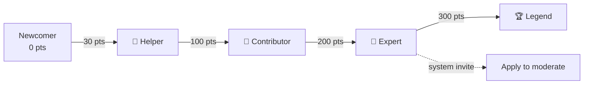

### A. Badge Display

- `topBadge(badgeKeys)` returns the single highest-tier badge for display under a user's name.
- `standing(points)` returns the current tier, next tier, points-to-next, and a progress percentage.
- `badgeDefs(keys)` maps stored badge keys to full definitions for a badges strip.

### B. Expert → Moderator Invitation

When a user reaches Expert (200 pts), they automatically receive a system notification inviting them to apply for moderator access from their Settings page. The application sets `moderator_requested = true` for admin review.

---

## 3. Negative Badges

Admin-issued or spam-escalated penalties on a user's account. Defined in `server/config/constants.js` → `NEGATIVE_BADGES`.

| Badge      | Key          | Icon | Effect                                                      |
| ---------- | ------------ | ---- | ----------------------------------------------------------- |
| Warning    | `warning`    | ⚠️   | Informational only                                          |
| Restricted | `restricted` | 🚫   | `requires_approval = true` — all posts need admin clearance |
| Suspended  | `suspended`  | ☠️   | Permanent ban (`is_banned = true`, `ban_expires_at = null`) |

### A. Spam Escalation (Automatic)

The spam escalation ladder in `server/services/spamService.js` applies penalties at strike thresholds:

| Strike Count | Penalty       | Effect                          |
| ------------ | ------------- | ------------------------------- |
| 1            | Warning       | No badge, just a logged strike  |
| 2            | Warning badge | Plus 24h temporary ban          |
| 5            | Restricted    | Requires approval for all posts |
| 10           | Suspended     | Permanent ban                   |

Higher tiers win — a single `recordSpamStrike()` call applies the most severe penalty the user's count has reached.

### B. Admin-Issued Negative Badges

Admins can manually issue or revoke negative badges via `userService.issueNegativeBadge()` / `revokeNegativeBadge()`. All issuances are logged to the Audit Log and trigger a notification to the affected user.

---

## 4. Admin-Verified Answers

Admins can mark an answer as "verified" (`server/services/answerService.js` → `setVerified()`). This:

1. Sets `answer.is_verified = true` and records `verified_by` (admin's ID).
2. Awards the answerer a **persistent** Admin Verified badge (`custom_badges` array on the User model) — kept even if the answer is later unverified.
3. Verified answers sort above all others in the answer list (`listAnswers` sorts by `is_verified: -1` first).

The Admin Verified badge definition lives in `server/config/constants.js` → `VERIFIED_ANSWER_BADGE` (key: `admin-verified`, icon: ✅).

---

## 5. Moderator Role

Moderators are non-admin users with elevated privileges. Reaching Expert (200 pts) triggers a system notification inviting the user to apply via Settings; an admin reviews and grants `is_moderator` from the Users tab — visible in `AdminModerators.jsx` alongside each person's role and points. Moderation is admin-granted (independent of badge tier), and moderators share all moderation powers with admins.

### A. Powers

- Delete any query or answer (soft-delete, within 15-minute rollback window)
- Restore soft-deleted content (within the rollback window)
- Edit a question's category/tags (`moderateTaxonomy` in `queryService`)
- Rate answers on any question (not just their own)
- Clear comments
- Flag questions for admin attention

### B. Granting Moderation

**Flow:** User reaches Expert → gets system invite → requests access from Settings (`moderator_requested = true`) → Admin grants via `setModerator()` in `userService`.

**Direct grant:** An admin can set `is_moderator = true` on any user at any time.

**Revocation:** An admin sets `is_moderator = false`.

The moderator roster is visible in `AdminModerators.jsx`, listing both moderators and admins (who moderate implicitly).

---

## 6. "Needs Attention" Escalation Queue

Expert-tier members and moderators can flag questions that need admin review (`server/services/queryService.js` → `flagForAttention()`).

### A. Who Can Flag

Only users holding the Expert badge (key: `expert`) or moderators/admins can flag a question for admin attention. The required badge key is configured in `constants.js` → `ATTENTION_FLAG_BADGE_KEY`.

### B. Behavior

- Sets `query.needs_attention = true`, records `attention_flagged_by` (user ID) and `attention_flagged_at` (timestamp).
- The question appears in `AdminAttention.jsx`, grouped by category, sorted by posting date then the asker's join date.
- An admin marks it "handled" via `clearAttention()`, which resets the three fields above.
- The admin overview dashboard shows the queue count in `metrics.needs_attention`.

### C. Attention Queue View

The queue (in `AdminAttention.jsx`) lists questions by the asker's email address, grouped by category. Each item shows a relative timestamp and a "Mark handled" button.

---

## 7. Moderation Queue (Content Flags)

Separate from the attention queue — this handles reported content (spam, duplicate flags, etc.). The queue (`AdminModeration.jsx`) lists pending flags filtered by type. Per item, admins can **Resolve**, **Dismiss**, or **Merge** (duplicate pairs only, using cosine similarity ≥ 80%). The page also shows amalgamation clusters — groups of semantically similar questions (similarity ≥ 60%) — and lets admins bulk-merge an entire cluster into its canonical question.

| Flag Type | Source                                                     |
| --------- | ---------------------------------------------------------- |
| Duplicate | Auto-flagged when a user posts despite a duplicate warning |
| Report    | Manual report via `reportContent()`                        |
| Spam      | Auto-detected gibberish submissions                        |
| Outdated  | Manual flag                                                |
| Gibberish | Auto-detected                                              |

Queue operations: `listModeration()`, `resolveModeration()`, `dismissModeration()` — all in `server/services/adminService.js`.

---

## 8. Key Files

| File                                            | Role                                                |
| ----------------------------------------------- | --------------------------------------------------- |
| `server/config/constants.js`                    | All thresholds, badge definitions, and time windows |
| `server/services/badgeService.js`               | Points → badges logic, `awardPoints` entry point    |
| `server/services/spamService.js`                | Spam strike escalation ladder                       |
| `server/services/userService.js`                | Negative badge CRUD, moderator management           |
| `server/services/answerService.js`              | `setVerified`, voting, helpful toggle               |
| `server/services/queryService.js`               | `flagForAttention`, `moderateTaxonomy`              |
| `server/services/adminService.js`               | Attention queue, moderation queue, rollback         |
| `client/src/lib/reputation.js`                  | Client-side tier calculation                        |
| `client/src/pages/admin/AdminAttention.jsx`     | Attention queue UI                                  |
| `client/src/pages/admin/AdminModerators.jsx`    | Moderator roster UI                                 |
| `client/src/pages/admin/AdminRollback.jsx`      | Undo-deletion UI                                    |
| `server/models/User.js`                         | User schema (badge arrays, ban flags)               |


<div align="right"><a href="#curio--master-documentation">↑ Back to top</a></div>

---


# FAQ Knowledge Base & AI Chatbot

Semantic FAQ search, category accordions, promote-Q&A-to-FAQ, the tiered grounded chatbot (FAQ → resolved queries → fallback), embeddings/cosine similarity, and the swappable AI mock/live boundary.

**Primary sources:** `server/services/faqService.js`, `server/services/chatbotService.js`, `server/services/vectorService.js`, `server/config/ai.js`, `client/src/pages/Faq.jsx`, `client/src/components/Chatbot.jsx`.

---

## Table of Contents

1. [Overview](#1-overview)
2. [Data Model — FaqEntry](#2-data-model--faqentry)
3. [Embeddings and Cosine Similarity](#3-embeddings-and-cosine-similarity)
4. [FAQ Service](#4-faq-service)
   - A. [Listing FAQs — Category Grouping](#a-listing-faqs--category-grouping)
   - B. [Hybrid Semantic Search](#b-hybrid-semantic-search)
   - C. [Creating FAQ Entries](#c-creating-faq-entries)
   - D. [Updating and Soft-Deleting Entries](#d-updating-and-soft-deleting-entries)
   - E. [Promoting a Resolved Q&A to FAQ](#e-promoting-a-resolved-qa-to-faq)
5. [FAQ Routes and Access Control](#5-faq-routes-and-access-control)
6. [FAQ Page — Frontend](#6-faq-page--frontend)
   - A. [Category Accordions](#a-category-accordions)
   - B. [Live Semantic Search](#b-live-semantic-search)
   - C. [Consent-Gated Forum Fallback](#c-consent-gated-forum-fallback)
7. [Chatbot Service — Tiered Grounded RAG Pipeline](#7-chatbot-service--tiered-grounded-rag-pipeline)
   - A. [Tier 1 — Curated FAQ Answer](#a-tier-1--curated-faq-answer)
   - B. [Tier 2 — Consent and Resolved Community Q&A](#b-tier-2--consent-and-resolved-community-qa)
   - C. [Tier 3 — Graceful Fallback](#c-tier-3--graceful-fallback)
   - D. [Session Management](#d-session-management)
   - E. [Prompt Construction and Grounded Composition](#e-prompt-construction-and-grounded-composition)
8. [Chatbot Routes and Rate Limiting](#8-chatbot-routes-and-rate-limiting)
9. [Chatbot Component — Frontend (Chatbot.jsx)](#9-chatbot-component--frontend-chatbotjsx)
10. [The AI Module — Swappable Mock/Live Boundary](#10-the-ai-module--swappable-mocklive-boundary)
    - A. [Mock Mode](#a-mock-mode)
    - B. [Live Mode — Gemini via @google/genai](#b-live-mode--gemini-via-googlegenai)
    - C. [Request Queue and Exponential Backoff](#c-request-queue-and-exponential-backoff)
    - D. [Public API Surface](#d-public-api-surface)
11. [Key Thresholds and Constants](#11-key-thresholds-and-constants)
12. [Embedding Refresh Job](#12-embedding-refresh-job)
13. [End-to-End Flow Diagrams](#13-end-to-end-flow-diagrams)
14. [Production Swap Guide](#14-production-swap-guide)

---

## 1. Overview

The FAQ Knowledge Base and AI Chatbot form **Pillar 1** of the platform's three-pillar architecture. Their purpose is to surface definitive, curated answers to users as quickly as possible — first from the canonical FAQ, then (with the user's consent) from resolved community threads — before asking the user to raise a new query.

The system has three interlocking parts:

- **The FAQ store** — a MongoDB-backed collection of curated entries organized by category, each carrying a 768-dimensional embedding vector for semantic retrieval.
- **The RAG chatbot** — a consent-gated, three-tier retrieval-augmented generation pipeline that grounds every answer in either a FAQ entry or a resolved community Q&A thread before composing a response with the AI model, with a hard fallback when neither source has a confident match.
- **The AI boundary module** (`server/config/ai.js`) — the single file in the entire codebase permitted to call the AI provider. It switches between a deterministic offline mock and the live Gemini API based solely on whether `AI_API_KEY` is set, making the system fully functional with zero cost or network access in development, CI, and demo environments.

Both the FAQ and the chatbot share the same underlying vector infrastructure: `vectorService.cosineSimilarity` is the comparison function, and `ai.embed` is the single embedding call site.

---

## 2. Data Model — FaqEntry

**File:** `server/models/FaqEntry.js`

```
faq_entries collection
├── category          String  (required, indexed)
├── question          String  (required)
├── answer            String  (required)
├── sort_order        Number  (default 0 — controls display order within a category)
├── source            Enum    'admin' | 'qa'
├── source_query_id   ObjectId → Query  (set when source = 'qa')
├── last_accessed_at  Date    (LRU tracking)
├── access_count      Number  (LRU tracking)
├── is_outdated       Boolean (admin-flaggable)
├── embedding         [Number, 768 dims]  (hidden from API responses)
├── is_deleted        Boolean (soft-delete)
├── deleted_at        Date
└── timestamps        (createdAt, updatedAt)
```

**Text index:** MongoDB text index on `{ question: 'text', answer: 'text' }` supplements full-text queries; however, all FAQ searches in production run through the semantic embedding path, not this index directly.

**Embedding validation:** The schema validator enforces `embedding.length === 768` (the value of `EMBEDDING_DIMS`). Any attempt to store an incorrectly sized vector is rejected at the Mongoose layer.

**Embedding exposure:** The `strip()` helper in `faqService.js` removes two internal fields from every object returned to callers — `embedding` (the raw vector) and `__v` (Mongoose's internal version key). The actual implementation is:

```js
const strip = ({ embedding, __v, ...rest }) => ({ ...rest, id: rest._id });
```

All remaining fields — including `_id` itself — are spread into the returned object, with `id` added as an alias for `_id`. The raw embedding vector is never sent over the API.

---

## 3. Embeddings and Cosine Similarity

**File:** `server/services/vectorService.js`

Semantic similarity across the entire platform — for FAQ search, chatbot retrieval, duplicate query detection, and query amalgamation — is computed by a single pure function:

```js
export function cosineSimilarity(a, b) {
  // dot(a, b) / (||a|| * ||b||)
  // Returns 0 if either argument is malformed or zero-norm.
}
```

The function iterates once over both vectors accumulating the dot product and both squared norms, then divides. It short-circuits to `0` for malformed inputs (non-array, mismatched lengths, zero-norm denominator) rather than throwing, so callers do not need to guard against edge-case vectors.

**Why in-app cosine similarity instead of a dedicated vector store?**

Per the project constraints and architecture decisions (`PLANNING.md §3`), a dedicated vector index (e.g. MongoDB Atlas Vector Search, pgvector, Pinecone) is explicitly deferred to production. For MVP corpus sizes — a few hundred FAQ entries, thousands of community queries at most — serialized in-app cosine comparison over all documents has negligible latency, requires zero additional infrastructure, and is trivially replaceable: callers pass embeddings and receive scores; the comparison function is a one-file swap. See [Section 14](#14-production-swap-guide) for the upgrade path.

`vectorService.js` also exports `findSimilarQueries`, used by the duplicate-detection and amalgamation subsystems, but the FAQ and chatbot pipelines call `cosineSimilarity` directly after fetching candidates themselves.

---

## 4. FAQ Service

**File:** `server/services/faqService.js`

This is the authoritative service layer for all FAQ operations. No controller, route, or other service reaches into the `FaqEntry` model directly — all reads and writes go through these exported functions.

### A. Listing FAQs — Category Grouping

```js
export async function listFaqs({ category } = {})
```

Fetches all non-deleted entries, optionally filtered to a single category. The query sorts by `{ category: 1, sort_order: 1, createdAt: 1 }` so entries within a category appear in admin-specified order (via `sort_order`), with creation-time as a stable tiebreaker. Results are then grouped in a single in-memory pass into the shape:

```json
[
  { "category": "Account", "items": [ ... ] },
  { "category": "Billing", "items": [ ... ] }
]
```

This array is what the `Faq.jsx` page receives and renders as category accordion sections. The `category` query parameter uses `String(category)` coercion to prevent NoSQL operator injection before passing to the Mongoose filter.

### B. Hybrid Semantic Search

```js
export async function searchFaqs(query)
```

Takes a user-supplied query string and returns up to 10 ranked FAQ entries. The scoring is a hybrid of two signals:

**Semantic score** — The query string is embedded via `ai.embed(q)` to produce a 768-dimensional query vector. Each stored FAQ entry's `embedding` field is compared against this vector using `cosineSimilarity`. Entries without an embedding receive a semantic score of `0`.

**Keyword boost** — If the lower-cased query string is a substring of either the entry's `question` or `answer` field, `0.3` is added to the entry's score. This ensures that obvious exact-phrase matches are never buried below semantically proximate but less relevant entries.

**Filtering and ranking** — Entries with a combined score ≤ `0.05` are discarded. The remainder are sorted descending and the top 10 are returned, each decorated with a `score` field (rounded to 3 decimal places) for transparency.

The search is stateless and public — no authentication is required.

### C. Creating FAQ Entries

```js
export async function createFaq({ category, question, answer, sort_order, source, sourceQueryId, force })
```

All three required fields (`category`, `question`, `answer`) are validated before any AI call is made. The combined text `"${question}\n\n${answer}"` is embedded via `ai.embed` and stored in the `embedding` field.

**Near-duplicate guard (admin-authored entries only):** When `source === 'admin'` and `force` is not set, the service fetches all existing non-deleted entries and checks every one for:

- An exact case-insensitive question match, or
- A cosine similarity ≥ `FAQ_DUPLICATE_THRESHOLD` (0.95) between the new entry's embedding and the existing entry's embedding.

If either condition is met, a `409 Conflict` is thrown with a `duplicate: true` payload that includes the matching entry's `id`, `question`, and similarity `score`. The admin UI can surface this to the operator and offer a `force: true` override to create the entry anyway.

Entries promoted from Q&A (`source === 'qa'`) bypass this guard intentionally — the promotion flow (see [E](#e-promoting-a-resolved-qa-to-faq)) has its own idempotency check.

### D. Updating and Soft-Deleting Entries

**`updateFaq(id, fields)`** — Applies partial updates to an entry. If the `question` or `answer` text changes, the embedding is automatically recomputed (`ai.embed(faqText(question, answer))`), keeping the vector in sync with the content. Changes to `category`, `sort_order`, and `is_outdated` never trigger re-embedding.

**`setFaqOutdated(id, isOutdated)`** — A dedicated toggle to mark or unmark an entry as outdated. Used by the admin FAQ manager when content becomes stale without requiring a full edit.

**`deleteFaq(id)`** — Soft-deletes the entry by setting `is_deleted = true` and `deleted_at = now`. The record is retained in the database for audit purposes and is excluded from all `listFaqs` and `searchFaqs` results by the `{ is_deleted: false }` filter.

### E. Promoting a Resolved Q&A to FAQ

```js
export async function promoteQueryToFaq(queryId)
```

This function is the bridge between Pillar 3 (the Q&A forum) and Pillar 1 (the FAQ). It allows an admin to "graduate" a community question into the curated FAQ once the community has produced a high-quality answer.

**Preconditions checked:**

1. The query must exist and not be soft-deleted.
2. The query must have an `accepted_answer_id` (only resolved questions qualify — unresolved questions are rejected with a `400`).
3. The accepted answer must still exist and not be deleted.
4. No prior promotion of this query may exist — re-promoting the same query returns a `409`.

When all checks pass, `createFaq` is called with:
- `category` — taken directly from the query's `category` field.
- `question` — the query's `title`.
- `answer` — the accepted answer's `body`.
- `source: FAQ_SOURCE.QA` — flags the entry as community-sourced so the UI can display a "Promoted from Q&A" badge.
- `sourceQueryId` — the originating query's `_id`, stored for traceability.

Because `source` is `'qa'`, the near-duplicate guard is skipped. The promoted entry gets its own fresh embedding computed from the question/answer text.

---

## 5. FAQ Routes and Access Control

**File:** `server/routes/faqRoutes.js`

| Method | Path | Auth | Description |
|--------|------|------|-------------|
| `GET` | `/api/faq` | Public | List all entries grouped by category |
| `GET` | `/api/faq/search` | Public | Semantic + keyword search (`?q=`) |
| `POST` | `/api/faq` | Admin only | Create a new FAQ entry |
| `POST` | `/api/faq/promote/:queryId` | Admin only | Promote a resolved query to FAQ |
| `PATCH` | `/api/faq/:id` | Admin only | Edit an existing FAQ entry |
| `POST` | `/api/faq/:id/outdated` | Admin only | Toggle outdated flag |
| `DELETE` | `/api/faq/:id` | Admin only | Soft-delete an entry |

Public reads are unauthenticated by design. All write operations require a valid JWT with `role: 'admin'` — the `auth` middleware verifies the token and the `admin` middleware checks the role, both applied as Express middleware before the controller.

---

## 6. FAQ Page — Frontend

**File:** `client/src/pages/Faq.jsx`

### A. Category Accordions

On mount, the page calls `listFaqs()` via the `GET /api/faq` endpoint and stores the returned `groups` array in state. Each group becomes a collapsible category section:

- A category header button toggles the `openCats` state entry for that category.
- The **first category is opened by default** on load (`setOpenCats({ [data[0].category]: true })`).
- Within an open category, at most `PREVIEW_COUNT` (5) items are shown initially. A "View all N articles" button expands the full list; a second click collapses back to the preview.
- Each individual FAQ item is a `FaqItem` component — a button that reveals the answer panel on click by toggling `openItems` state.

**Promoted entries** are visually distinguished: `FaqItem` renders a `"Promoted from Q&A"` chip alongside the question text when `entry.source === 'qa'`.

### B. Live Semantic Search

When the user types in the search bar, a 300ms debounced effect fires `searchFaqs(term)` against `GET /api/faq/search?q=`. Results replace the accordion view entirely. A new search resets `forumResults` to `null` (meaning "never checked") so any prior forum opt-in is invalidated.

Clicking "Clear" calls `setResults(null)` and `setForumResults([])` (an empty array, meaning "checked and found nothing"). In practice the entire results block disappears when `results` is `null`, so the visual effect is the same — the category accordion is restored. The distinction between `null` and `[]` matters for the conditional rendering logic: `null` shows the consent prompt when search finds nothing; `[]` renders the empty community-results state.

The search hint explicitly tells the user that semantic search is active, encouraging natural-language queries ("how do I report data?") rather than just keyword lookups.

### C. Consent-Gated Forum Fallback

If the semantic search returns zero FAQ results, the page shows a consent prompt: **"Not in the FAQ. Do you want me to check in the forum?"** The community database is never queried until the user clicks "Yes, check the forum." This mirrors the chatbot's `await_forum` tier and ensures the platform never implicitly searches user-generated content.

Upon consent, `searchQueries(term)` is called against the community forum API. Results are displayed as a linked list of query titles with status badges. If the forum also returns nothing, the user is directed to raise a new query via `/ask`.

---

## 7. Chatbot Service — Tiered Grounded RAG Pipeline

**File:** `server/services/chatbotService.js`

The chatbot implements a **consent-gated three-tier RAG pipeline**: Tier 1 answers from the curated FAQ, Tier 2 (after explicit user consent) searches resolved community Q&A, and Tier 3 is a hard fallback when neither source returns a confident match. Every answer in Tiers 1 and 2 is grounded in retrieved documents from the platform's own knowledge base before being passed to the AI model for composition. The AI never answers from general knowledge alone.

The key constant governing retrieval confidence is `CHATBOT_MATCH_THRESHOLD = 0.3` from `constants.js`. A retrieved document must exceed this cosine similarity score to be used as context.

### A. Tier 1 — Curated FAQ Answer

On every new question (when `checkForum` is `false`), the service:

1. Embeds the user's question via `ai.embed(text)`.
2. Fetches all non-deleted `FaqEntry` documents, selecting only `question`, `answer`, and `embedding`.
3. Finds the single best-scoring FAQ entry using `bestMatch()`, which scans the list computing `cosineSimilarity(qEmbed, doc.embedding)` for each entry.
4. If `faqHit.score >= CHATBOT_MATCH_THRESHOLD`, the service calls `compose()` with a grounded prompt built from the FAQ entry's question and answer text (see [E](#e-prompt-construction-and-grounded-composition)). The response carries:
   - `source_tier: 'faq'`
   - `citations: [{ kind: 'faq', ref_id: entry._id, title: entry.question }]`

### B. Tier 2 — Consent and Resolved Community Q&A

If Tier 1 finds no confident FAQ match, the service does **not** silently fall through to the community database. Instead it returns:

```json
{
  "content": "I couldn't find this in the FAQ. Do you want me to check the community forum for a related discussion?",
  "source_tier": "await_forum",
  "awaiting_forum": true,
  "citations": []
}
```

The client (`Chatbot.jsx`) stores the original question in `pending` state and renders "Yes, check the forum" / "No, thanks" buttons alongside the message.

When the user consents, the client re-calls `POST /api/chatbot/ask` with `check_forum: true` and the same `session_token`. The service then:

1. Fetches all non-deleted, accepted, and embedding-carrying `Query` documents.
2. Finds the best-scoring resolved query via `bestMatch()`.
3. If `qHit.score >= CHATBOT_MATCH_THRESHOLD`, fetches the accepted answer body and calls `compose()` with a grounded prompt. The response carries:
   - `source_tier: 'community'`
   - `citations: [{ kind: 'query', ref_id: query._id, title: query.title }]`

The citation links directly to the forum thread (`/queries/:ref_id`), so the user can follow up in the community.

### C. Tier 3 — Graceful Fallback

If Tier 2 also finds no match above the threshold, the service returns:

```
"I couldn't find this in the FAQ or the community forum. Try rephrasing your question, browse the FAQ, or raise a query so the community can help."
```

with `source_tier: 'fallback'` and an empty `citations` array. This message is hard-coded in the service (`FALLBACK` constant) and does not involve any AI call — it is always available even when the AI provider is down.

### D. Session Management

Every chatbot exchange is persisted to a `ChatbotSession` document.

**Session token:** Tokens are minted server-side using `crypto.randomUUID()`. The client never sets its own token — a client-supplied `session_token` is only used to look up an existing session. This prevents session fixation attacks.

**Session ownership:** An anonymous session (no `user_id`) can be claimed by a logged-in user on first access (the `user_id` is written on reuse). A session owned by a specific user is rejected if a different authenticated user presents its token — the service starts a fresh session instead. Unauthenticated users can read any anonymous session they hold the token for.

**Message persistence:** Each turn appends two messages to `session.messages`: one `role: 'user'` and one `role: 'assistant'`. The assistant message stores `source_tier` and `citations` so the client can reconstruct the full annotated history on session restore. On the consent step, the user turn is recorded as "Yes, check the forum." rather than the original question, matching the actual consent interaction.

**Session restore:** On panel open, `Chatbot.jsx` calls `GET /api/chatbot/session/:token` to hydrate prior messages into local state.

### E. Prompt Construction and Grounded Composition

The `buildPrompt(question, contextLabel, contextText)` helper produces:

```
You are the FAQ Platform assistant. Answer the user using ONLY the context below.
Be concise and accurate. If the context does not fully answer, say what is missing.

Context (<contextLabel>):
<contextText>

User question: <question>
```

The instruction "ONLY the context below" is intentional — it prevents the model from supplementing with general knowledge, keeping answers grounded exclusively in platform content.

The `compose(prompt, grounded)` function calls `ai.chat(prompt, grounded)`. The second argument is the raw retrieved text (FAQ answer or community answer body) used as the mock-mode return value and as a fallback if the live call throws or returns an empty string. This means the chatbot always returns a useful, grounded answer even during a provider outage or rate-limit event — it falls back to the raw retrieved text rather than an error message.

---

## 8. Chatbot Routes and Rate Limiting

**File:** `server/routes/chatbotRoutes.js`

| Method | Path | Auth | Rate limit |
|--------|------|------|------------|
| `POST` | `/api/chatbot/ask` | Optional | `aiLimiter`: 20 requests / 60 s per IP |
| `GET` | `/api/chatbot/session/:token` | Optional | None |

The chatbot is publicly accessible — authentication is optional (`optionalAuth`). When a valid JWT is present, the session is linked to the authenticated user. Without a token the session remains anonymous.

The `aiLimiter` (20 req/min) is applied to `/ask` because each request may trigger one or two AI calls (an embedding plus a chat completion). The tight budget reflects the Gemini free-tier reality (~10 RPM shared across the whole application).

---

## 9. Chatbot Component — Frontend (Chatbot.jsx)

**File:** `client/src/components/Chatbot.jsx`

The chatbot renders as a floating action button (`chat-fab`) fixed to the viewport. Clicking it opens a `chat-panel` overlay. The component is mounted globally in `App.jsx` as a sibling to `<AppShell>`, not inside it:

```jsx
<>
  <AppShell>...</AppShell>
  <Chatbot />   {/* sibling, not child */}
</>
```

This placement means the chatbot overlay is always available regardless of which route is active inside the shell. The component listens for a `window` event `'open-chatbot'` so any part of the application (e.g. the Home page's "Ask the Assistant" card) can open it programmatically via `window.dispatchEvent(new Event('open-chatbot'))`.

**State:**
- `messages` — array of `{ role, content, source_tier, citations }` objects rendered in the panel.
- `input` — controlled text input.
- `busy` — disables the send button and input during an in-flight API call.
- `pending` — stores the original question when the assistant is waiting for forum-search consent (`source_tier === 'await_forum'`). Cleared on consent, decline, or new question.

**Consent flow in the UI:** When the latest assistant message has `source_tier === 'await_forum'` and `pending` is set, the message bubble is followed by two buttons: "Yes, check the forum" (calls `runAsk(pending, true)`) and "No, thanks" (calls `declineForum()`). Declining appends a hard-coded assistant message:

```
"No problem. You can browse the FAQ or raise a query and the community will help."
```

with `source_tier: 'fallback'`, and clears `pending`. These consent buttons only appear on the most recent assistant message.

**Source attribution:** Non-fallback, non-consent assistant messages display a `chat-cite` line below the bubble: "Source: FAQ" or "Source: Community Q&A", with a link to the specific FAQ entry title or a clickable `<Link>` to the forum thread (`/queries/:ref_id`) for community citations.

**Session persistence:** The session token is stored in `localStorage` under the key `'chatbotSession'`. On panel open, if a token exists and the messages array is empty, the session history is loaded from the server.

**Source tier labels** are defined as a module-level constant:

```js
const TIER_LABEL = { faq: 'FAQ', community: 'Community Q&A', ai: 'AI', fallback: '' };
```

The backend (`chatbotService.js`) returns four `source_tier` values: `'faq'`, `'await_forum'`, `'community'`, and `'fallback'`. The `'ai'` key in `TIER_LABEL` has **no corresponding backend tier** — the service never emits `source_tier: 'ai'`. It is dead/unused code in the frontend constant. The `fallback` and `await_forum` tiers intentionally produce no source attribution label in the UI (empty string and no match respectively).

---

## 10. The AI Module — Swappable Mock/Live Boundary

**File:** `server/config/ai.js`

This is the **only file in the entire codebase that imports or calls the AI provider SDK**. No service, controller, model, or job may import `@google/genai` directly. All AI operations — embedding, cheap JSON calls, chat completions — go through the `ai` object exported from this module.

This isolation means swapping the AI provider in production is a change to one file and its environment variables, not a codebase-wide refactor.

### A. Mock Mode

Mock mode is active whenever `AI_API_KEY` is absent or empty:

```js
get mockMode() {
  return !this.apiKey;
}
```

In mock mode:

- **`ai.embed(text)`** returns a deterministic 768-dimensional vector computed by a hash-based function (`mockEmbed`). Tokens are extracted from the text, each is hashed with a polynomial rolling hash, and the result at `hash % dims` is incremented. The vector is L2-normalized so cosine similarity behaves correctly. The vectors are not semantically meaningful but are stable across runs — the same text always produces the same vector, making tests deterministic.
- **`ai.cheapJson(prompt, mockResult)`** returns `mockResult` immediately, without any network call.
- **`ai.chat(prompt, mockText)`** returns `mockText` if provided, otherwise the hard-coded offline message: `"I'm running in offline mode right now, so I can't compose a live answer. Please browse the FAQ or ask the community."`

Mock mode allows the entire platform — including FAQ search, chatbot, and duplicate detection — to run with zero network access and zero quota consumption. This is the default for all local development, CI pipelines, and demo environments without a configured API key.

### B. Live Mode — Gemini via @google/genai

When `AI_API_KEY` is set, the module lazily constructs a `GoogleGenAI` client on the first call and reuses it for all subsequent requests. The SDK is imported dynamically (`await import('@google/genai')`) so it is only loaded when actually needed.

The models used, all configurable via environment variables:

| Purpose | Default model | Env var |
|---------|--------------|---------|
| Chat / RAG composition | `gemini-2.5-flash` | `AI_CHAT_MODEL` |
| Cheap JSON (gibberish, autocorrect) | `gemini-2.5-flash-lite` | `AI_CHEAP_MODEL` |
| Embeddings | `gemini-embedding-001` | `AI_EMBED_MODEL` |
| Embedding dimensions | `768` | `AI_EMBED_DIMS` |

The embedding call uses `outputDimensionality: config.ai.embedDims` to request fixed-size vectors, ensuring all stored embeddings across the database are the same length and cosine similarity is always valid.

### C. Request Queue and Exponential Backoff

All live AI calls are serialized through a shared promise chain (`queue`) and wrapped in an exponential backoff retry loop:

- **Serialization:** `enqueue(fn)` chains each new call onto the previous promise. This ensures the application never issues concurrent AI requests that would blow the Gemini free-tier RPM quota (~10 RPM as of Dec 2025).
- **Backoff:** `withBackoff(fn)` retries up to `MAX_RETRIES` (4) times on `HTTP 429` (rate limit) responses with a delay of `BASE_DELAY_MS * 2^attempt + random(0..200ms)`. Any other error is re-thrown immediately.
- **Chain resilience:** Failed calls do not poison the queue — `queue = run.catch(() => {})` keeps the chain alive even after a rejection.

This means a transient quota spike degrades gracefully: the call eventually succeeds after backoff, or fails cleanly and allows the `compose()` function in `chatbotService` to return the grounded fallback text.

### D. Public API Surface

```js
ai.mockMode           // Boolean — true when no API key is set
ai.embed(text)        // Promise<number[]> — 768-dim vector
ai.embedBatch(texts)  // Promise<number[][]> — parallel embed (used by seed)
ai.cheapJson(prompt, mockResult)  // Promise<object> — structured JSON call
ai.chat(prompt, mockText)         // Promise<string> — chat completion
```

---

## 11. Key Thresholds and Constants

**File:** `server/config/constants.js`

| Constant | Value | Where used |
|----------|-------|------------|
| `EMBEDDING_DIMS` | `768` | Schema validation, mock embed size, `outputDimensionality` |
| `CHATBOT_MATCH_THRESHOLD` | `0.3` | Tier 1 and Tier 2 retrieval in `chatbotService` |
| `FAQ_DUPLICATE_THRESHOLD` | `0.95` | Near-duplicate guard in `createFaq` (admin entries) |
| `DUPLICATE_SIMILARITY_THRESHOLD` | `0.8` | Community query duplicate detection |
| `AMALGAMATION_SIMILARITY_THRESHOLD` | `0.6` | Admin amalgamation grouping |
| `FAQ_SOURCE.ADMIN` | `'admin'` | Manually curated entries |
| `FAQ_SOURCE.QA` | `'qa'` | Promoted community entries |

All thresholds are centralized in `constants.js` and imported by the services that need them. Tuning similarity cutoffs for production is a constants-file change, not a service-layer change.

---

## 12. Embedding Refresh Job

**File:** `server/jobs/embeddingRefresh.js`

Over time, query content may be edited in ways that bypass the normal embedding hook (e.g. direct database fixes, model migrations). The `embeddingRefresh` job handles this:

1. Fetches all non-deleted queries.
2. For each query, computes `SHA-256(title + "\n\n" + body)` and compares it to the stored `embedding_hash`.
3. If the hash differs, re-embeds the text and updates both `embedding` and `embedding_hash`.
4. Returns `{ refreshed: N }`.

This job is also the **migration path when the embedding model changes** (e.g. moving from `gemini-embedding-001` to a future model at deployment): clearing `embedding_hash` on all documents causes the job to re-embed everything on its next run. FAQ entries do not participate in this job — their embeddings are updated inline on `updateFaq` when the text changes.

---

## 13. End-to-End Flow Diagrams

### FAQ Search Flow

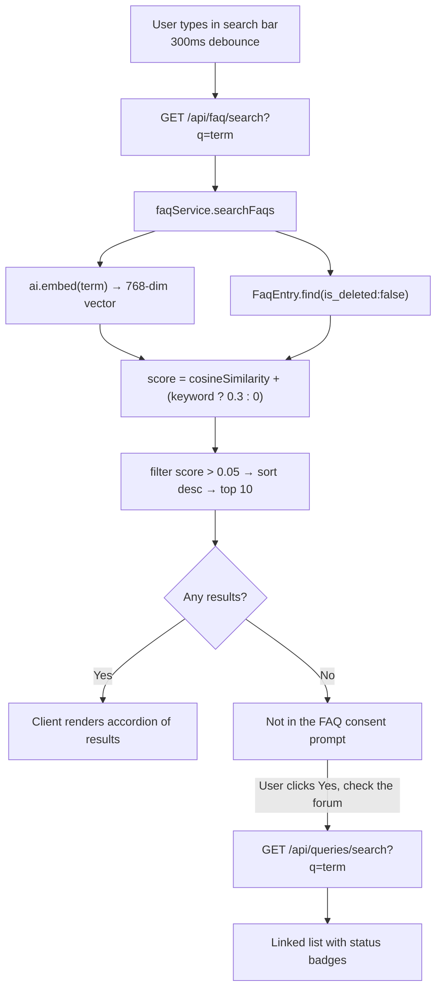

### Chatbot RAG Pipeline

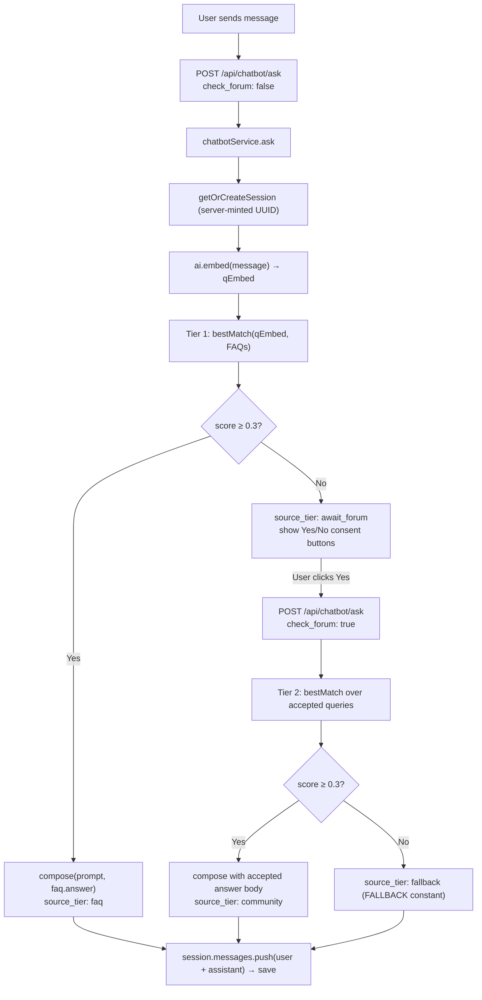

### Q&A Promotion Flow

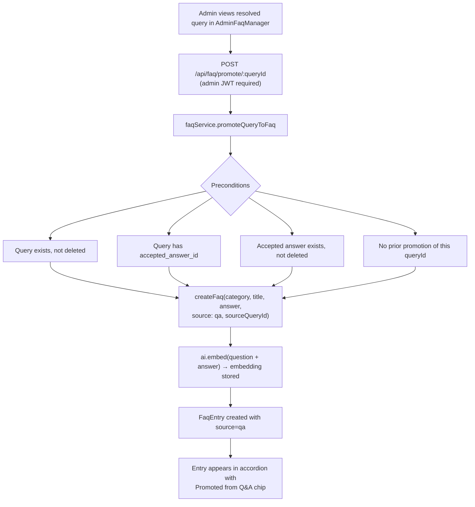

---

## 14. Production Swap Guide

The codebase is built around two explicitly documented swappable boundaries. Upgrading either in production requires no changes outside their respective single files.

### Swapping the AI Provider

Edit `server/config/ai.js` only:

1. Change the import to the new provider's SDK.
2. Re-implement `ai.embed()`, `ai.chat()`, and `ai.cheapJson()` using the new SDK.
3. Update `config.ai` fields in `server/config/env.js` to add any new environment variables.
4. Keep the `mockMode` getter — it must remain functional for CI.

All callers (`faqService`, `chatbotService`, `gibberishService`, `spamService`, `embeddingRefresh`) are unaffected because they only use the `ai.*` API surface.

### Swapping the Embedding Model

If moving to a model with a different output dimension:

1. Update `EMBEDDING_DIMS` in `constants.js` and `AI_EMBED_DIMS` in environment configuration.
2. Clear `embedding_hash` on all `Query` documents and delete all `FaqEntry` embeddings.
3. Run `embeddingRefresh` to re-embed queries; re-run the FAQ seed or `updateFaq` for FAQ entries.
4. All similarity thresholds continue to work — cosine similarity is dimension-agnostic.

### Upgrading to a Dedicated Vector Index

Replace the body of `vectorService.js` with calls to the vector store's SDK (Atlas Vector Search, pgvector, etc.). The public function signatures — `cosineSimilarity(a, b)` and `findSimilarQueries(embedding, opts)` — must be preserved. Callers in `faqService` that call `cosineSimilarity` inline (rather than via `findSimilarQueries`) may need to be updated to delegate the search to the service layer, but the service contracts remain the same.


<div align="right"><a href="#curio--master-documentation">↑ Back to top</a></div>

---


# Admin Dashboard & Maintenance

An detailed overview of the system's administration, governance layer, taxonomy control, audit trail, and scheduled maintenance architecture.

---

## 1. Overview of Admin Operations & Tab Architecture

Curio's administrative dashboard functions as the command center for knowledge curation, community moderation, system telemetry, and manual operational override. The administrative system follows three core principles:
1. **Attribution and Accountability**: Every administrative action is logged to the persistent `AuditLog` collection. Anonymous administrative actions do not exist.
2. **Safety and Grace Windows**: Destructive actions (like deletions) are soft-deletions and remain fully reversible within a 15-minute grace window.
3. **Decoupled Job Orchestration**: Background cron jobs are exposed as synchronous API handlers, enabling admins to trigger scheduled actions on demand with instant UI feedback.

The dashboard layout is divided into 10 dedicated admin tabs, which map to three functional areas:

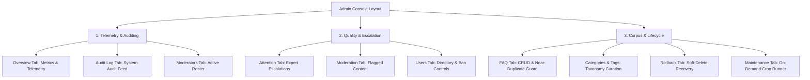

---

## 2. Admin Interface: Section-by-Section Scope

The admin system is structured inside `client/src/pages/admin/` and backed by `server/services/adminService.js` and `server/services/taxonomyService.js`.

### A. System Overview & Dashboard (`AdminOverview.jsx`)
Exposes live KPIs and telemetry:
- **KPI Metrics Cards**:
  - `TOTAL USERS`: Count of active users (`User.countDocuments({ is_deleted: false })`) and banned users.
  - `OPEN QUESTIONS`: Count of questions in `open` status and total questions.
  - `RESOLUTION RATE`: Percentage of queries resolved (`(resolved / total) * 100`).
  - `MOD QUEUE`: Total pending moderation items, flagging "High load" if $\ge 10$ items.
  - `AI STATUS`: Displays whether the Google Gemini service is `Operational` (based on `/health` checks, indicating if running in `live` or `mock` mode).
- **"Needs Attention" Action Board**:
  Aggregates high-priority tasks and deep-links to them:
  - *Questions need admin attention* $\to$ links to `/admin/attention` (escalations).
  - *Flagged content review* $\to$ links to `/admin/moderation`.
  - *Pending user approvals* $\to$ links to `/admin/users` (where `requires_approval === true`).
  - *Open questions* $\to$ links to `/queries?status=open`.
- **Queries by Category**: Displays a status breakdown (Total, Open, Answered, Resolved) grouped by category, populated using a MongoDB aggregation pipeline in `queriesByCategory()`.
- **Recent Audit Log**: A live stream of the 6 most recent administrative actions with performer names and relative timestamps.

---

### B. Content Escalation & Moderation Queue (`AdminAttention.jsx` & `AdminModeration.jsx`)
Curio uses an advanced quality gating and community-moderated workflow where items requiring intervention are routed to either the **Attention Queue** or the **Moderation Queue**.

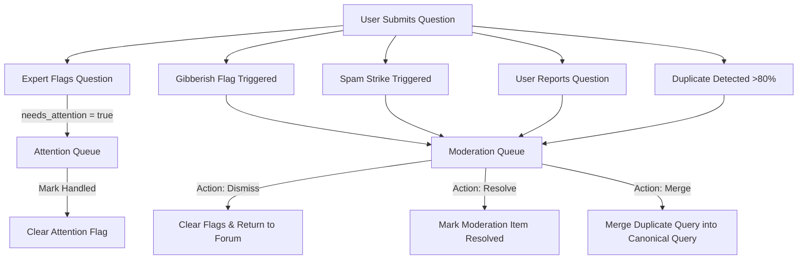

#### The Attention Queue (`AdminAttention.jsx`)
Handles questions escalated by Expert members or Moderators.
- **Rules**: If a question is flagged `needs_attention: true`, it routes here.
- **Sorting**: The queue is sorted by **Category** $\to$ **Question Posting Date** $\to$ **Author's Joining Date**.
- **UX**: Lists askers by their **email ID** (a link opening the thread detail) and displays their required **joining date**.
- **Action**: Admins can dismiss the attention flag by clicking "Mark handled" which executes `clearAttention()` and logs it.

#### The Moderation Queue & Amalgamation (`AdminModeration.jsx`)
Manages flags and AI-driven duplicate clustering:
1. **Flagged Items Table**: Filterable by `type` (duplicate, report, spam, outdated, gibberish). Provides three key actions:
   - **Merge**: (For duplicates only) Merges the duplicate query into a canonical query.
   - **Resolve**: Marks the item `resolved` in the `ModerationQueue`.
   - **Dismiss**: Dismisses the moderation item. If it was flagged as a duplicate, it clears the duplicate metadata (`is_flagged_duplicate`, `duplicate_of`, `similarity_score`, `merge_status`) on the original `Query` record, returning it to normal.
2. **Amalgamation Suggestions**:
   - Uses the in-app embedding system to find clusters of active queries with cosine similarity scores $\ge 0.6$ (`AMALGAMATION_SIMILARITY_THRESHOLD`).
   - Group lists are displayed with the first query as the proposed **canonical** thread. All other threads display their similarity percentage.
   - Admins can merge all related queries into the canonical one with a single click, automating the Q&A gardening.

---

### C. FAQ Manager & Near-Duplicate Guard (`AdminFaqManager.jsx`)
Maintains the FAQ corpus:
- **FAQ Creator Form**: Allows admins to input Category, Sort order, Question, and Answer.
- **FAQ Near-Duplicate Guard**:
  - When submitting a new FAQ, the system checks it against existing FAQs using cosine similarity with a strict $95\%$ threshold (`FAQ_DUPLICATE_THRESHOLD`).
  - If a potential duplicate is detected, the API throws a `409 Conflict`.
  - The client catches this and displays a `window.confirm` modal showing the existing question. If the admin overrides it, it posts with `force: true`.
- **Badges**: FAQs promoted from community Q&A carry a `from Q&A` badge (`source === 'qa'`), and outdated ones show an `outdated` badge.
- **Actions**: Edit, Delete (with confirmation), and toggle `Mark outdated` / `Mark current` (toggles `is_outdated` flag).

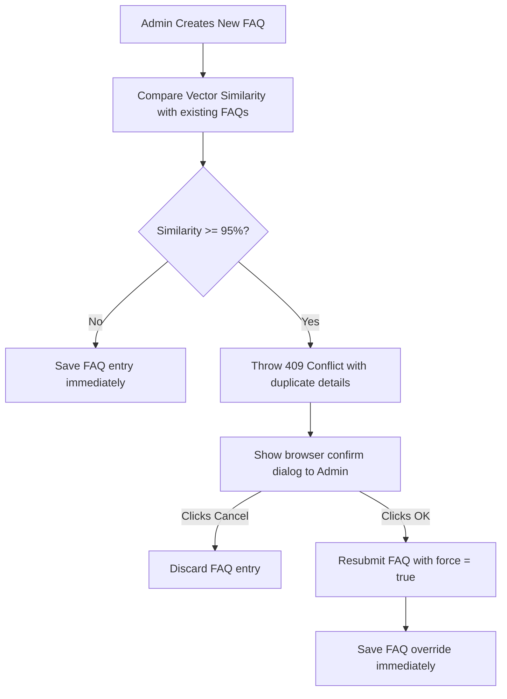

---

### D. Categories & Tags Curation (`AdminTaxonomy.jsx`)
Manages Curio's structured category and tag taxonomy to prevent free-form tag bloat:
- Admins can add or delete categories and tags.
- New entries automatically derive clean, URL-safe slugs via `slugify()`.
- Deleting a category/tag removes it from the list of options for new questions, but existing questions retain it.
- **Built-in Guard**: The tag `others` is a built-in fallback and cannot be deleted or duplicated.

---

### E. User Directory & Ban Controls (`AdminUsers.jsx` & `AdminModerators.jsx`)
Provides granular administrative control over the member directory:
- **Search**: Real-time filtering by name or email.
- **Role Control**: Promotes or demotes accounts to/from `admin` role.
- **Moderator Promotion**: Grants/revokes `moderator` status (identifies pending requests with a `requested` badge).
- **Ban Controls**:
  - Admins can ban any user for a specified duration in hours (via prompt; blank is permanent) and must supply a reason.
  - Timed bans display a banner to the user showing a countdown, while permanent bans lock them out entirely.
- **Self-Moderation Guard**: Administrative controls are hidden on the admin's own user row to prevent accidental self-banning, demotion, or lockout.
- **Moderators Roster**: Displays a dedicated view of the community's moderation team (explicit moderators and admins who moderate implicitly) showing Name, Email, Role, and Reputation Points.

---

### F. Audit Trail & Rollback Engine (`AdminAudit.jsx` & `AdminRollback.jsx`)
Curio guarantees system accountability and mistake recovery using a strict audit logging system and a soft-delete rollback window.

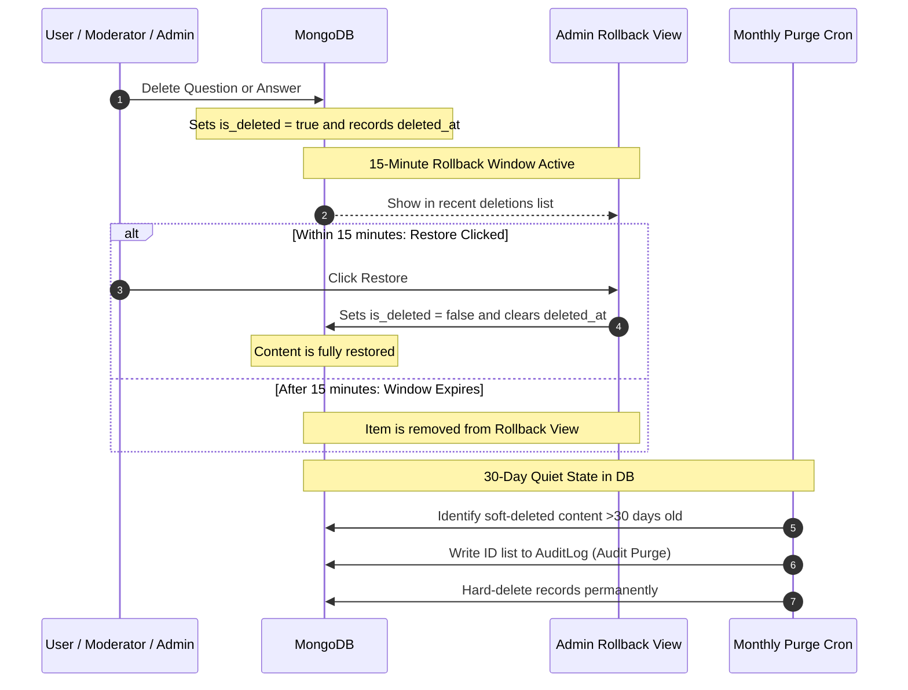

#### System Audit Log (`AdminAudit.jsx`)
Provides absolute accountability and transparency:
- Displays a tabular stream of every administrative and system action.
- Columns: Date/time, action slug (e.g. `query.merge`, `user.set_role`, `taxonomy.create_category`), Entity Type + Entity ID (truncated to last 6 chars), Performed By (user or `system`), and JSON-stringified details of the event payload.

#### Rollback Console (`AdminRollback.jsx`)
Reverts accidental content deletions:
- **15-Minute Undo Window**: Shows queries and answers soft-deleted (`is_deleted: true`) within the last 15 minutes (`ROLLBACK_WINDOW_MINUTES`).
- **Data Display**: Shows who deleted the item and how long ago.
- **Action**: Provides a "Restore" button to toggle the deletion flag off (`is_deleted: false`), automatically reconciling thread statuses and solutions.

---

### G. Maintenance & Cron Panel (`AdminMaintenance.jsx`)
Exposes background scheduled crons to manual control:
- Lists all 8 cron jobs registered in `server/jobs/index.js`.
- Shows their cron expression and description.
- Admins can click "Run now" to trigger the job synchronously and immediately view the JSON result payload.

---

## 3. Scheduled Maintenance Crons (`server/jobs/`)

Curio includes 8 scheduled tasks that maintain data hygiene, process reputation cycles, and enforce governance. Every job is a decoupled async function registered in `server/jobs/index.js`, allowing execution on a cron schedule or on-demand from the admin panel.

| Job Name | Schedule | Target Model | Purpose & Inner Workings |
|---|---|---|---|
| `finalize-solutions` | `0 3 * * *` (Daily 03:00) | `Query`, `Answer` | Finalizes open queries past their 48h grace period (`GRACE_PERIOD_HOURS`). Handles both **Path A** (asker-marked; awards +15 pts to answerer) and **Path B** (no selection; auto-selects most-liked answer; no points). Prunes surplus answers exceeding 3 (`MAX_ANSWERS_KEPT_ON_RESOLVE`). |
| `expire-bans` | `0 * * * *` (Hourly) | `User` | Safety net that lifts expired timed bans. Finds users where `is_banned: true` and `ban_expires_at` is past the current time, setting `is_banned: false`, `ban_expires_at: null`, and `ban_reason: null`. |
| `badge-recalc` | `0 2 * * *` (Daily 02:00) | `User` | Runs `recalcAllBadges()` to evaluate and resync every user's positive badges against the points thresholds (Helper: 30, Contributor: 100, Expert: 200, Legend: 300). |
| `lru-eviction` | `0 4 * * *` (Daily 04:00) | `Query` | Archives resolved questions that have not been accessed for 90 days (`LRU_ARCHIVE_DAYS`). Sets `is_archived: true`. Viewing an archived question automatically un-archives it. |
| `staleness-check` | `0 5 * * 1` (Weekly, Mon 05:00) | `Answer` | Identifies answers older than 180 days (`STALENESS_DAYS`) that have not been modified, setting `is_outdated: true` to flag them for review. |
| `orphan-cleanup` | `0 5 * * 2` (Weekly, Tue 05:00) | `Like`, `ChatbotSession` | Cleans up broken relations. Deletes `Like` records pointing to soft-deleted or removed answers. Deletes `ChatbotSession` records owned by deleted users. |
| `embedding-refresh` | `0 5 * * 3` (Weekly, Wed 05:00) | `Query` | Refreshes vector embeddings. Concatenates title and body, hashes them, and compares with `embedding_hash`. Re-embeds content if changed (e.g. from direct DB updates or model upgrades). |
| `soft-delete-purge` | `0 6 1 * *` (Monthly, 1st 06:00) | `Query`, `Answer`, `FaqEntry` | **Deletion-with-Audit**: Permanently hard-deletes content soft-deleted more than 30 days ago (`SOFT_DELETE_PURGE_DAYS`). Prior to calling `deleteMany`, it creates an AuditLog record of the batch showing deleted IDs and counts. |

---

## 4. Administrative Configuration and Constants

All administration thresholds are centralized in `server/config/constants.js`. Adjusting these constants recalibrates the entire platform's governance and maintenance mechanics:

```javascript
// Time Window Constants
export const EDIT_WINDOW_MINUTES = 15;        // Window for users to edit post
export const ROLLBACK_WINDOW_MINUTES = 15;    // Window for admins/mods to restore deleted items
export const GRACE_PERIOD_HOURS = 48;         // Grace window for solution selection
export const AUTO_BAN_HOURS = 24;            // Timed ban length for spam strikes
export const LRU_ARCHIVE_DAYS = 90;           // LRU inactive period before archival
export const SOFT_DELETE_PURGE_DAYS = 30;     // Soft-delete data retention period
export const STALENESS_DAYS = 180;            // Period before an answer is marked outdated

// Quality Gate and AI Similarity Thresholds
export const DUPLICATE_SIMILARITY_THRESHOLD = 0.8;    // Question duplicate similarity (cosine)
export const AMALGAMATION_SIMILARITY_THRESHOLD = 0.6; // Broader similarity for cluster suggestions
export const FAQ_DUPLICATE_THRESHOLD = 0.95;         // Guard similarity to prevent duplicate FAQs
export const MAX_ANSWERS_KEPT_ON_RESOLVE = 3;        // Answer pruning cap on query resolution
```


<div align="right"><a href="#curio--master-documentation">↑ Back to top</a></div>

---
