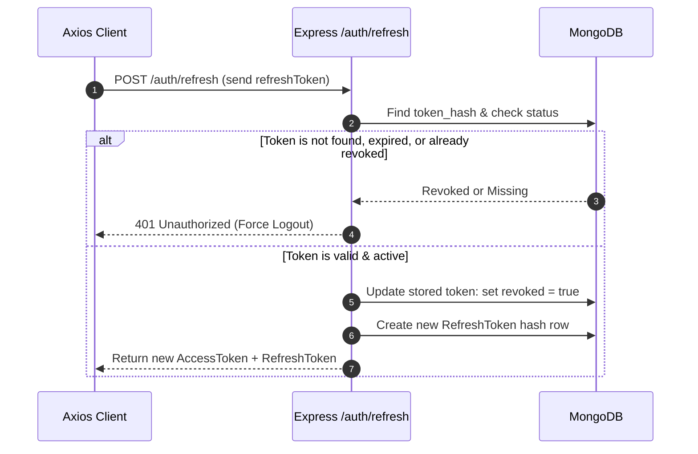

# Authentication & User Accounts

This page documents the authentication architecture, token rotation mechanisms, user roles, governance/ban flows, and notification settings implemented in **Curio**.

---

## 1. Overview & Authentication Model

Curio uses a stateless **JSON Web Token (JWT)** authentication model for the API, paired with a stateful **refresh token revocation database** for secure session invalidation.

```
┌──────────────┐          1. Credentials          ┌──────────────┐
│  React Client│ ───────────────────────────────> │  Express API │
│              │ <─────────────────────────────── │              │
└──────────────┘    2. Access & Refresh Tokens    └──────────────┘
       │                                                 │
       │ Access Token (Bearer Header)                    │ Validate & Verify
       ├───────────────────────────────────────────────> │ (via auth.js)
       │                                                 │
  [401 Expired]                                          │
       │ 3. Send Refresh Token                           │ Revoke Old,
       ├───────────────────────────────────────────────> │ Issue New Pair
       │ <────────────────────────────────────────────── │ (Rotate)
       │         4. New Access + Refresh Token           │
```

* **Access Token**: Short-lived JWT containing the user's ID (`sub`) and role (`role`). Stored in memory and `localStorage` on the client. Sent in the `Authorization: Bearer <token>` header.
* **Refresh Token**: Long-lived JWT containing the user's ID (`sub`) and a unique identifier (`jti`). Stored in `localStorage` on the client. It is hashed (`SHA-256`) and stored in the database to allow remote revocation/logout.

> [!IMPORTANT]
> **Production Safety Guard**: The server environment resolver (`server/config/env.js`) prevents startup in a production environment (`NODE_ENV=production`) if default or missing JWT secrets are detected, mitigating the risk of credential leakage.

---

## 2. Database Models

Authentication and governance statuses are managed through two main MongoDB collections:

### A. User Model (`server/models/User.js`)
Stores account credentials, reputation statistics, badge arrays, governance restrictions, and notification preferences.

| Field | Type | Description |
|---|---|---|
| `name` | String | User's display name (sanitized and trimmed). |
| `email` | String | Unique, lowercase email address used for login and admin attention tracking. |
| `password_hash` | String | Bcrypt hash of the user's password (`select: false` by default). |
| `role` | String | Enum matching `user` or `admin`. |
| `is_moderator` | Boolean | True if the user has been granted moderator capabilities by an admin. |
| `moderator_requested` | Boolean | True if an Expert user has requested moderation privileges. |
| `points` | Number | Earned reputation total (from marking solutions or receiving answer likes). |
| `badges` | Array of Strings | Keys of automatically earned reputation-tier positive badges. |
| `negative_badges` | Array of Objects | Admin-issued flags (`warning`, `restricted`, `suspended`) with reasoning. |
| `custom_badges` | Array of Objects | Admin-authored bespoke badges (includes automatic **Admin Verified** badge). |
| `spam_flag_count` | Number | Counter of flagged submissions; triggers automated escalating penalties. |
| `is_banned` | Boolean | Global lockout state flag. |
| `ban_expires_at` | Date / Null | Timestamp for temporary ban expiration (null = permanent ban). |
| `ban_reason` | String / Null | Description of why the ban was issued. |
| `requires_approval` | Boolean | True if restricted (requires manual admin approval for all queries). |
| `login_streak` | Number | Number of consecutive calendar days the user has logged in. |
| `last_login_at` | Date | Timestamp of the user's last login. |
| `notification_prefs` | Object | Map of preferences: `{ answers: boolean, mentions: boolean, system: boolean }`. |

### B. Refresh Token Model (`server/models/RefreshToken.js`)
Tracks active sessions and handles revocation.

* **`user_id`**: Reference to the User.
* **`token_hash`**: SHA-256 hash of the issued refresh token.
* **`expires_at`**: TTL-indexed timestamp for automatic deletion upon expiration.
* **`revoked`**: Boolean flag marked true upon logout or rotation.

---

## 3. Register & Login Flows

### Registration
Located in [`server/services/authService.js`](file:///C:/Users/Lenovo/.gemini/antigravity/scratch/cp1/server/services/authService.js#L34):
1. Validates that `name`, `email`, and `password` are present and that the password is at least 8 characters.
2. Checks for email uniqueness.
3. Hashes the password using bcrypt.
4. Initializes `login_streak` to 1.
5. Saves the user record and issues the initial access/refresh token pair.

### Login & Streak Calculation
Located in [`server/services/authService.js`](file:///C:/Users/Lenovo/.gemini/antigravity/scratch/cp1/server/services/authService.js#L56):
1. Verifies credentials against the bcrypt hash.
2. Calculates the **Login Streak**:
   * If the last login date is exactly **1 calendar day** before today (ignoring hours), `login_streak` increments by 1.
   * If the last login is **more than 1 calendar day** before today, `login_streak` resets to 1.
   * If the last login was **today**, the streak remains unchanged.
3. Updates `last_login_at` to the current timestamp.
4. Generates and returns the user object, access token, and a new refresh token.

---

## 4. Token Rotation & Refresh Mechanism

To protect against token hijacking, Curio implements **One-Time Use Refresh Tokens** with rotation.



### Client-Side Integration
Axios client setup in [`client/src/api/client.js`](file:///C:/Users/Lenovo/.gemini/antigravity/scratch/cp1/client/src/api/client.js):
* An **interceptor request** automatically appends the current in-memory access token to every outgoing request.
* A **response interceptor** catches `401 Unauthorized` errors.
  * If a refresh token is present in local storage, it triggers a single, unified `POST /api/auth/refresh` request.
  * While this refresh promise is in flight, any concurrent `401` errors are queued to wait for this same promise (`refreshing` lock).
  * On success, the new tokens are saved to local storage, and the failed requests are replayed with the new access token.
  * On failure (e.g., refresh token expired/revoked), local storage is cleared, and the user is redirected to the login gate.

---

## 5. Roles & Authorization Middleware

Curio supports three user roles: **User**, **Moderator**, and **Admin**. Roles and access gates are handled via the middleware modules in [`server/middleware/auth.js`](file:///C:/Users/Lenovo/.gemini/antigravity/scratch/cp1/server/middleware/auth.js):

* **`auth`**: Ensures a valid access token is present in the `Authorization` header. Attaches the full, updated `req.user` database document to the request, which prevents stale role claims from client-side cookies.
* **`optionalAuth`**: Decodes the token if present to establish user context (such as for checking ownership or moderation roles on queries), but does not block anonymous visitors (except for login gates).
* **`admin`**: Checks that `req.user.role === 'admin'`. Rejects all other users with a `403 Forbidden`.
* **`banCheck`**: Middleware applied to all write endpoints. Refreshes the user's document; if `is_banned` is true and `ban_expires_at` is either null (permanent) or in the future, it rejects the operation with a `403 Forbidden`.

---

## 6. User Profiles, Settings & Notifications

### User Profiles
Public profiles are loaded via the [`getProfile`](file:///C:/Users/Lenovo/.gemini/antigravity/scratch/cp1/server/services/userService.js#L12) service. It returns the user's credentials, statistics (total questions, answers, register date), reputation standing, and earned/custom badges.
* **Automatic Standing Calculation**: Returns their current reputation level and progress (`pts_to_next`) calculated dynamically from the reputation tiers (Helper at 30 pts, Contributor at 100 pts, Expert at 200 pts, Legend at 300 pts).

### Settings & Preferences
Users manage their account via the Settings page:
* **Display name**: Modifiable display name (max 80 chars, trimmed).
* **Notification Preferences**: Configurable flags for different message types:
  * `answers`: Notify when a reply is posted on their question.
  * `mentions`: Notify when they are mentioned or replied to.
  * `system`: Notify on system alerts or moderation logs.
* **Moderator Request**: Users who have unlocked the **Expert** badge can submit a request to become a moderator. This sets `moderator_requested = true`, placing them on the admin request roster.

---

## 7. Governance, Ban & Badge Flows

```
                        ┌─────────────────────────┐
                        │      Admin Action       │
                        └────────────┬────────────┘
                                     │
           ┌─────────────────────────┼─────────────────────────┐
           ▼                         ▼                         ▼
      [Issue Ban]              [Negative Badge]         [Custom Badge]
           │                         │                         │
  Temp (Hours) or Perm               │                Bespoke Badge awarded
           │                 ┌───────┴───────┐        (e.g., Admin Verified)
           ▼                 ▼               ▼                 │
      Sets:              ⚠️ Warning      🚫 Restricted          │
      is_banned: true    Info message    requires_approval     │
      ban_expires_at     in profiles     flag is set.          │
                                             │                 │
                                             ▼                 ▼
                                        Write endpoints   Visible on user
                                        require admin     profile & under
                                        approval first.   forum name.
```

All moderation actions are performed exclusively by administrators and are recorded in the central audit log:

### The Ban/Unban Flow
1. **Ban**: An administrator can issue a ban via [`banUser`](file:///C:/Users/Lenovo/.gemini/antigravity/scratch/cp1/server/services/userService.js#L90).
   * Supports temporary bans (e.g., `24` hours) or permanent bans (omitting hours).
   * Updates `is_banned = true` and calculates the expiry timestamp.
   * Logs a `user.ban` event inside `AuditLog`.
   * Sends an in-app system notification to the recipient explaining the reason.
2. **Unban**: Handled via [`unbanUser`](file:///C:/Users/Lenovo/.gemini/antigravity/scratch/cp1/server/services/userService.js#L120).
   * Resets `is_banned = false`, `ban_expires_at = null`, `ban_reason = null`, and `requires_approval = false`.
   * Logs `user.unban` in the audit log and notifies the user.
3. **Auto-Ban Expiry Cron**: An automated cron job executes hourly to search for users where `is_banned = true` and `ban_expires_at` has passed, automatically lifting the ban.

### Negative Badges (Moderation Flags)
Issued via [`issueNegativeBadge`](file:///C:/Users/Lenovo/.gemini/antigravity/scratch/cp1/server/services/userService.js#L152):
* **⚠️ Warning**: Used as a behavioral warning.
* **🚫 Restricted**: Sets `requires_approval = true`. The user remains logged in, but any new query they post is automatically flagged as `pending_moderation` and hidden until approved by a moderator.
* **☠️ Suspended**: Auto-locks the account globally (sets `is_banned = true` permanently).

### Custom Badges
Issued via [`awardCustomBadge`](file:///C:/Users/Lenovo/.gemini/antigravity/scratch/cp1/server/services/userService.js#L262):
* Admins can create and assign free-form badges with custom labels and emojis (e.g., "Top Doc Writer" 📝).
* **Admin Verified** ✅: Automatically assigned to a user when an administrator verifies one of their forum answers as authoritative. The badge remains on their profile even if the answer is subsequently unverified.

> [!CAUTION]
> **Self-Moderation Protection**: Admins cannot ban, warn, restrict, suspend, or award custom badges to their own accounts. The user interface explicitly hides these buttons when an admin views their own profile page, and the backend service rejects self-governance requests with a `400 Bad Request` block.
