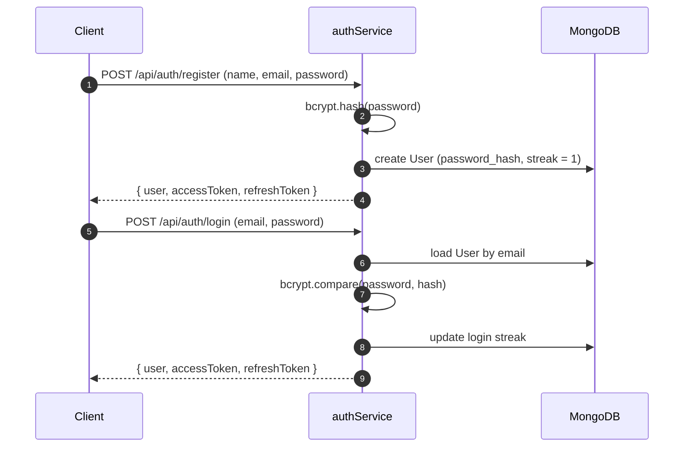
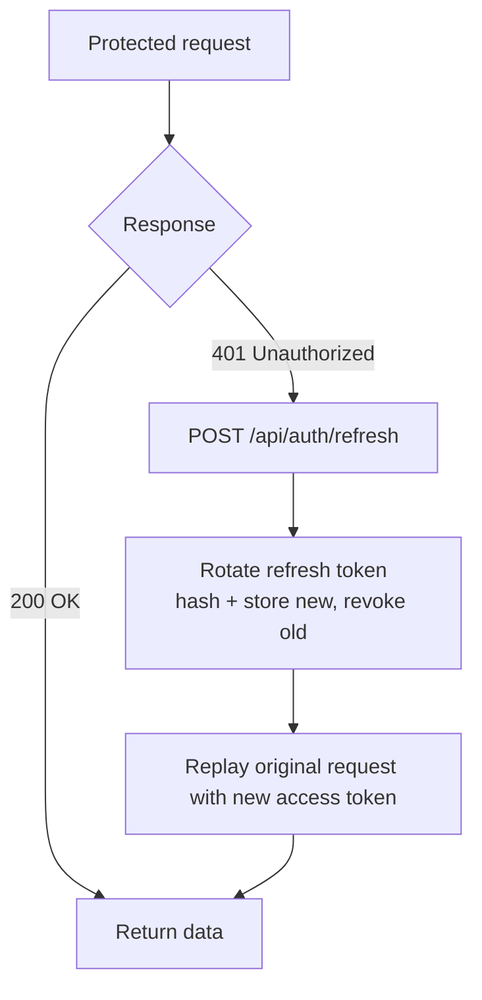
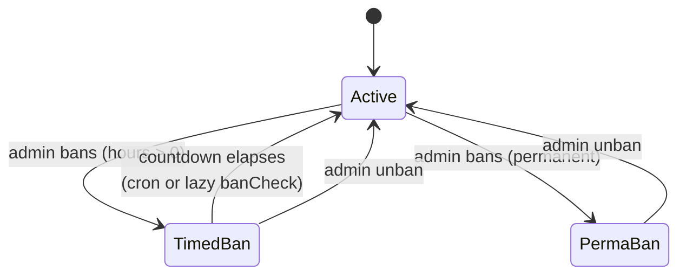

# Authentication & User Accounts

A detailed overview of Curio's identity layer: JWT-based authentication with refresh-token rotation, role-based authorization, user profiles and settings, and the ban lifecycle that gates write access across the platform.

---

## 1. Register & Login Flow

Curio implements a secure authentication model using JSON Web Tokens (JWT) backed by a stateful refresh-token store. The credential lifecycle is handled in `server/services/authService.js`.

- **Registration:** Validates credentials, hashes passwords using **bcrypt**, creates the user record, and starts a 1-day login streak. The `password_hash` is never returned over the API.
- **Login:** Verifies the supplied credentials against the bcrypt hash, updates the consecutive login streak, and returns an **access / refresh token pair**.

---

## 2. JWT Access & Refresh-Token Rotation

Authentication uses a two-token model: a short-lived access token for request authorization and a long-lived, single-use refresh token for silent re-authentication.

### A. Access Token

A short-lived JWT held in memory by the client, containing the user ID and role. It is sent on every protected request in the `Authorization: Bearer <token>` header.

### B. Refresh-Token Rotation

Refresh tokens are **one-time use**. Each refresh token is stored **hashed (SHA-256)** in the database so it can be revoked instantly on logout, and every refresh issues a brand-new token, invalidating the previous one. A random `jti` (token ID) is embedded so two tokens minted in the same second never collide on the unique hash index.

### C. Axios Interceptor (`client/src/api/client.js`)

The client's Axios layer transparently handles expiry: it catches `401` responses, executes a **single in-flight refresh** request (subsequent calls await the same promise), and replays the originally failed requests once a fresh access token is obtained.

---

## 3. Roles & Authorization

Authorization is role-based, with three tiers defined in the `ROLES` constant (`server/config/constants.js`).

| Role | Capabilities |
|---|---|
| `user` | Standard member — ask, answer, vote, bookmark |
| `moderator` | Delete / regulate content, rate any answer, escalate, re-tag |
| `admin` | Global control — full dashboard, bans, roles, taxonomy, badges |

Enforcement lives in `server/middleware/auth.js`:

- **`auth`** — requires a valid access token; rejects unauthenticated requests.
- **`optionalAuth`** — attaches the user to the request context if a token is present, but allows anonymous access (used for public reads).
- **`admin`** — restricts a route to `admin`-role accounts. The middleware loads a fresh `User` document, so a role promoted in the database takes effect immediately, regardless of the (possibly stale) token claim.

---

## 4. User Profiles & Settings

- **Profiles (`server/services/userService.js`):** A public route returning a user's stats, reputation tier, and earned / custom badges via `getProfile`. Profiles surface query and answer counts, member-since date, and ban status.
- **Settings:** A form that lets a member update their display name and toggle notification preferences (answers, mentions, system) through `PATCH /users/me`.

---

## 5. Ban & Unban Flow

Bans are the enforcement mechanism that gates write access for misbehaving accounts.

- **Bans:** Admins ban users **temporarily** (an hourly duration) or **permanently**. Every ban writes an entry to the Audit Log and triggers a system notification to the affected user.
- **Ban enforcement:** The `banCheck` middleware blocks all write routes for banned users. Timed bans render a live countdown banner to the user; permanent bans lock the account out entirely.
- **Unban & expiry:** Admins can lift a ban manually (which also clears `requires_approval`). Expired time-limited bans are lifted automatically — both lazily on access via `banCheck` and proactively by an hourly `expire-bans` cron job.

