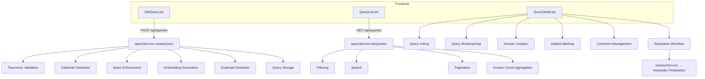
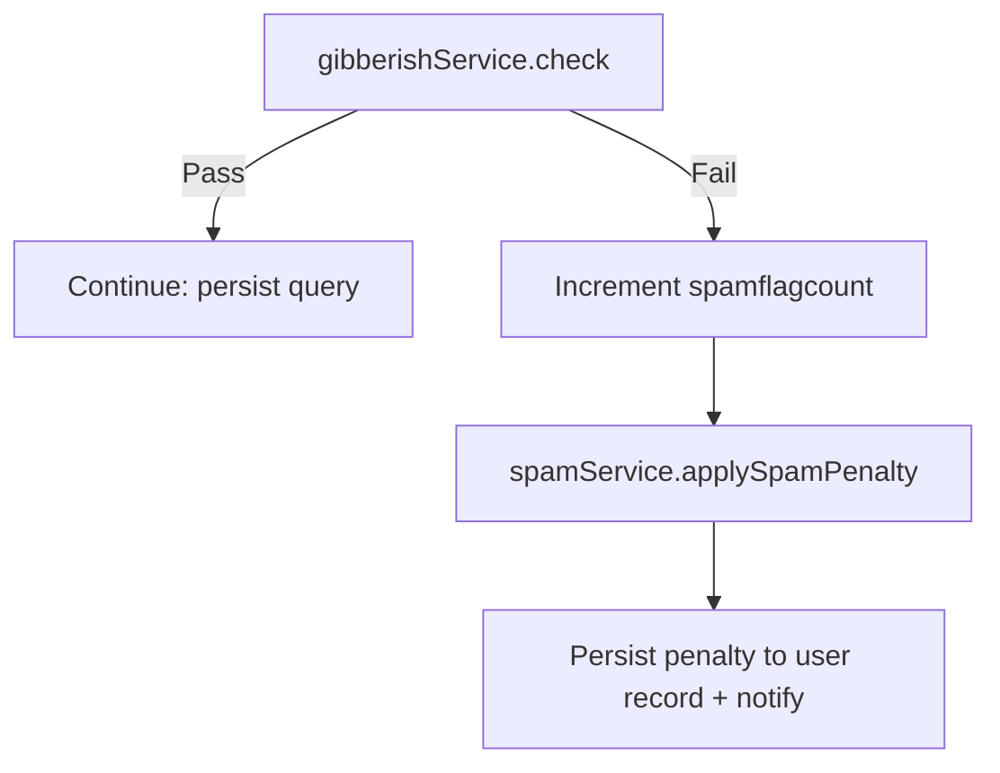

# Ask a Query & Forum Engine

A structured community support system where users post questions, receive answers, participate in threaded discussions, vote and bookmark, and reach resolution — combining traditional forum mechanics with AI-assisted quality control, duplicate detection, and automated solution finalization.

---

## 1. Overview

The Ask a Query & Forum Engine provides a structured community support system where users can post questions, receive answers, participate in threaded discussions, vote on content, bookmark useful queries, and finalize solutions. The module combines traditional forum functionality with AI-assisted quality control, duplicate detection, and automated solution resolution workflows.

The implementation is distributed across frontend pages (`AskQuery.jsx`, `QueryList.jsx`, `QueryDetail.jsx`) and backend services (`queryService.js`, `answerService.js`, `solutionService.js`, `gibberishService.js`, `spamService.js`, and `vectorService.js`).

Key capabilities include:

- Structured query submission
- Category and tag taxonomy enforcement
- Screenshot attachments
- AI-assisted grammar correction
- Gibberish detection
- Spam prevention and penalty escalation
- Duplicate query detection using vector similarity
- Hybrid keyword and semantic search
- Answer management
- Threaded comments
- Voting and bookmarking
- Helpful answer selection
- Automated solution finalization

---

## 2. Architecture Overview

The Ask a Query module follows a layered architecture. Frontend pages drive REST endpoints, which delegate to the service layer where validation, moderation, duplicate prevention, and lifecycle management are enforced.



---

## 3. Question Posting Workflow

### A. Query Submission Interface

The query creation interface is implemented in `AskQuery.jsx`. Users are required to provide:

| Field         | Required |
| ------------- | -------- |
| Title         | Yes      |
| Body          | Yes      |
| Category      | Yes      |
| Tags          | Yes      |
| Joining Date  | Yes      |
| Contact Email | Yes      |
| Attachments   | Optional |

Anonymous posting is not supported. Any anonymous flag is ignored and forced to `false` on the server.

### B. Category Selection

Categories are loaded dynamically:

```http
GET /api/taxonomy?kind=category
```

The user must select a category from the administrator-maintained taxonomy list. No free-form categories are accepted.

### C. Tag Selection

Tags are loaded dynamically:

```http
GET /api/taxonomy?kind=tag
```

Tags are selected through predefined checkboxes. Custom user-generated tags are not permitted.

### D. Attachment Support

The query form supports multiple image uploads.

```html
<input
  type="file"
  multiple
  accept="image/*"
/>
```

Attachments are submitted using `multipart/form-data`. Uploaded attachments are displayed within the interface using a lightbox viewer. The query detail page allows users to view attachment counts and open images in a zoomable preview.

### E. Grammar Correction Workflow

Before submitting a query, users may optionally perform grammar correction.

```http
POST /api/queries/autocorrect
```

The API returns:

```json
{
  "corrected": "...",
  "changes": [...]
}
```

A diff modal presents the proposed corrections. The user may **accept all changes** or **keep the original content**. When corrections are accepted, both corrected content and original content are submitted.

### F. Query Creation Pipeline

Query creation is performed through `POST /api/queries`, routed as `queryController.createQuery()` → `queryService.createQuery()`. The service performs the following operations in order:

1. Input coercion
2. Taxonomy validation
3. Joining date validation
4. Contact email validation
5. Anonymous flag enforcement
6. Gibberish detection
7. Spam handling
8. Embedding generation
9. Duplicate detection
10. Query persistence

---

## 4. Taxonomy Management

The platform uses a controlled taxonomy model. Categories and tags are validated against records stored in the taxonomy collection. Validation occurs during:

- Query creation
- Query update
- Moderator re-categorization

Invalid values immediately generate validation failures. Example validation:

```text
Taxonomy.findOne({ kind, name })
```

Only administrator-approved taxonomy values may be used.

---

## 5. Gibberish Detection Pipeline

The system implements a two-layer content quality gate.

### A. Layer 1 — Heuristic Validation

Every submitted query body passes through heuristic analysis. Checks include:

- **Minimum length** — very short submissions are rejected immediately.
- **Repeated character detection** — e.g. `aaaaaaaaaaaa` or `!!!!!!!!!!!!`. The service calculates a repeated-character ratio and rejects excessive repetition.
- **Dictionary word ratio** — the service evaluates `recognized_words / total_words`; a low ratio indicates nonsensical content.

### B. Layer 1 Outcomes

| Outcome | Result |
|---|---|
| **Pass** | Content is considered valid. |
| **Fail** | Content is immediately rejected. |
| **Borderline** | Content is escalated to Layer 2 AI analysis. |

### C. Layer 2 — AI Evaluation

Borderline content triggers AI-based validation via `ai.js cheapCall()`. Expected response:

```json
{
  "isvalid": true,
  "confidence": 0.92,
  "reason": "..."
}
```

The AI determines whether the content appears meaningful.

### D. Fail-Open Strategy

If the AI service returns HTTP 429, times out, or encounters an error, the submission is treated as valid. This prevents legitimate users from being blocked during AI quota exhaustion.

---

## 6. Spam Prevention & Penalty System

Spam enforcement is handled by `spamService.js`. A user's spam history is tracked through `user.spamflagcount`. Spam flags are generated when gibberish detection fails.

### A. Penalty Escalation Levels

| Offense Count | Action                                         |
| ------------- | ---------------------------------------------- |
| 1             | Warning notification                           |
| 2             | Warning badge + 24-hour ban                    |
| 5             | Restricted badge + moderator approval required |
| 10            | Permanent suspension                           |

### B. Enforcement Flow



Each penalty update is persisted to the user record and generates appropriate notifications.

---

## 7. Duplicate Detection & Vector Search

The platform uses embedding-based similarity detection to identify duplicate questions.

### A. Embedding Generation

After content validation, `ai.js.embed(title + body)` generates an embedding vector stored with the query. The embedding becomes the basis for semantic search and duplicate detection.

### B. Similarity Search

Generated embeddings are compared against existing queries using `vectorService.findSimilarQueries()`, which:

1. Loads stored query embeddings
2. Computes cosine similarity (`computeCosineSimilarity()`)
3. Filters by threshold
4. Returns ranked matches

### C. Duplicate Detection Logic

When similarity exceeds the configured threshold (`similarity > 0.80`), the query is marked as a potential duplicate. Query fields updated:

```text
isflaggedduplicate
duplicateof
similarityscore
```

A moderation record is also created.

---

## 8. Query Discovery & Search

The query discovery system enables users to browse, search, and filter community questions through the `QueryList.jsx` interface and the query service layer.

### A. Query Listing

Queries are retrieved through `GET /api/queries`. The backend supports status filtering, category filtering, tag filtering, pagination, full-text search, and resolved-last ordering. All filter values received through request parameters are coerced to strings before entering MongoDB filters to prevent malformed query injection.

### B. Search Functionality

The platform supports two search mechanisms:

- **Full-text search** — MongoDB text indexes for keyword-based searching: `GET /api/queries?q=<search-term>`.
- **Semantic search** — embedding-based similarity search: `GET /api/queries/search`. Uses stored embeddings and cosine similarity to locate conceptually similar queries even when exact keywords differ.

### C. Pagination

Query listings support page-based navigation. Returned metadata includes `page`, `limit`, and `total`. The frontend renders navigation controls using these values.

### D. Query Ordering

Resolved queries are intentionally pushed toward the bottom of search results (newest queries top, resolved queries bottom). This ensures active discussions remain visible.

---

## 9. Answers & Threaded Comments

Answer management is implemented through `answerService.js` and rendered through `QueryDetail.jsx`.

### A. Answer Creation

Answers are submitted through `POST /api/queries/:id/answers`. Validation rules:

- User must not be banned.
- Query author cannot answer their own question.
- Query status must be Open or Answered.
- Resolved or Archived queries cannot receive new answers.

When an answer is successfully created: the answer document is saved, the query status changes from Open to Answered, and the query author receives a notification.

### B. Answer Editing

Answers may be edited only within a 15-minute window, by the answer author, a moderator, or an administrator. The original answer body is preserved when modifications occur.

### C. Answer Deletion

The platform uses soft deletion. Deleted answers receive `isdeleted`, `deletedat`, and `deletedby`. Status reconciliation is automatically performed:

- Removing an accepted answer clears the accepted answer reference.
- Queries never remain resolved without a valid accepted answer.
- If all answers are removed, the query returns to Open status.

### D. Threaded Comments — Permissions

Comments provide limited discussion under answers. Only two users may participate: the **query author** and the **answer author**. Any other user receives an authorization error.

### E. Comment Creation

```http
POST /api/answers/:id/comments
```

Workflow: permission validation → comment creation → notification sent to the other participant.

### F. Comment Deletion

Comments use soft deletion and may be removed by the comment author, a moderator, or an administrator.

---

## 10. Helpful Answer & Resolution Workflow

The platform follows a support-ticket-style resolution model.

### A. Mark Helpful

Authorized users (query author, moderator, or administrator) call:

```http
POST /api/queries/:id/answers/:answerId/helpful
```

Actions performed:

1. Answer marked as accepted.
2. Accepted answer ID stored on the query.
3. Query status changed to Resolved.
4. Thread closure enforced.
5. Answer author awarded reputation points.
6. Notification generated.

### B. Accepted Answer Display

Accepted answers appear with a `✓ Solution` marker and are always prioritized in thread ordering.

### C. Unmark Helpful

Authorized users may reopen discussions: remove the accepted answer association, clear the acceptance flag, and change query status back to Answered. Previously awarded points remain unchanged.

---

## 11. Voting & Bookmarking

The platform supports voting on both queries and answers.

### A. Query Voting

```http
POST /api/queries/:id/vote
```

Supports upvote, downvote, and self-vote prevention. Votes are stored separately and aggregated into a query vote score.

### B. Answer Voting

```http
POST /api/answers/:id/vote
```

Answer votes use signed values (`+1` = upvote, `-1` = downvote). Self-voting is blocked. Only positive votes contribute to reputation; downvotes are recorded but do not reduce reputation.

### C. Bookmarking

Users can save useful queries:

```http
POST   /api/queries/:id/save
DELETE /api/queries/:id/save
GET    /api/queries/bookmarks
```

Bookmarks are stored using a dedicated bookmark model.

---

## 12. Solution Finalization Engine

Automated solution resolution is implemented in `solutionService.js`.

### A. Finalization Trigger

The engine runs daily through cron scheduling and can be triggered manually through an administrative endpoint.

### B. Eligibility Rules

Queries become eligible when `Status = Answered` and `Age > 48 Hours`.

### C. Manual Resolution Path

If a query already contains an accepted answer: the accepted answer is retained, high-quality answers are retained, excess answers are pruned, the query is marked Resolved, and reputation is awarded.

### D. Automatic Resolution Path

If no accepted answer exists after 48 hours: the highest-voted answer is selected and marked accepted, the query is resolved automatically, and no reputation is awarded.

### E. Answer Pruning

To keep resolved discussions concise, accepted and high-value answers are retained and the remainder may be soft-deleted. A maximum of three answers are preserved.

### F. Audit Logging

Every finalization event creates an audit record containing the query identifier, resolution action, timestamp, and system activity metadata.

---

## 13. Frontend Responsibilities

| Component       | Responsibility                                                                 |
| --------------- | ------------------------------------------------------------------------------ |
| AskQuery.jsx    | Query submission, attachments, grammar correction, duplicate warnings          |
| QueryList.jsx   | Search, filtering, pagination, query discovery                                 |
| QueryDetail.jsx | Full thread view, voting, bookmarking, answers, comments, resolution workflows |

---

## 14. Service Layer Responsibilities

| Service          | Responsibility                                                        |
| ---------------- | --------------------------------------------------------------------- |
| queryService     | Query lifecycle, validation, duplicate detection, voting, bookmarking |
| answerService    | Answer management, comments, helpful workflow, verification           |
| solutionService  | Automatic solution finalization and cron execution                    |
| gibberishService | Content quality validation                                            |
| spamService      | Spam penalty enforcement                                              |
| vectorService    | Semantic similarity search and duplicate detection                    |

---

## 15. API Summary

| Method | Endpoint                                   | Purpose             |
| ------ | ------------------------------------------ | ------------------- |
| POST   | /api/queries                               | Create query        |
| GET    | /api/queries                               | List queries        |
| GET    | /api/queries/search                        | Hybrid search       |
| GET    | /api/queries/:id                           | Query details       |
| POST   | /api/queries/:id/vote                      | Vote on query       |
| POST   | /api/queries/:id/save                      | Save query          |
| POST   | /api/queries/:id/answers                   | Create answer       |
| POST   | /api/answers/:id/vote                      | Vote on answer      |
| POST   | /api/answers/:id/comments                  | Create comment      |
| POST   | /api/queries/:id/answers/:answerId/helpful | Mark helpful        |
| POST   | /api/admin/answers/:id/verify              | Verify answer       |
| POST   | /api/jobs/solution-finalization/run        | Manual finalization |

---

## 16. End-to-End Workflow

1. User opens AskQuery page.
2. Categories and tags are loaded from taxonomy endpoints.
3. User submits a query with required metadata and optional attachments.
4. Query passes taxonomy validation.
5. Query passes gibberish detection.
6. Spam penalties are applied if validation fails.
7. Embeddings are generated.
8. Duplicate detection is performed.
9. Query is stored.
10. Community members submit answers.
11. Eligible users participate in threaded comments.
12. Answers receive votes.
13. Users bookmark useful discussions.
14. Query author marks an answer as helpful, or the automated finalization engine resolves the query after 48 hours.
15. Query status becomes Resolved.
16. Audit logs and notifications are generated.

---

## 17. Conclusion

The Ask a Query & Forum Engine combines structured query submission, taxonomy-based organization, AI-assisted content validation, semantic duplicate detection, community-driven answering, voting, bookmarking, and automated solution finalization. The module ensures that discussions remain searchable, moderated, and resolution-oriented while maintaining data integrity through validation, soft deletion, audit logging, and controlled workflow transitions.
