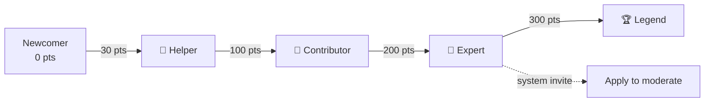

# Reputation, Badges & Moderation

A detailed overview of Curio's reputation economy and governance layer: how points are earned, how positive and negative badges are applied, how answers get admin-verified, and how moderators and the escalation/moderation queues keep the knowledge base clean.

---

## 1. Points System

Users earn reputation points through contributions. Points never go negative (floor is 0).

| Action                                   | Points | Trigger                                                  |
| ---------------------------------------- | ------ | -------------------------------------------------------- |
| Answer accepted (marked helpful)         | +15    | Question author resolves their query                     |
| Answer liked (upvoted)                   | +2     | Per upvote from the question author (only they can rate) |
| Query resolved (asker's question closed) | +5     | Awarded to the asker                                     |

Only answer upvotes move reputation. Downvotes never deduct points (avoids griefing). The single entry point for all points changes is `awardPoints()` in `server/services/badgeService.js`.

---

## 2. Positive Badge Tiers

Badges are earned automatically when a user's points reach a threshold. They are synced on every points change and recalculated daily by the M7 job (`recalcAllBadges`).

| Tier        | Key           | Icon   | Threshold |
| ----------- | ------------- | ------ | --------- |
| Newcomer    | `newcomer`    | (none) | 0 pts     |
| Helper      | `helper`      | 🥉     | 30 pts    |
| Contributor | `contributor` | 🥈     | 100 pts   |
| Expert      | `expert`      | 🥇     | 200 pts   |
| Legend      | `legend`      | 🏆     | 300 pts   |

Definitions live in `server/config/constants.js` → `POSITIVE_BADGES`. Client-side mirror in `client/src/lib/reputation.js`.

### A. Badge Display

- `topBadge(badgeKeys)` returns the single highest-tier badge for display under a user's name.
- `standing(points)` returns the current tier, next tier, points-to-next, and a progress percentage.
- `badgeDefs(keys)` maps stored badge keys to full definitions for a badges strip.

### B. Expert → Moderator Invitation

When a user reaches Expert (200 pts), they automatically receive a system notification inviting them to apply for moderator access from their Settings page. The application sets `moderator_requested = true` for admin review.

---

## 3. Negative Badges

Admin-issued or spam-escalated penalties on a user's account. Defined in `server/config/constants.js` → `NEGATIVE_BADGES`.

| Badge      | Key          | Icon | Effect                                                      |
| ---------- | ------------ | ---- | ----------------------------------------------------------- |
| Warning    | `warning`    | ⚠️   | Informational only                                          |
| Restricted | `restricted` | 🚫   | `requires_approval = true` — all posts need admin clearance |
| Suspended  | `suspended`  | ☠️   | Permanent ban (`is_banned = true`, `ban_expires_at = null`) |

### A. Spam Escalation (Automatic)

The spam escalation ladder in `server/services/spamService.js` applies penalties at strike thresholds:

| Strike Count | Penalty       | Effect                          |
| ------------ | ------------- | ------------------------------- |
| 1            | Warning       | No badge, just a logged strike  |
| 2            | Warning badge | Plus 24h temporary ban          |
| 5            | Restricted    | Requires approval for all posts |
| 10           | Suspended     | Permanent ban                   |

Higher tiers win — a single `recordSpamStrike()` call applies the most severe penalty the user's count has reached.

### B. Admin-Issued Negative Badges

Admins can manually issue or revoke negative badges via `userService.issueNegativeBadge()` / `revokeNegativeBadge()`. All issuances are logged to the Audit Log and trigger a notification to the affected user.

---

## 4. Admin-Verified Answers

Admins can mark an answer as "verified" (`server/services/answerService.js` → `setVerified()`). This:

1. Sets `answer.is_verified = true` and records `verified_by` (admin's ID).
2. Awards the answerer a **persistent** Admin Verified badge (`custom_badges` array on the User model) — kept even if the answer is later unverified.
3. Verified answers sort above all others in the answer list (`listAnswers` sorts by `is_verified: -1` first).

The Admin Verified badge definition lives in `server/config/constants.js` → `VERIFIED_ANSWER_BADGE` (key: `admin-verified`, icon: ✅).

---

## 5. Moderator Role

Moderators are non-admin users with elevated privileges. Reaching Expert (200 pts) triggers a system notification inviting the user to apply via Settings; an admin reviews and grants `is_moderator` from the Users tab — visible in `AdminModerators.jsx` alongside each person's role and points. Moderation is admin-granted (independent of badge tier), and moderators share all moderation powers with admins.

### A. Powers

- Delete any query or answer (soft-delete, within 15-minute rollback window)
- Restore soft-deleted content (within the rollback window)
- Edit a question's category/tags (`moderateTaxonomy` in `queryService`)
- Rate answers on any question (not just their own)
- Clear comments
- Flag questions for admin attention

### B. Granting Moderation

**Flow:** User reaches Expert → gets system invite → requests access from Settings (`moderator_requested = true`) → Admin grants via `setModerator()` in `userService`.

**Direct grant:** An admin can set `is_moderator = true` on any user at any time.

**Revocation:** An admin sets `is_moderator = false`.

The moderator roster is visible in `AdminModerators.jsx`, listing both moderators and admins (who moderate implicitly).

---

## 6. "Needs Attention" Escalation Queue

Expert-tier members and moderators can flag questions that need admin review (`server/services/queryService.js` → `flagForAttention()`).

### A. Who Can Flag

Only users holding the Expert badge (key: `expert`) or moderators/admins can flag a question for admin attention. The required badge key is configured in `constants.js` → `ATTENTION_FLAG_BADGE_KEY`.

### B. Behavior

- Sets `query.needs_attention = true`, records `attention_flagged_by` (user ID) and `attention_flagged_at` (timestamp).
- The question appears in `AdminAttention.jsx`, grouped by category, sorted by posting date then the asker's join date.
- An admin marks it "handled" via `clearAttention()`, which resets the three fields above.
- The admin overview dashboard shows the queue count in `metrics.needs_attention`.

### C. Attention Queue View

The queue (in `AdminAttention.jsx`) lists questions by the asker's email address, grouped by category. Each item shows a relative timestamp and a "Mark handled" button.

---

## 7. Moderation Queue (Content Flags)

Separate from the attention queue — this handles reported content (spam, duplicate flags, etc.). The queue (`AdminModeration.jsx`) lists pending flags filtered by type. Per item, admins can **Resolve**, **Dismiss**, or **Merge** (duplicate pairs only, using cosine similarity ≥ 80%). The page also shows amalgamation clusters — groups of semantically similar questions (similarity ≥ 60%) — and lets admins bulk-merge an entire cluster into its canonical question.

| Flag Type | Source                                                     |
| --------- | ---------------------------------------------------------- |
| Duplicate | Auto-flagged when a user posts despite a duplicate warning |
| Report    | Manual report via `reportContent()`                        |
| Spam      | Auto-detected gibberish submissions                        |
| Outdated  | Manual flag                                                |
| Gibberish | Auto-detected                                              |

Queue operations: `listModeration()`, `resolveModeration()`, `dismissModeration()` — all in `server/services/adminService.js`.

---

## 8. Key Files

| File                                            | Role                                                |
| ----------------------------------------------- | --------------------------------------------------- |
| `server/config/constants.js`                    | All thresholds, badge definitions, and time windows |
| `server/services/badgeService.js`               | Points → badges logic, `awardPoints` entry point    |
| `server/services/spamService.js`                | Spam strike escalation ladder                       |
| `server/services/userService.js`                | Negative badge CRUD, moderator management           |
| `server/services/answerService.js`              | `setVerified`, voting, helpful toggle               |
| `server/services/queryService.js`               | `flagForAttention`, `moderateTaxonomy`              |
| `server/services/adminService.js`               | Attention queue, moderation queue, rollback         |
| `client/src/lib/reputation.js`                  | Client-side tier calculation                        |
| `client/src/pages/admin/AdminAttention.jsx`     | Attention queue UI                                  |
| `client/src/pages/admin/AdminModerators.jsx`    | Moderator roster UI                                 |
| `client/src/pages/admin/AdminRollback.jsx`      | Undo-deletion UI                                    |
| `server/models/User.js`                         | User schema (badge arrays, ban flags)               |
