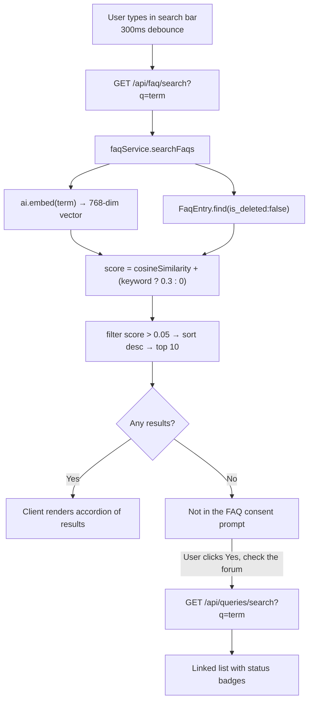
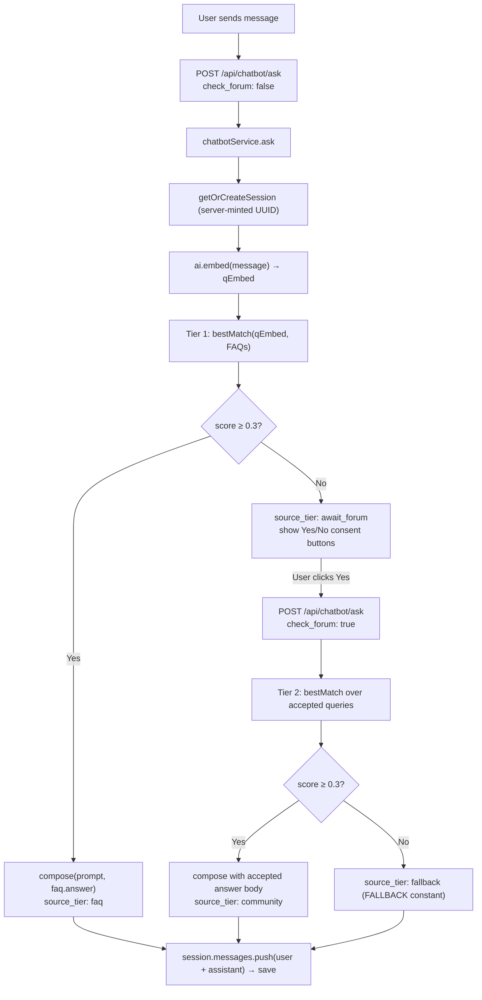
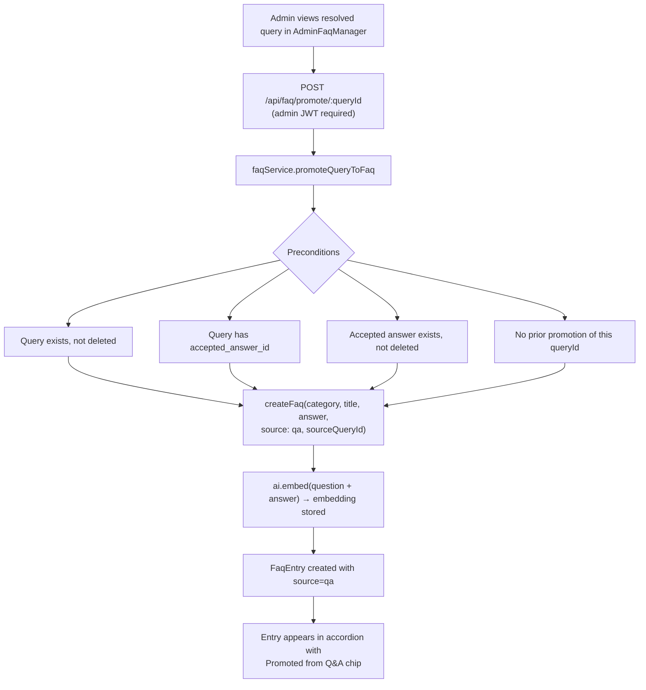

# FAQ Knowledge Base & AI Chatbot


## 1. Overview

The FAQ Knowledge Base and AI Chatbot form **Pillar 1** of the platform's three-pillar architecture. Their purpose is to surface definitive, curated answers to users as quickly as possible — first from the canonical FAQ, then (with the user's consent) from resolved community threads — before asking the user to raise a new query.

The system has three interlocking parts:

- **The FAQ store** — a MongoDB-backed collection of curated entries organized by category, each carrying a 768-dimensional embedding vector for semantic retrieval.
- **The RAG chatbot** — a consent-gated, three-tier retrieval-augmented generation pipeline that grounds every answer in either a FAQ entry or a resolved community Q&A thread before composing a response with the AI model, with a hard fallback when neither source has a confident match.
- **The AI boundary module** (`server/config/ai.js`) — the single file in the entire codebase permitted to call the AI provider. It switches between a deterministic offline mock and the live Gemini API based solely on whether `AI_API_KEY` is set, making the system fully functional with zero cost or network access in development, CI, and demo environments.

Both the FAQ and the chatbot share the same underlying vector infrastructure: `vectorService.cosineSimilarity` is the comparison function, and `ai.embed` is the single embedding call site.

---

## 2. Data Model — FaqEntry

**File:** `server/models/FaqEntry.js`

```
faq_entries collection
├── category          String  (required, indexed)
├── question          String  (required)
├── answer            String  (required)
├── sort_order        Number  (default 0 — controls display order within a category)
├── source            Enum    'admin' | 'qa'
├── source_query_id   ObjectId → Query  (set when source = 'qa')
├── last_accessed_at  Date    (LRU tracking)
├── access_count      Number  (LRU tracking)
├── is_outdated       Boolean (admin-flaggable)
├── embedding         [Number, 768 dims]  (hidden from API responses)
├── is_deleted        Boolean (soft-delete)
├── deleted_at        Date
└── timestamps        (createdAt, updatedAt)
```

**Text index:** MongoDB text index on `{ question: 'text', answer: 'text' }` supplements full-text queries; however, all FAQ searches in production run through the semantic embedding path, not this index directly.

**Embedding validation:** The schema validator enforces `embedding.length === 768` (the value of `EMBEDDING_DIMS`). Any attempt to store an incorrectly sized vector is rejected at the Mongoose layer.

**Embedding exposure:** The `strip()` helper in `faqService.js` removes two internal fields from every object returned to callers — `embedding` (the raw vector) and `__v` (Mongoose's internal version key). The actual implementation is:

```js
const strip = ({ embedding, __v, ...rest }) => ({ ...rest, id: rest._id });
```

All remaining fields — including `_id` itself — are spread into the returned object, with `id` added as an alias for `_id`. The raw embedding vector is never sent over the API.

---

## 3. Embeddings and Cosine Similarity

**File:** `server/services/vectorService.js`

Semantic similarity across the entire platform — for FAQ search, chatbot retrieval, duplicate query detection, and query amalgamation — is computed by a single pure function:

```js
export function cosineSimilarity(a, b) {
  // dot(a, b) / (||a|| * ||b||)
  // Returns 0 if either argument is malformed or zero-norm.
}
```

The function iterates once over both vectors accumulating the dot product and both squared norms, then divides. It short-circuits to `0` for malformed inputs (non-array, mismatched lengths, zero-norm denominator) rather than throwing, so callers do not need to guard against edge-case vectors.

**Why in-app cosine similarity instead of a dedicated vector store?**

Per the project constraints and architecture decisions (`PLANNING.md §3`), a dedicated vector index (e.g. MongoDB Atlas Vector Search, pgvector, Pinecone) is explicitly deferred to production. For MVP corpus sizes — a few hundred FAQ entries, thousands of community queries at most — serialized in-app cosine comparison over all documents has negligible latency, requires zero additional infrastructure, and is trivially replaceable: callers pass embeddings and receive scores; the comparison function is a one-file swap. See [Section 14](#14-production-swap-guide) for the upgrade path.

`vectorService.js` also exports `findSimilarQueries`, used by the duplicate-detection and amalgamation subsystems, but the FAQ and chatbot pipelines call `cosineSimilarity` directly after fetching candidates themselves.

---

## 4. FAQ Service

**File:** `server/services/faqService.js`

This is the authoritative service layer for all FAQ operations. No controller, route, or other service reaches into the `FaqEntry` model directly — all reads and writes go through these exported functions.

### A. Listing FAQs — Category Grouping

```js
export async function listFaqs({ category } = {})
```

Fetches all non-deleted entries, optionally filtered to a single category. The query sorts by `{ category: 1, sort_order: 1, createdAt: 1 }` so entries within a category appear in admin-specified order (via `sort_order`), with creation-time as a stable tiebreaker. Results are then grouped in a single in-memory pass into the shape:

```json
[
  { "category": "Account", "items": [ ... ] },
  { "category": "Billing", "items": [ ... ] }
]
```

This array is what the `Faq.jsx` page receives and renders as category accordion sections. The `category` query parameter uses `String(category)` coercion to prevent NoSQL operator injection before passing to the Mongoose filter.

### B. Hybrid Semantic Search

```js
export async function searchFaqs(query)
```

Takes a user-supplied query string and returns up to 10 ranked FAQ entries. The scoring is a hybrid of two signals:

**Semantic score** — The query string is embedded via `ai.embed(q)` to produce a 768-dimensional query vector. Each stored FAQ entry's `embedding` field is compared against this vector using `cosineSimilarity`. Entries without an embedding receive a semantic score of `0`.

**Keyword boost** — If the lower-cased query string is a substring of either the entry's `question` or `answer` field, `0.3` is added to the entry's score. This ensures that obvious exact-phrase matches are never buried below semantically proximate but less relevant entries.

**Filtering and ranking** — Entries with a combined score ≤ `0.05` are discarded. The remainder are sorted descending and the top 10 are returned, each decorated with a `score` field (rounded to 3 decimal places) for transparency.

The search is stateless and public — no authentication is required.

### C. Creating FAQ Entries

```js
export async function createFaq({ category, question, answer, sort_order, source, sourceQueryId, force })
```

All three required fields (`category`, `question`, `answer`) are validated before any AI call is made. The combined text `"${question}\n\n${answer}"` is embedded via `ai.embed` and stored in the `embedding` field.

**Near-duplicate guard (admin-authored entries only):** When `source === 'admin'` and `force` is not set, the service fetches all existing non-deleted entries and checks every one for:

- An exact case-insensitive question match, or
- A cosine similarity ≥ `FAQ_DUPLICATE_THRESHOLD` (0.95) between the new entry's embedding and the existing entry's embedding.

If either condition is met, a `409 Conflict` is thrown with a `duplicate: true` payload that includes the matching entry's `id`, `question`, and similarity `score`. The admin UI can surface this to the operator and offer a `force: true` override to create the entry anyway.

Entries promoted from Q&A (`source === 'qa'`) bypass this guard intentionally — the promotion flow (see [E](#e-promoting-a-resolved-qa-to-faq)) has its own idempotency check.

### D. Updating and Soft-Deleting Entries

**`updateFaq(id, fields)`** — Applies partial updates to an entry. If the `question` or `answer` text changes, the embedding is automatically recomputed (`ai.embed(faqText(question, answer))`), keeping the vector in sync with the content. Changes to `category`, `sort_order`, and `is_outdated` never trigger re-embedding.

**`setFaqOutdated(id, isOutdated)`** — A dedicated toggle to mark or unmark an entry as outdated. Used by the admin FAQ manager when content becomes stale without requiring a full edit.

**`deleteFaq(id)`** — Soft-deletes the entry by setting `is_deleted = true` and `deleted_at = now`. The record is retained in the database for audit purposes and is excluded from all `listFaqs` and `searchFaqs` results by the `{ is_deleted: false }` filter.

### E. Promoting a Resolved Q&A to FAQ

```js
export async function promoteQueryToFaq(queryId)
```

This function is the bridge between Pillar 3 (the Q&A forum) and Pillar 1 (the FAQ). It allows an admin to "graduate" a community question into the curated FAQ once the community has produced a high-quality answer.

**Preconditions checked:**

1. The query must exist and not be soft-deleted.
2. The query must have an `accepted_answer_id` (only resolved questions qualify — unresolved questions are rejected with a `400`).
3. The accepted answer must still exist and not be deleted.
4. No prior promotion of this query may exist — re-promoting the same query returns a `409`.

When all checks pass, `createFaq` is called with:
- `category` — taken directly from the query's `category` field.
- `question` — the query's `title`.
- `answer` — the accepted answer's `body`.
- `source: FAQ_SOURCE.QA` — flags the entry as community-sourced so the UI can display a "Promoted from Q&A" badge.
- `sourceQueryId` — the originating query's `_id`, stored for traceability.

Because `source` is `'qa'`, the near-duplicate guard is skipped. The promoted entry gets its own fresh embedding computed from the question/answer text.

---

## 5. FAQ Routes and Access Control

**File:** `server/routes/faqRoutes.js`

| Method | Path | Auth | Description |
|--------|------|------|-------------|
| `GET` | `/api/faq` | Public | List all entries grouped by category |
| `GET` | `/api/faq/search` | Public | Semantic + keyword search (`?q=`) |
| `POST` | `/api/faq` | Admin only | Create a new FAQ entry |
| `POST` | `/api/faq/promote/:queryId` | Admin only | Promote a resolved query to FAQ |
| `PATCH` | `/api/faq/:id` | Admin only | Edit an existing FAQ entry |
| `POST` | `/api/faq/:id/outdated` | Admin only | Toggle outdated flag |
| `DELETE` | `/api/faq/:id` | Admin only | Soft-delete an entry |

Public reads are unauthenticated by design. All write operations require a valid JWT with `role: 'admin'` — the `auth` middleware verifies the token and the `admin` middleware checks the role, both applied as Express middleware before the controller.

---

## 6. FAQ Page — Frontend

**File:** `client/src/pages/Faq.jsx`

### A. Category Accordions

On mount, the page calls `listFaqs()` via the `GET /api/faq` endpoint and stores the returned `groups` array in state. Each group becomes a collapsible category section:

- A category header button toggles the `openCats` state entry for that category.
- The **first category is opened by default** on load (`setOpenCats({ [data[0].category]: true })`).
- Within an open category, at most `PREVIEW_COUNT` (5) items are shown initially. A "View all N articles" button expands the full list; a second click collapses back to the preview.
- Each individual FAQ item is a `FaqItem` component — a button that reveals the answer panel on click by toggling `openItems` state.

**Promoted entries** are visually distinguished: `FaqItem` renders a `"Promoted from Q&A"` chip alongside the question text when `entry.source === 'qa'`.

### B. Live Semantic Search

When the user types in the search bar, a 300ms debounced effect fires `searchFaqs(term)` against `GET /api/faq/search?q=`. Results replace the accordion view entirely. A new search resets `forumResults` to `null` (meaning "never checked") so any prior forum opt-in is invalidated.

Clicking "Clear" calls `setResults(null)` and `setForumResults([])` (an empty array, meaning "checked and found nothing"). In practice the entire results block disappears when `results` is `null`, so the visual effect is the same — the category accordion is restored. The distinction between `null` and `[]` matters for the conditional rendering logic: `null` shows the consent prompt when search finds nothing; `[]` renders the empty community-results state.

The search hint explicitly tells the user that semantic search is active, encouraging natural-language queries ("how do I report data?") rather than just keyword lookups.

### C. Consent-Gated Forum Fallback

If the semantic search returns zero FAQ results, the page shows a consent prompt: **"Not in the FAQ. Do you want me to check in the forum?"** The community database is never queried until the user clicks "Yes, check the forum." This mirrors the chatbot's `await_forum` tier and ensures the platform never implicitly searches user-generated content.

Upon consent, `searchQueries(term)` is called against the community forum API. Results are displayed as a linked list of query titles with status badges. If the forum also returns nothing, the user is directed to raise a new query via `/ask`.

---

## 7. Chatbot Service — Tiered Grounded RAG Pipeline

**File:** `server/services/chatbotService.js`

The chatbot implements a **consent-gated three-tier RAG pipeline**: Tier 1 answers from the curated FAQ, Tier 2 (after explicit user consent) searches resolved community Q&A, and Tier 3 is a hard fallback when neither source returns a confident match. Every answer in Tiers 1 and 2 is grounded in retrieved documents from the platform's own knowledge base before being passed to the AI model for composition. The AI never answers from general knowledge alone.

The key constant governing retrieval confidence is `CHATBOT_MATCH_THRESHOLD = 0.3` from `constants.js`. A retrieved document must exceed this cosine similarity score to be used as context.

### A. Tier 1 — Curated FAQ Answer

On every new question (when `checkForum` is `false`), the service:

1. Embeds the user's question via `ai.embed(text)`.
2. Fetches all non-deleted `FaqEntry` documents, selecting only `question`, `answer`, and `embedding`.
3. Finds the single best-scoring FAQ entry using `bestMatch()`, which scans the list computing `cosineSimilarity(qEmbed, doc.embedding)` for each entry.
4. If `faqHit.score >= CHATBOT_MATCH_THRESHOLD`, the service calls `compose()` with a grounded prompt built from the FAQ entry's question and answer text (see [E](#e-prompt-construction-and-grounded-composition)). The response carries:
   - `source_tier: 'faq'`
   - `citations: [{ kind: 'faq', ref_id: entry._id, title: entry.question }]`

### B. Tier 2 — Consent and Resolved Community Q&A

If Tier 1 finds no confident FAQ match, the service does **not** silently fall through to the community database. Instead it returns:

```json
{
  "content": "I couldn't find this in the FAQ. Do you want me to check the community forum for a related discussion?",
  "source_tier": "await_forum",
  "awaiting_forum": true,
  "citations": []
}
```

The client (`Chatbot.jsx`) stores the original question in `pending` state and renders "Yes, check the forum" / "No, thanks" buttons alongside the message.

When the user consents, the client re-calls `POST /api/chatbot/ask` with `check_forum: true` and the same `session_token`. The service then:

1. Fetches all non-deleted, accepted, and embedding-carrying `Query` documents.
2. Finds the best-scoring resolved query via `bestMatch()`.
3. If `qHit.score >= CHATBOT_MATCH_THRESHOLD`, fetches the accepted answer body and calls `compose()` with a grounded prompt. The response carries:
   - `source_tier: 'community'`
   - `citations: [{ kind: 'query', ref_id: query._id, title: query.title }]`

The citation links directly to the forum thread (`/queries/:ref_id`), so the user can follow up in the community.

### C. Tier 3 — Graceful Fallback

If Tier 2 also finds no match above the threshold, the service returns:

```
"I couldn't find this in the FAQ or the community forum. Try rephrasing your question, browse the FAQ, or raise a query so the community can help."
```

with `source_tier: 'fallback'` and an empty `citations` array. This message is hard-coded in the service (`FALLBACK` constant) and does not involve any AI call — it is always available even when the AI provider is down.

### D. Session Management

Every chatbot exchange is persisted to a `ChatbotSession` document.

**Session token:** Tokens are minted server-side using `crypto.randomUUID()`. The client never sets its own token — a client-supplied `session_token` is only used to look up an existing session. This prevents session fixation attacks.

**Session ownership:** An anonymous session (no `user_id`) can be claimed by a logged-in user on first access (the `user_id` is written on reuse). A session owned by a specific user is rejected if a different authenticated user presents its token — the service starts a fresh session instead. Unauthenticated users can read any anonymous session they hold the token for.

**Message persistence:** Each turn appends two messages to `session.messages`: one `role: 'user'` and one `role: 'assistant'`. The assistant message stores `source_tier` and `citations` so the client can reconstruct the full annotated history on session restore. On the consent step, the user turn is recorded as "Yes, check the forum." rather than the original question, matching the actual consent interaction.

**Session restore:** On panel open, `Chatbot.jsx` calls `GET /api/chatbot/session/:token` to hydrate prior messages into local state.

### E. Prompt Construction and Grounded Composition

The `buildPrompt(question, contextLabel, contextText)` helper produces:

```
You are the FAQ Platform assistant. Answer the user using ONLY the context below.
Be concise and accurate. If the context does not fully answer, say what is missing.

Context (<contextLabel>):
<contextText>

User question: <question>
```

The instruction "ONLY the context below" is intentional — it prevents the model from supplementing with general knowledge, keeping answers grounded exclusively in platform content.

The `compose(prompt, grounded)` function calls `ai.chat(prompt, grounded)`. The second argument is the raw retrieved text (FAQ answer or community answer body) used as the mock-mode return value and as a fallback if the live call throws or returns an empty string. This means the chatbot always returns a useful, grounded answer even during a provider outage or rate-limit event — it falls back to the raw retrieved text rather than an error message.

---

## 8. Chatbot Routes and Rate Limiting

**File:** `server/routes/chatbotRoutes.js`

| Method | Path | Auth | Rate limit |
|--------|------|------|------------|
| `POST` | `/api/chatbot/ask` | Optional | `aiLimiter`: 20 requests / 60 s per IP |
| `GET` | `/api/chatbot/session/:token` | Optional | None |

The chatbot is publicly accessible — authentication is optional (`optionalAuth`). When a valid JWT is present, the session is linked to the authenticated user. Without a token the session remains anonymous.

The `aiLimiter` (20 req/min) is applied to `/ask` because each request may trigger one or two AI calls (an embedding plus a chat completion). The tight budget reflects the Gemini free-tier reality (~10 RPM shared across the whole application).

---

## 9. Chatbot Component — Frontend (Chatbot.jsx)

**File:** `client/src/components/Chatbot.jsx`

The chatbot renders as a floating action button (`chat-fab`) fixed to the viewport. Clicking it opens a `chat-panel` overlay. The component is mounted globally in `App.jsx` as a sibling to `<AppShell>`, not inside it:

```jsx
<>
  <AppShell>...</AppShell>
  <Chatbot />   {/* sibling, not child */}
</>
```

This placement means the chatbot overlay is always available regardless of which route is active inside the shell. The component listens for a `window` event `'open-chatbot'` so any part of the application (e.g. the Home page's "Ask the Assistant" card) can open it programmatically via `window.dispatchEvent(new Event('open-chatbot'))`.

**State:**
- `messages` — array of `{ role, content, source_tier, citations }` objects rendered in the panel.
- `input` — controlled text input.
- `busy` — disables the send button and input during an in-flight API call.
- `pending` — stores the original question when the assistant is waiting for forum-search consent (`source_tier === 'await_forum'`). Cleared on consent, decline, or new question.

**Consent flow in the UI:** When the latest assistant message has `source_tier === 'await_forum'` and `pending` is set, the message bubble is followed by two buttons: "Yes, check the forum" (calls `runAsk(pending, true)`) and "No, thanks" (calls `declineForum()`). Declining appends a hard-coded assistant message:

```
"No problem. You can browse the FAQ or raise a query and the community will help."
```

with `source_tier: 'fallback'`, and clears `pending`. These consent buttons only appear on the most recent assistant message.

**Source attribution:** Non-fallback, non-consent assistant messages display a `chat-cite` line below the bubble: "Source: FAQ" or "Source: Community Q&A", with a link to the specific FAQ entry title or a clickable `<Link>` to the forum thread (`/queries/:ref_id`) for community citations.

**Session persistence:** The session token is stored in `localStorage` under the key `'chatbotSession'`. On panel open, if a token exists and the messages array is empty, the session history is loaded from the server.

**Source tier labels** are defined as a module-level constant:

```js
const TIER_LABEL = { faq: 'FAQ', community: 'Community Q&A', ai: 'AI', fallback: '' };
```

The backend (`chatbotService.js`) returns four `source_tier` values: `'faq'`, `'await_forum'`, `'community'`, and `'fallback'`. The `'ai'` key in `TIER_LABEL` has **no corresponding backend tier** — the service never emits `source_tier: 'ai'`. It is dead/unused code in the frontend constant. The `fallback` and `await_forum` tiers intentionally produce no source attribution label in the UI (empty string and no match respectively).

---

## 10. The AI Module — Swappable Mock/Live Boundary

**File:** `server/config/ai.js`

This is the **only file in the entire codebase that imports or calls the AI provider SDK**. No service, controller, model, or job may import `@google/genai` directly. All AI operations — embedding, cheap JSON calls, chat completions — go through the `ai` object exported from this module.

This isolation means swapping the AI provider in production is a change to one file and its environment variables, not a codebase-wide refactor.

### A. Mock Mode

Mock mode is active whenever `AI_API_KEY` is absent or empty:

```js
get mockMode() {
  return !this.apiKey;
}
```

In mock mode:

- **`ai.embed(text)`** returns a deterministic 768-dimensional vector computed by a hash-based function (`mockEmbed`). Tokens are extracted from the text, each is hashed with a polynomial rolling hash, and the result at `hash % dims` is incremented. The vector is L2-normalized so cosine similarity behaves correctly. The vectors are not semantically meaningful but are stable across runs — the same text always produces the same vector, making tests deterministic.
- **`ai.cheapJson(prompt, mockResult)`** returns `mockResult` immediately, without any network call.
- **`ai.chat(prompt, mockText)`** returns `mockText` if provided, otherwise the hard-coded offline message: `"I'm running in offline mode right now, so I can't compose a live answer. Please browse the FAQ or ask the community."`

Mock mode allows the entire platform — including FAQ search, chatbot, and duplicate detection — to run with zero network access and zero quota consumption. This is the default for all local development, CI pipelines, and demo environments without a configured API key.

### B. Live Mode — Gemini via @google/genai

When `AI_API_KEY` is set, the module lazily constructs a `GoogleGenAI` client on the first call and reuses it for all subsequent requests. The SDK is imported dynamically (`await import('@google/genai')`) so it is only loaded when actually needed.

The models used, all configurable via environment variables:

| Purpose | Default model | Env var |
|---------|--------------|---------|
| Chat / RAG composition | `gemini-2.5-flash` | `AI_CHAT_MODEL` |
| Cheap JSON (gibberish, autocorrect) | `gemini-2.5-flash-lite` | `AI_CHEAP_MODEL` |
| Embeddings | `gemini-embedding-001` | `AI_EMBED_MODEL` |
| Embedding dimensions | `768` | `AI_EMBED_DIMS` |

The embedding call uses `outputDimensionality: config.ai.embedDims` to request fixed-size vectors, ensuring all stored embeddings across the database are the same length and cosine similarity is always valid.

### C. Request Queue and Exponential Backoff

All live AI calls are serialized through a shared promise chain (`queue`) and wrapped in an exponential backoff retry loop:

- **Serialization:** `enqueue(fn)` chains each new call onto the previous promise. This ensures the application never issues concurrent AI requests that would blow the Gemini free-tier RPM quota (~10 RPM as of Dec 2025).
- **Backoff:** `withBackoff(fn)` retries up to `MAX_RETRIES` (4) times on `HTTP 429` (rate limit) responses with a delay of `BASE_DELAY_MS * 2^attempt + random(0..200ms)`. Any other error is re-thrown immediately.
- **Chain resilience:** Failed calls do not poison the queue — `queue = run.catch(() => {})` keeps the chain alive even after a rejection.

This means a transient quota spike degrades gracefully: the call eventually succeeds after backoff, or fails cleanly and allows the `compose()` function in `chatbotService` to return the grounded fallback text.

### D. Public API Surface

```js
ai.mockMode           // Boolean — true when no API key is set
ai.embed(text)        // Promise<number[]> — 768-dim vector
ai.embedBatch(texts)  // Promise<number[][]> — parallel embed (used by seed)
ai.cheapJson(prompt, mockResult)  // Promise<object> — structured JSON call
ai.chat(prompt, mockText)         // Promise<string> — chat completion
```

---

## 11. Key Thresholds and Constants

**File:** `server/config/constants.js`

| Constant | Value | Where used |
|----------|-------|------------|
| `EMBEDDING_DIMS` | `768` | Schema validation, mock embed size, `outputDimensionality` |
| `CHATBOT_MATCH_THRESHOLD` | `0.3` | Tier 1 and Tier 2 retrieval in `chatbotService` |
| `FAQ_DUPLICATE_THRESHOLD` | `0.95` | Near-duplicate guard in `createFaq` (admin entries) |
| `DUPLICATE_SIMILARITY_THRESHOLD` | `0.8` | Community query duplicate detection |
| `AMALGAMATION_SIMILARITY_THRESHOLD` | `0.6` | Admin amalgamation grouping |
| `FAQ_SOURCE.ADMIN` | `'admin'` | Manually curated entries |
| `FAQ_SOURCE.QA` | `'qa'` | Promoted community entries |

All thresholds are centralized in `constants.js` and imported by the services that need them. Tuning similarity cutoffs for production is a constants-file change, not a service-layer change.

---

## 12. Embedding Refresh Job

**File:** `server/jobs/embeddingRefresh.js`

Over time, query content may be edited in ways that bypass the normal embedding hook (e.g. direct database fixes, model migrations). The `embeddingRefresh` job handles this:

1. Fetches all non-deleted queries.
2. For each query, computes `SHA-256(title + "\n\n" + body)` and compares it to the stored `embedding_hash`.
3. If the hash differs, re-embeds the text and updates both `embedding` and `embedding_hash`.
4. Returns `{ refreshed: N }`.

This job is also the **migration path when the embedding model changes** (e.g. moving from `gemini-embedding-001` to a future model at deployment): clearing `embedding_hash` on all documents causes the job to re-embed everything on its next run. FAQ entries do not participate in this job — their embeddings are updated inline on `updateFaq` when the text changes.

---

## 13. End-to-End Flow Diagrams

### FAQ Search Flow



### Chatbot RAG Pipeline



### Q&A Promotion Flow



---

## 14. Production Swap Guide

The codebase is built around two explicitly documented swappable boundaries. Upgrading either in production requires no changes outside their respective single files.

### Swapping the AI Provider

Edit `server/config/ai.js` only:

1. Change the import to the new provider's SDK.
2. Re-implement `ai.embed()`, `ai.chat()`, and `ai.cheapJson()` using the new SDK.
3. Update `config.ai` fields in `server/config/env.js` to add any new environment variables.
4. Keep the `mockMode` getter — it must remain functional for CI.

All callers (`faqService`, `chatbotService`, `gibberishService`, `spamService`, `embeddingRefresh`) are unaffected because they only use the `ai.*` API surface.

### Swapping the Embedding Model

If moving to a model with a different output dimension:

1. Update `EMBEDDING_DIMS` in `constants.js` and `AI_EMBED_DIMS` in environment configuration.
2. Clear `embedding_hash` on all `Query` documents and delete all `FaqEntry` embeddings.
3. Run `embeddingRefresh` to re-embed queries; re-run the FAQ seed or `updateFaq` for FAQ entries.
4. All similarity thresholds continue to work — cosine similarity is dimension-agnostic.

### Upgrading to a Dedicated Vector Index

Replace the body of `vectorService.js` with calls to the vector store's SDK (Atlas Vector Search, pgvector, etc.). The public function signatures — `cosineSimilarity(a, b)` and `findSimilarQueries(embedding, opts)` — must be preserved. Callers in `faqService` that call `cosineSimilarity` inline (rather than via `findSimilarQueries`) may need to be updated to delegate the search to the service layer, but the service contracts remain the same.
