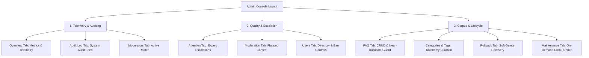
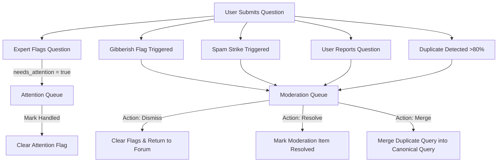
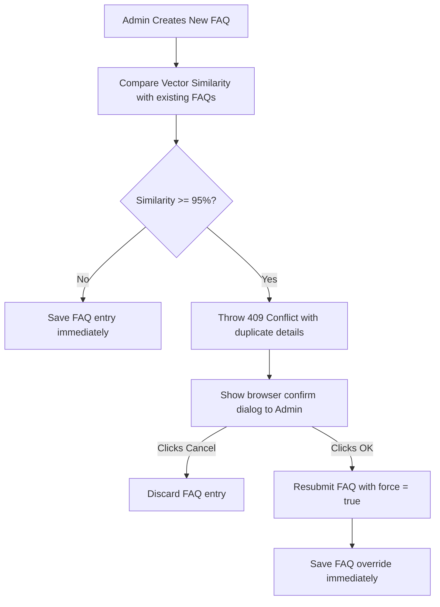
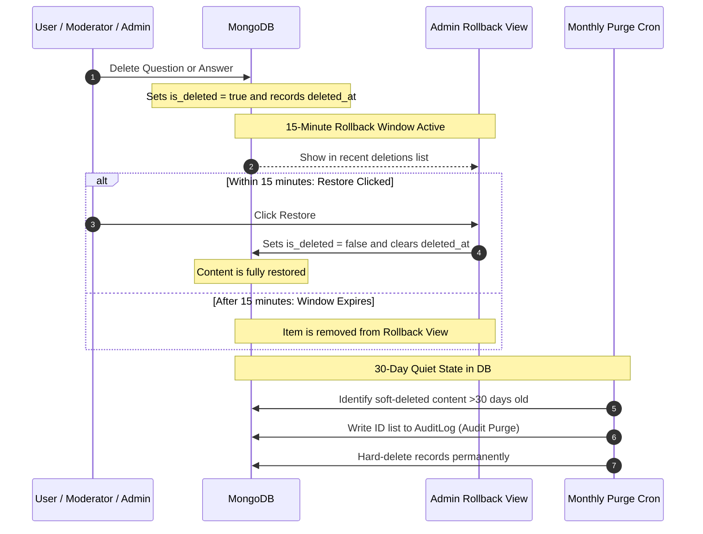

# Admin Dashboard & Maintenance

An detailed overview of the system's administration, governance layer, taxonomy control, audit trail, and scheduled maintenance architecture.

---

## 1. Overview of Admin Operations & Tab Architecture

Curio's administrative dashboard functions as the command center for knowledge curation, community moderation, system telemetry, and manual operational override. The administrative system follows three core principles:
1. **Attribution and Accountability**: Every administrative action is logged to the persistent `AuditLog` collection. Anonymous administrative actions do not exist.
2. **Safety and Grace Windows**: Destructive actions (like deletions) are soft-deletions and remain fully reversible within a 15-minute grace window.
3. **Decoupled Job Orchestration**: Background cron jobs are exposed as synchronous API handlers, enabling admins to trigger scheduled actions on demand with instant UI feedback.

The dashboard layout is divided into 10 dedicated admin tabs, which map to three functional areas:



---

## 2. Admin Interface: Section-by-Section Scope

The admin system is structured inside `client/src/pages/admin/` and backed by `server/services/adminService.js` and `server/services/taxonomyService.js`.

### A. System Overview & Dashboard (`AdminOverview.jsx`)
Exposes live KPIs and telemetry:
- **KPI Metrics Cards**:
  - `TOTAL USERS`: Count of active users (`User.countDocuments({ is_deleted: false })`) and banned users.
  - `OPEN QUESTIONS`: Count of questions in `open` status and total questions.
  - `RESOLUTION RATE`: Percentage of queries resolved (`(resolved / total) * 100`).
  - `MOD QUEUE`: Total pending moderation items, flagging "High load" if $\ge 10$ items.
  - `AI STATUS`: Displays whether the Google Gemini service is `Operational` (based on `/health` checks, indicating if running in `live` or `mock` mode).
- **"Needs Attention" Action Board**:
  Aggregates high-priority tasks and deep-links to them:
  - *Questions need admin attention* $\to$ links to `/admin/attention` (escalations).
  - *Flagged content review* $\to$ links to `/admin/moderation`.
  - *Pending user approvals* $\to$ links to `/admin/users` (where `requires_approval === true`).
  - *Open questions* $\to$ links to `/queries?status=open`.
- **Queries by Category**: Displays a status breakdown (Total, Open, Answered, Resolved) grouped by category, populated using a MongoDB aggregation pipeline in `queriesByCategory()`.
- **Recent Audit Log**: A live stream of the 6 most recent administrative actions with performer names and relative timestamps.

---

### B. Content Escalation & Moderation Queue (`AdminAttention.jsx` & `AdminModeration.jsx`)
Curio uses an advanced quality gating and community-moderated workflow where items requiring intervention are routed to either the **Attention Queue** or the **Moderation Queue**.



#### The Attention Queue (`AdminAttention.jsx`)
Handles questions escalated by Expert members or Moderators.
- **Rules**: If a question is flagged `needs_attention: true`, it routes here.
- **Sorting**: The queue is sorted by **Category** $\to$ **Question Posting Date** $\to$ **Author's Joining Date**.
- **UX**: Lists askers by their **email ID** (a link opening the thread detail) and displays their required **joining date**.
- **Action**: Admins can dismiss the attention flag by clicking "Mark handled" which executes `clearAttention()` and logs it.

#### The Moderation Queue & Amalgamation (`AdminModeration.jsx`)
Manages flags and AI-driven duplicate clustering:
1. **Flagged Items Table**: Filterable by `type` (duplicate, report, spam, outdated, gibberish). Provides three key actions:
   - **Merge**: (For duplicates only) Merges the duplicate query into a canonical query.
   - **Resolve**: Marks the item `resolved` in the `ModerationQueue`.
   - **Dismiss**: Dismisses the moderation item. If it was flagged as a duplicate, it clears the duplicate metadata (`is_flagged_duplicate`, `duplicate_of`, `similarity_score`, `merge_status`) on the original `Query` record, returning it to normal.
2. **Amalgamation Suggestions**:
   - Uses the in-app embedding system to find clusters of active queries with cosine similarity scores $\ge 0.6$ (`AMALGAMATION_SIMILARITY_THRESHOLD`).
   - Group lists are displayed with the first query as the proposed **canonical** thread. All other threads display their similarity percentage.
   - Admins can merge all related queries into the canonical one with a single click, automating the Q&A gardening.

---

### C. FAQ Manager & Near-Duplicate Guard (`AdminFaqManager.jsx`)
Maintains the FAQ corpus:
- **FAQ Creator Form**: Allows admins to input Category, Sort order, Question, and Answer.
- **FAQ Near-Duplicate Guard**:
  - When submitting a new FAQ, the system checks it against existing FAQs using cosine similarity with a strict $95\%$ threshold (`FAQ_DUPLICATE_THRESHOLD`).
  - If a potential duplicate is detected, the API throws a `409 Conflict`.
  - The client catches this and displays a `window.confirm` modal showing the existing question. If the admin overrides it, it posts with `force: true`.
- **Badges**: FAQs promoted from community Q&A carry a `from Q&A` badge (`source === 'qa'`), and outdated ones show an `outdated` badge.
- **Actions**: Edit, Delete (with confirmation), and toggle `Mark outdated` / `Mark current` (toggles `is_outdated` flag).



---

### D. Categories & Tags Curation (`AdminTaxonomy.jsx`)
Manages Curio's structured category and tag taxonomy to prevent free-form tag bloat:
- Admins can add or delete categories and tags.
- New entries automatically derive clean, URL-safe slugs via `slugify()`.
- Deleting a category/tag removes it from the list of options for new questions, but existing questions retain it.
- **Built-in Guard**: The tag `others` is a built-in fallback and cannot be deleted or duplicated.

---

### E. User Directory & Ban Controls (`AdminUsers.jsx` & `AdminModerators.jsx`)
Provides granular administrative control over the member directory:
- **Search**: Real-time filtering by name or email.
- **Role Control**: Promotes or demotes accounts to/from `admin` role.
- **Moderator Promotion**: Grants/revokes `moderator` status (identifies pending requests with a `requested` badge).
- **Ban Controls**:
  - Admins can ban any user for a specified duration in hours (via prompt; blank is permanent) and must supply a reason.
  - Timed bans display a banner to the user showing a countdown, while permanent bans lock them out entirely.
- **Self-Moderation Guard**: Administrative controls are hidden on the admin's own user row to prevent accidental self-banning, demotion, or lockout.
- **Moderators Roster**: Displays a dedicated view of the community's moderation team (explicit moderators and admins who moderate implicitly) showing Name, Email, Role, and Reputation Points.

---

### F. Audit Trail & Rollback Engine (`AdminAudit.jsx` & `AdminRollback.jsx`)
Curio guarantees system accountability and mistake recovery using a strict audit logging system and a soft-delete rollback window.



#### System Audit Log (`AdminAudit.jsx`)
Provides absolute accountability and transparency:
- Displays a tabular stream of every administrative and system action.
- Columns: Date/time, action slug (e.g. `query.merge`, `user.set_role`, `taxonomy.create_category`), Entity Type + Entity ID (truncated to last 6 chars), Performed By (user or `system`), and JSON-stringified details of the event payload.

#### Rollback Console (`AdminRollback.jsx`)
Reverts accidental content deletions:
- **15-Minute Undo Window**: Shows queries and answers soft-deleted (`is_deleted: true`) within the last 15 minutes (`ROLLBACK_WINDOW_MINUTES`).
- **Data Display**: Shows who deleted the item and how long ago.
- **Action**: Provides a "Restore" button to toggle the deletion flag off (`is_deleted: false`), automatically reconciling thread statuses and solutions.

---

### G. Maintenance & Cron Panel (`AdminMaintenance.jsx`)
Exposes background scheduled crons to manual control:
- Lists all 8 cron jobs registered in `server/jobs/index.js`.
- Shows their cron expression and description.
- Admins can click "Run now" to trigger the job synchronously and immediately view the JSON result payload.

---

## 3. Scheduled Maintenance Crons (`server/jobs/`)

Curio includes 8 scheduled tasks that maintain data hygiene, process reputation cycles, and enforce governance. Every job is a decoupled async function registered in `server/jobs/index.js`, allowing execution on a cron schedule or on-demand from the admin panel.

| Job Name | Schedule | Target Model | Purpose & Inner Workings |
|---|---|---|---|
| `finalize-solutions` | `0 3 * * *` (Daily 03:00) | `Query`, `Answer` | Finalizes open queries past their 48h grace period (`GRACE_PERIOD_HOURS`). Handles both **Path A** (asker-marked; awards +15 pts to answerer) and **Path B** (no selection; auto-selects most-liked answer; no points). Prunes surplus answers exceeding 3 (`MAX_ANSWERS_KEPT_ON_RESOLVE`). |
| `expire-bans` | `0 * * * *` (Hourly) | `User` | Safety net that lifts expired timed bans. Finds users where `is_banned: true` and `ban_expires_at` is past the current time, setting `is_banned: false`, `ban_expires_at: null`, and `ban_reason: null`. |
| `badge-recalc` | `0 2 * * *` (Daily 02:00) | `User` | Runs `recalcAllBadges()` to evaluate and resync every user's positive badges against the points thresholds (Helper: 30, Contributor: 100, Expert: 200, Legend: 300). |
| `lru-eviction` | `0 4 * * *` (Daily 04:00) | `Query` | Archives resolved questions that have not been accessed for 90 days (`LRU_ARCHIVE_DAYS`). Sets `is_archived: true`. Viewing an archived question automatically un-archives it. |
| `staleness-check` | `0 5 * * 1` (Weekly, Mon 05:00) | `Answer` | Identifies answers older than 180 days (`STALENESS_DAYS`) that have not been modified, setting `is_outdated: true` to flag them for review. |
| `orphan-cleanup` | `0 5 * * 2` (Weekly, Tue 05:00) | `Like`, `ChatbotSession` | Cleans up broken relations. Deletes `Like` records pointing to soft-deleted or removed answers. Deletes `ChatbotSession` records owned by deleted users. |
| `embedding-refresh` | `0 5 * * 3` (Weekly, Wed 05:00) | `Query` | Refreshes vector embeddings. Concatenates title and body, hashes them, and compares with `embedding_hash`. Re-embeds content if changed (e.g. from direct DB updates or model upgrades). |
| `soft-delete-purge` | `0 6 1 * *` (Monthly, 1st 06:00) | `Query`, `Answer`, `FaqEntry` | **Deletion-with-Audit**: Permanently hard-deletes content soft-deleted more than 30 days ago (`SOFT_DELETE_PURGE_DAYS`). Prior to calling `deleteMany`, it creates an AuditLog record of the batch showing deleted IDs and counts. |

---

## 4. Administrative Configuration and Constants

All administration thresholds are centralized in `server/config/constants.js`. Adjusting these constants recalibrates the entire platform's governance and maintenance mechanics:

```javascript
// Time Window Constants
export const EDIT_WINDOW_MINUTES = 15;        // Window for users to edit post
export const ROLLBACK_WINDOW_MINUTES = 15;    // Window for admins/mods to restore deleted items
export const GRACE_PERIOD_HOURS = 48;         // Grace window for solution selection
export const AUTO_BAN_HOURS = 24;            // Timed ban length for spam strikes
export const LRU_ARCHIVE_DAYS = 90;           // LRU inactive period before archival
export const SOFT_DELETE_PURGE_DAYS = 30;     // Soft-delete data retention period
export const STALENESS_DAYS = 180;            // Period before an answer is marked outdated

// Quality Gate and AI Similarity Thresholds
export const DUPLICATE_SIMILARITY_THRESHOLD = 0.8;    // Question duplicate similarity (cosine)
export const AMALGAMATION_SIMILARITY_THRESHOLD = 0.6; // Broader similarity for cluster suggestions
export const FAQ_DUPLICATE_THRESHOLD = 0.95;         // Guard similarity to prevent duplicate FAQs
export const MAX_ANSWERS_KEPT_ON_RESOLVE = 3;        // Answer pruning cap on query resolution
```
