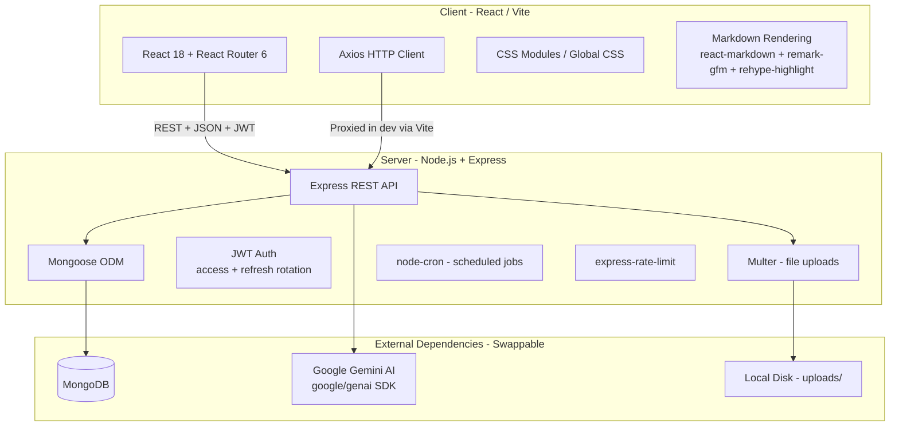
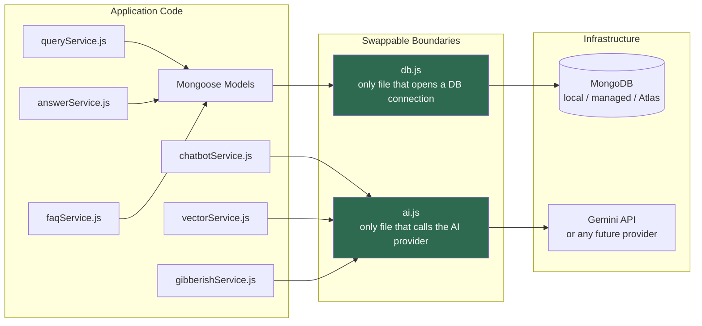
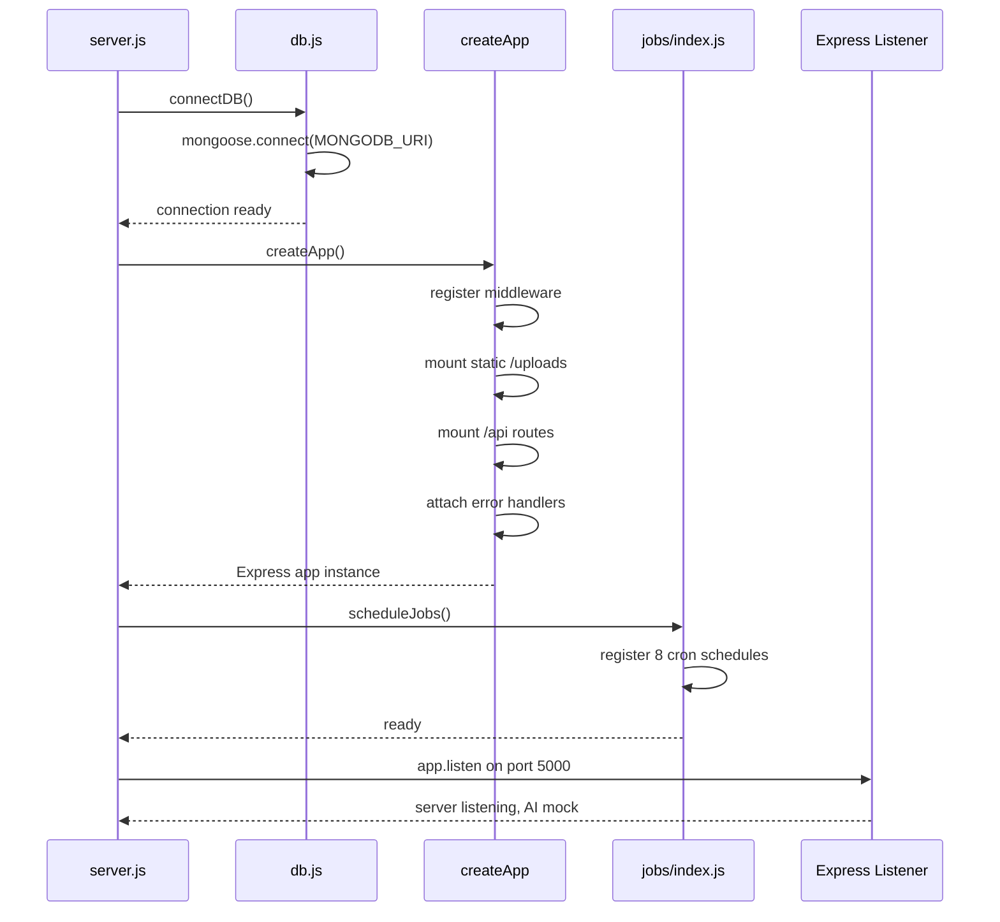
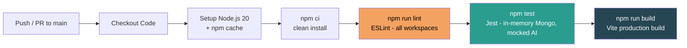
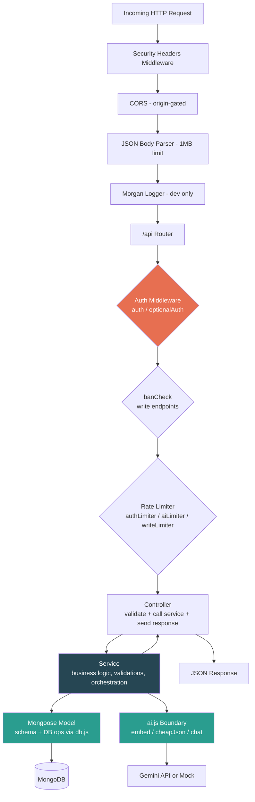

# Architecture, Setup & DevOps

This page is the architectural landing page for **Curio** — the entry point for anyone who wants to understand how the system is built, how to run it, and how code gets from a developer's machine into a deployable state. It covers the MERN stack and its ESM foundation, the monorepo layout, the two swappable infrastructure boundaries that make production migration painless, environment configuration, local development with MongoDB, the testing infrastructure, the CI pipeline, containerisation, and the conventions the team follows for commits and pull requests.

---

## Technology Stack

Curio is a full-stack JavaScript application built on the MERN stack (MongoDB, Express, React, Node.js). The entire codebase — server, client, configuration, tests, tooling — uses **native ECMAScript Modules** (`"type": "module"` in every `package.json`). There are no CommonJS `require()` calls anywhere. This means top-level `await`, standard `import`/`export` syntax, and `import.meta.url` for file-path resolution are used consistently throughout.



The technology choices and their rationale:

| Layer | Technology | Rationale |
|---|---|---|
| Frontend | React 18 (Vite), React Router 6, Axios | Fast HMR during development, component-based architecture, scoped styles via CSS Modules |
| Backend | Node.js 20+, Express 4 (REST) | Simple, widely understood, matches team skills, ESM-native |
| Database | MongoDB 7+ with Mongoose 8 | Flexible document schema, easy parity between local and managed instances |
| AI / LLM | Google Gemini free tier via `@google/genai` | `gemini-2.5-flash` for chat, `gemini-2.5-flash-lite` for cheap high-volume checks, `gemini-embedding-001` (768 dimensions) for embeddings |
| Vector search | In-app cosine similarity | Zero extra infrastructure; correct for the MVP-scale corpus (hundreds to low thousands of documents) |
| File storage | Multer → local `uploads/` directory | No object-store dependency; files are served as static assets by Express |
| Scheduling | `node-cron` with manual admin triggers | Works on any always-on server; each job is also callable on demand from the admin panel |
| Auth | JWT (short-lived access + revocable refresh) + bcrypt | Stateless request validation combined with real logout and session invalidation |
| Real-time | Polling | Removes the requirement for persistent WebSocket connections; trivial to host |
| Testing | Jest 29, Supertest 7, `mongodb-memory-server` 10 | In-memory database for isolated tests, HTTP-level integration testing, no external services required |
| Linting | ESLint 9 (flat config) | Shared root config extended by workspace-level overrides |
| CI/CD | GitHub Actions | Required by the project constraints; lint → test → build on every push and PR |
| Orchestration | Docker Compose | One-command reproducible run for reviewers and demos |

---

## Monorepo Structure

The project is organised as an **npm-workspaces monorepo**. The root `package.json` declares two workspaces — `server` and `client` — and provides unified scripts that delegate to the appropriate workspace. A single `npm install` at the root installs dependencies for both workspaces, each into its own local `node_modules`. There is nothing installed globally.

```
.
├── package.json                  # root: workspaces, unified scripts, shared dev deps
├── package-lock.json             # single lockfile for the entire repo
├── eslint.config.js              # shared flat ESLint config (base rules)
├── docker-compose.yml            # one-command local orchestration
├── .env.example                  # documented env vars with safe defaults
│
├── client/                       # @faq-platform/client workspace
│   ├── package.json
│   ├── vite.config.js            # dev proxy for /api and /uploads → :5000
│   ├── index.html
│   ├── eslint.config.js          # extends root + React/hooks plugins
│   └── src/
│       ├── main.jsx              # React DOM entry
│       ├── App.jsx               # router, AuthContext, app shell
│       ├── styles.css            # global design system
│       ├── api/                  # Axios wrappers (client.js, auth.js, queries.js, …)
│       ├── context/              # AuthContext (token state, refresh interceptor)
│       ├── components/           # AppShell, Sidebar, Topbar, Chatbot, Markdown, …
│       ├── pages/                # Login, Register, Home, QueryList, QueryDetail, Faq, …
│       │   └── admin/            # Admin-only pages (dashboard, moderation, users, …)
│       └── lib/                  # Pure utilities (reputation calculations, etc.)
│
├── server/                       # @faq-platform/server workspace
│   ├── package.json
│   ├── Dockerfile                # Express API container image
│   ├── server.js                 # entry: connect DB → create app → schedule jobs → listen
│   ├── app.js                    # Express app factory (no network binding — testable)
│   ├── eslint.config.js          # extends root + Jest globals for test files
│   ├── jest.config.js            # ESM-native Jest, 30s timeout, verbose
│   ├── config/
│   │   ├── env.js                # centralized env loading (typed, defaulted, frozen)
│   │   ├── db.js                 # swappable boundary — database connection
│   │   ├── ai.js                 # swappable boundary — AI provider + queue + backoff
│   │   └── constants.js          # all tunable thresholds, enums, badge defs
│   ├── models/                   # 14 Mongoose schemas (User, Query, Answer, FaqEntry, …)
│   ├── routes/                   # Express routers (auth, queries, answers, admin, faq, …)
│   ├── controllers/              # request → response glue (thin; delegates to services)
│   ├── services/                 # business logic (queryService, answerService, chatbot, …)
│   ├── middleware/               # auth, admin, banCheck, rateLimit, upload, error
│   ├── jobs/                     # 8 scheduled maintenance jobs + registry + cron setup
│   ├── seed/                     # seed.js + data/ (curated FAQ JSON with offline embeddings)
│   ├── uploads/                  # Multer local disk storage (gitignored)
│   └── tests/                    # 11 test suites + helpers.js
│       └── helpers.js            # setupTestDB / teardownTestDB / clearDB
│
├── .github/
│   ├── workflows/
│   │   ├── ci.yml                # lint → test → build on push/PR to main
│   │   └── deploy.yml            # verify gate + commented deploy block
│   ├── ISSUE_TEMPLATE/
│   │   ├── bug_report.md
│   │   └── feature_request.md
│   └── PULL_REQUEST_TEMPLATE.md
│
├── PLANNING.md                   # single source of truth: vision, architecture, decisions
├── TASK.md                       # milestone tracker
├── CONTRIBUTING.md               # setup, commit conventions, PR process
├── LICENSE                       # MIT
└── README.md                     # project overview, feature list, run instructions
```

The **root scripts** in `package.json` are the primary interface for developers:

| Script | What it does |
|---|---|
| `npm run dev` | Starts both server (Express on `:5000` with `--watch`) and client (Vite on `:5173`) concurrently via `concurrently` |
| `npm run dev:server` | Server only, with Node's built-in watch mode for auto-restart |
| `npm run dev:client` | Client only (Vite dev server with HMR) |
| `npm run lint` | Runs ESLint across both workspaces sequentially |
| `npm test` | Runs Jest in the server workspace (in-memory Mongo, mocked AI) |
| `npm run build` | Production build of the client via `vite build` |
| `npm run seed` | Populates MongoDB with the admin account and curated FAQ set |
| `npm start` | Starts the server in production mode (`node server.js`) |

Vite's dev server is configured to proxy `/api` and `/uploads` requests to `http://localhost:5000`, so the client uses same-origin relative URLs during development and never needs to know the backend's port directly.

---

## The Two Swappable Boundaries

This is the most important architectural decision in Curio. The platform was built as an internship MVP running entirely on free infrastructure (local MongoDB, Gemini free tier, local disk for files). But it was designed from day one so that migrating to production infrastructure — the company's own managed database, its own AI keys, its own object storage — is a **configuration change, not a refactor**.

This is achieved through two gateway modules. Every database call in the entire application flows through `server/config/db.js`. Every AI call flows through `server/config/ai.js`. No other file in the codebase imports the Mongoose connection logic or the Gemini SDK directly. This invariant is enforced by code review, the PR checklist, and convention.



### `server/config/db.js` — the database boundary

This module is the sole location that calls `mongoose.connect()`. It exports three things: `connectDB(uri?)`, `disconnectDB()`, and the `mongoose` instance itself (so models can import the same Mongoose without requiring a separate import). The `connectDB` function accepts an optional URI override, which is how the test infrastructure injects the `mongodb-memory-server` URI without touching the production connection string.

The function is idempotent — it tracks whether a connection has already been established and skips reconnection. To swap to a company-managed MongoDB instance (Atlas, self-hosted replica set, or anything else Mongoose supports), you change the `MONGODB_URI` environment variable and nothing else.

### `server/config/ai.js` — the AI boundary

This is the single module that calls the Google Gemini SDK (`@google/genai`). It exposes a clean public API with three methods:

- **`ai.embed(text)`** — returns a 768-dimensional embedding vector for a single string.
- **`ai.embedBatch(texts)`** — embeds multiple strings (currently parallelised per-item).
- **`ai.cheapJson(prompt, mockResult)`** — sends a structured prompt to `gemini-2.5-flash-lite` and parses the JSON response. Used for gibberish detection and auto-correction checks.
- **`ai.chat(prompt, mockText)`** — sends a prompt to `gemini-2.5-flash` and returns the text response. Used by the RAG chatbot.

The module also encapsulates all rate-limit resilience: a **serial request queue** ensures only one live API call is in flight at a time across the entire application, and an **exponential backoff** mechanism (up to 4 retries, starting at 500ms with jitter) handles HTTP 429 responses gracefully.

**Mock mode** is the default and is central to the development experience. When the `AI_API_KEY` environment variable is empty (or unset), every method returns a deterministic offline result instead of making a network call. The `embed()` mock uses a hash-based vector generator that produces stable, L2-normalised vectors — not semantically meaningful, but sufficient for cosine similarity to work consistently in dev/test/CI. The `cheapJson()` mock returns a permissive default (gibberish detection passes, auto-correct returns no changes). The `chat()` mock returns a canned offline message. This means `npm run dev`, `npm test`, and the entire CI pipeline all work without an API key, without quota burn, and without network access.

---

## Environment Variables

All environment configuration is loaded and centralised in `server/config/env.js`. This module reads `process.env` exactly once at startup, applies defaults, and exports a frozen `config` object. No other file in the codebase touches `process.env` directly.

The `.env.example` file documents every variable:

```
# ─── Server ──────────────────────────────────────────────────────────────────
NODE_ENV=development
PORT=5000

# MongoDB connection string (swappable boundary — only db.js reads this)
MONGODB_URI=mongodb://localhost:27017/faq_platform

# JWT secrets — generate strong random values in production
JWT_ACCESS_SECRET=change-me-access-secret
JWT_REFRESH_SECRET=change-me-refresh-secret
JWT_ACCESS_TTL=15m
JWT_REFRESH_TTL=7d

# AI provider (swappable boundary — only ai.js reads this).
# Leave AI_API_KEY empty to run in mock mode (no live calls, no quota burn).
AI_API_KEY=
AI_CHAT_MODEL=gemini-2.5-flash
AI_CHEAP_MODEL=gemini-2.5-flash-lite
AI_EMBED_MODEL=gemini-embedding-001
AI_EMBED_DIMS=768

# Uploads
UPLOAD_DIR=uploads
MAX_UPLOAD_MB=5

# CORS / client origin
CLIENT_ORIGIN=http://localhost:5173

# ─── Client (Vite) ───────────────────────────────────────────────────────────
# Prefix client-exposed vars with VITE_
VITE_API_BASE_URL=http://localhost:5000/api
```

There is also a **production safety guard**: if `NODE_ENV=production` and the JWT secrets are still set to their well-known dev defaults (or missing entirely), `env.js` throws immediately and refuses to start the server. This prevents a public repo's placeholder secrets from silently securing a real deployment.

Additional variables handled by `env.js` that are not in `.env.example` but can be set:

| Variable | Purpose |
|---|---|
| `TRUST_PROXY` | Configures Express's `trust proxy` setting for `X-Forwarded-For` header parsing behind reverse proxies. Accepts a number (hops to trust), `"true"`, or left unset for direct connections. |
| `DISABLE_RATE_LIMIT` | Set to `"true"` to bypass all `express-rate-limit` middleware — useful for shared-IP demo environments behind a tunnel where all visitors would collapse into a single rate-limit bucket. |

---

## Local Development Setup

### Prerequisites

- **Node.js ≥ 20** (the `engines` field enforces this)
- **MongoDB** running locally on `localhost:27017`, or provided via the bundled Docker Compose

### Step-by-step

```bash
# 1. Clone the repository
git clone <repo-url>
cd <repo-name>

# 2. Install all dependencies (root + both workspaces)
npm install

# 3. Create your local environment file
cp .env.example .env
# The defaults work out of the box. Leave AI_API_KEY empty for mock mode.

# 4. Seed the database with the admin account and curated FAQ set
npm run seed

# 5. Start the development servers
npm run dev
```

After step 5, Express is listening on `http://localhost:5000` and Vite is serving the React app on `http://localhost:5173`. Vite proxies API and upload requests to Express, so you interact with the app at `http://localhost:5173`.

The seed script creates a single admin account (`admin@example.com` / `admin12345`) and imports the full curated FAQ set with pre-computed embeddings. Search, duplicate detection, and the RAG chatbot all work immediately in mock mode because the FAQ embeddings were generated offline and stored in the seed JSON — zero live AI calls are needed.

### Server startup sequence

When `npm run dev` starts the server, the following happens in `server.js`:



The `createApp()` function in `app.js` is deliberately separated from `server.js`. It creates and configures the Express app **without binding to a network port**, which allows test suites to import the same app directly and pass it to Supertest for HTTP-level testing without spinning up a real server.

---

## Testing Infrastructure

Curio's test suite is built for speed, isolation, and reliability. Tests run in CI without needing a running MongoDB instance, without AI API keys, and without any network access.

### Tools

| Tool | Role |
|---|---|
| **Jest 29** | Test runner, configured for native ESM via `--experimental-vm-modules` (set in the server's `package.json` test script through `cross-env` and `NODE_OPTIONS`) |
| **Supertest 7** | HTTP-level integration testing — sends real HTTP requests to the Express app without a running server |
| **mongodb-memory-server 10** | Spins up an ephemeral, in-memory MongoDB instance per test suite — no external database needed |

### How tests are structured

The test helper in `server/tests/helpers.js` provides three functions that every test suite uses:

- **`setupTestDB()`** — called in `beforeAll`. Starts a `MongoMemoryServer` instance and connects Mongoose to its URI.
- **`teardownTestDB()`** — called in `afterAll`. Disconnects Mongoose and stops the in-memory server.
- **`clearDB()`** — called in `afterEach`. Wipes every collection between test cases for full isolation.

A typical test file looks like this:

```javascript
import request from 'supertest';
import { createApp } from '../app.js';
import { setupTestDB, teardownTestDB, clearDB } from './helpers.js';

const app = createApp();

beforeAll(async () => { await setupTestDB(); });
afterAll(async () => { await teardownTestDB(); });
afterEach(async () => { await clearDB(); });

describe('auth flow', () => {
  test('register returns user + tokens, hides password_hash', async () => {
    const res = await request(app)
      .post('/api/auth/register')
      .send({ name: 'Ada', email: 'ada@example.com', password: 'supersecret1' });
    expect(res.status).toBe(201);
    expect(res.body.user.password_hash).toBeUndefined();
    expect(res.body.accessToken).toBeTruthy();
  });
});
```

The key pattern here is that `createApp()` returns the Express app without calling `listen()`, and Supertest binds to it internally. The AI layer is automatically in mock mode because `AI_API_KEY` is never set in the test environment — no mocking library is needed for the AI layer because the `ai.js` module handles it natively.

### Jest configuration

The Jest config in `server/jest.config.js` is minimal:

```javascript
export default {
  testEnvironment: 'node',
  transform: {},                          // no Babel — native ESM
  testMatch: ['**/tests/**/*.test.js'],   // all test files under tests/
  testTimeout: 30_000,                    // 30s per test (mongodb-memory-server startup)
  verbose: true,
};
```

The `transform: {}` setting disables all code transforms, letting Node handle ESM natively. The 30-second timeout accounts for the time `mongodb-memory-server` takes to download and start the MongoDB binary on first run.

Tests are run with `--runInBand` (serial execution) to prevent concurrent in-memory MongoDB instances from interfering with each other, specified in the server's `package.json` test script:

```
"test": "cross-env NODE_ENV=test NODE_OPTIONS=--experimental-vm-modules jest --runInBand"
```

### Test suites

The 11 test suites cover the application end-to-end:

| Suite | Coverage |
|---|---|
| `auth.test.js` | Registration, login, token rotation, logout, credential validation |
| `query.test.js` | Query creation, retrieval, search, status transitions |
| `forum.test.js` | Answering, thread lifecycle, restrictions (can't answer own question) |
| `engagement.test.js` | Voting, bookmarks, likes, comments |
| `social.test.js` | Notifications, user-to-user interactions |
| `faq.test.js` | FAQ CRUD, duplicate guard, promotion from Q&A |
| `badges.test.js` | Point awards, badge tier unlocking, badge recalculation |
| `admin.test.js` | Admin dashboard, moderation queue, user management |
| `adminfixes.test.js` | Admin-specific edge cases, rollback, taxonomy control |
| `security.test.js` | Authorization gates, ban enforcement, rate limiting, self-mod guards |
| `maintenance.test.js` | Scheduled jobs (LRU eviction, staleness, orphan cleanup, soft-delete purge) |

Running the full suite:

```bash
npm test
```

---

## CI Pipeline

Curio has two GitHub Actions workflows, both defined in `.github/workflows/`.

### `ci.yml` — the gatekeeper

This workflow runs on every push to `main` and on every pull request targeting `main`. It is the primary quality gate — no code merges until this is green.



The workflow runs on `ubuntu-latest` with Node.js 20 and uses npm's built-in cache for dependency restoration. The three steps are always sequential — lint must pass before tests run, and tests must pass before the client build is attempted.

The test step sets `NODE_ENV=test`, which triggers three behaviors in the application code: `morgan` logging is suppressed, rate limiting is skipped (determinism), and the AI layer operates in mock mode (no key is set in CI). The server tests use `mongodb-memory-server`, so no MongoDB service container is needed in the workflow — the runner downloads and starts a local MongoDB binary automatically.

### `deploy.yml` — the deployment gate

This workflow runs on pushes to `main` and can also be triggered manually (`workflow_dispatch`). It re-runs the full verify gate (lint + test + build) to confirm `main` is always in a deployable state.

The actual deployment step is **intentionally commented out**. The MVP runs on zero paid infrastructure — GitHub Actions is the pipeline, not the host. It cannot run an always-on server, a persistent database, or persistent file storage. The commented block contains a template for building a Docker image and pushing it to a registry, with placeholders for the repository secrets (`DEPLOY_TOKEN`, `MONGODB_URI`, `AI_API_KEY`, `JWT_ACCESS_SECRET`, `JWT_REFRESH_SECRET`) that would be filled in once the company provides its own hosting.

```yaml
# --- Enable deployment by uncommenting and configuring for your host ---
#
# - name: Build server image
#   run: docker build -t $REGISTRY/faq-platform-api:$GITHUB_SHA ./server
#
# - name: Deploy
#   env:
#     DEPLOY_TOKEN: ${{ secrets.DEPLOY_TOKEN }}
#     MONGODB_URI:  ${{ secrets.MONGODB_URI }}
#     AI_API_KEY:   ${{ secrets.AI_API_KEY }}
#     JWT_ACCESS_SECRET:  ${{ secrets.JWT_ACCESS_SECRET }}
#     JWT_REFRESH_SECRET: ${{ secrets.JWT_REFRESH_SECRET }}
#   run: |
#     echo "Push the image and roll out using your platform's CLI here,"
#     echo "e.g. fly deploy / render deploy / kubectl set image ..."
```

---

## Docker & Deployment

### Docker Compose — local orchestration

The `docker-compose.yml` at the project root provides a **one-command, reproducible run** for any reviewer, interviewer, or team member. It spins up two services:

**`mongo`** — an official MongoDB 7 container with a named volume (`mongo_data`) for data persistence across restarts. Exposed on the standard port `27017`.

**`server`** — the Express API, built from `server/Dockerfile`. It depends on the `mongo` service, connects to `mongodb://mongo:27017/faq_platform` (the Docker-internal hostname), and uses dev-safe JWT secrets. `AI_API_KEY` is intentionally left empty so the server starts in mock mode. User uploads are persisted in a named volume (`uploads`).

```bash
docker compose up --build
```

This single command starts MongoDB and the API server. The Vite client is run separately via `npm run dev:client` during development because Vite's HMR is more useful outside a container.

### The Dockerfile

The server's `Dockerfile` (`server/Dockerfile`) produces a lean Alpine-based Node.js 20 image:

```dockerfile
FROM node:20-alpine

WORKDIR /app

# Install workspace deps (root manifest + server manifest) with a clean,
# reproducible install.
COPY package.json package-lock.json* ./
COPY server/package.json ./server/package.json
RUN npm install --omit=dev --workspace server || npm install --workspace server

COPY server ./server
COPY eslint.config.js ./

WORKDIR /app/server
EXPOSE 5000
CMD ["node", "server.js"]
```

The image copies only the root and server `package.json` files first (Docker layer caching — dependencies are only reinstalled when `package.json` changes), installs production dependencies for the server workspace, then copies the server source. Dev dependencies (Jest, Supertest, `mongodb-memory-server`) are omitted from the production image.

### Production deployment model

The production target is the company's own server — a persistent process that supports `node-cron` schedules, local file uploads, and a connection to a managed MongoDB instance. The deployment path:

1. The `deploy.yml` workflow verifies the code (lint, test, build).
2. A Docker image is built and tagged with the commit SHA.
3. The image is pushed to the company's container registry.
4. The platform's deployment CLI (Fly, Render, Kubernetes, or similar) rolls out the new image.

Environment variables (`MONGODB_URI`, `AI_API_KEY`, JWT secrets) are set as repository secrets in GitHub and injected at deploy time. The `env.js` production safety guard ensures the server refuses to start if JWT secrets are still set to their dev defaults.

### Health check endpoint

The Express API exposes `GET /api/health` that returns the application status, database connection state, AI mode (mock or live), and uptime. This is suitable for Docker healthchecks, load-balancer probes, and CI smoke tests:

```json
{
  "status": "ok",
  "db": "connected",
  "ai": "mock",
  "uptime_seconds": 42,
  "time": "2026-06-02T12:00:00.000Z"
}
```

---

## Application Architecture — Request Flow

Understanding how a request moves through the server is important for anyone contributing code. The architecture follows a strict layered pattern: **route → controller → service → model/boundary**.



**Routes** (`server/routes/`) define the HTTP method, path, and middleware chain for each endpoint. They do not contain business logic. There are 11 route modules covering auth, queries, answers, notifications, users, admin, FAQ, chatbot, jobs, and taxonomy.

**Controllers** (`server/controllers/`) are thin — they extract request parameters, call the appropriate service function, and send back the response. Controllers do not access models or boundaries directly.

**Services** (`server/services/`) contain all business logic. They operate on Mongoose models, call the AI boundary when needed, and compose the multi-step flows (duplicate detection, gibberish checks, solution marking, chatbot RAG pipeline). There are 14 service modules.

**Middleware** (`server/middleware/`) provides cross-cutting concerns:

| Middleware | Purpose |
|---|---|
| `auth` / `optionalAuth` / `admin` | JWT verification, user hydration, role gates |
| `banCheck` | Blocks banned users from write operations |
| `rateLimit` (3 presets) | `authLimiter` (30 req/15min), `aiLimiter` (20 req/min), `writeLimiter` (40 req/min) |
| `upload` | Multer configuration — up to 4 image files, MIME-validated, MIME-derived extensions |
| `error` | Central error handler — normalises Mongoose errors, hides stack traces in production |

---

## Constants & Configuration Centralisation

All tunable thresholds, enum values, badge definitions, and timing windows are centralised in `server/config/constants.js`. This makes the system's behaviour easy to adjust without searching across the codebase.

| Constant | Value | Purpose |
|---|---|---|
| `DUPLICATE_SIMILARITY_THRESHOLD` | `0.8` | Cosine similarity above which a new query is flagged as a potential duplicate |
| `CHATBOT_MATCH_THRESHOLD` | `0.3` | Minimum cosine similarity for a retrieved FAQ/forum entry to count as a chatbot match |
| `AMALGAMATION_SIMILARITY_THRESHOLD` | `0.6` | Broader threshold for grouping related queries for admin review |
| `FAQ_DUPLICATE_THRESHOLD` | `0.95` | Near-duplicate guard when admins create new FAQ entries |
| `EMBEDDING_DIMS` | `768` | Fixed embedding vector dimensionality |
| `EDIT_WINDOW_MINUTES` | `15` | Authors can edit their own posts for this long |
| `ROLLBACK_WINDOW_MINUTES` | `15` | Admins/moderators can undo a deletion for this long |
| `GRACE_PERIOD_HOURS` | `48` | Time before solution finalisation kicks in |
| `AUTO_BAN_HOURS` | `24` | Duration of automatic spam bans |
| `LRU_ARCHIVE_DAYS` | `90` | Archive resolved queries unaccessed for this many days |
| `SOFT_DELETE_PURGE_DAYS` | `30` | Hard-delete items soft-deleted beyond this retention window |
| `STALENESS_DAYS` | `180` | Flag answers older than this as potentially outdated |

Centralising constants here means a behaviour change (e.g., extending the edit window or tightening the duplicate threshold) requires touching exactly one file — no hunting for magic numbers scattered across services.

---

## Scheduled Jobs & the Cron Registry

Eight maintenance jobs run on cron schedules via `node-cron` and are also individually triggerable from the admin panel through `POST /api/jobs/:name`. The registry in `server/jobs/index.js` maps each job name to its schedule, description, and handler function:

| Job | Schedule | What it does |
|---|---|---|
| `finalize-solutions` | Daily at 03:00 | Resolves queries past their 48-hour grace period (both Path A — author-selected, and Path B — auto-select most liked) |
| `expire-bans` | Hourly | Lifts time-limited bans whose deadline has passed |
| `badge-recalc` | Daily at 02:00 | Resyncs every user's positive badge array to their current point total |
| `lru-eviction` | Daily at 04:00 | Archives resolved queries unaccessed for 90+ days |
| `staleness-check` | Weekly (Monday 05:00) | Flags answers older than the staleness window as potentially outdated |
| `orphan-cleanup` | Weekly (Tuesday 05:00) | Removes likes and chatbot sessions referencing deleted records |
| `embedding-refresh` | Weekly (Wednesday 05:00) | Re-embeds queries whose text has changed since their last embedding |
| `soft-delete-purge` | Monthly (1st at 06:00) | Hard-deletes content that was soft-deleted beyond the retention window, with audit logging |

Each job is a plain async function. The `scheduleJobs()` function registers all cron schedules at server startup (called from `server.js`). The `runJob(name)` function allows any registered job to be executed on demand by the admin panel. Job failures are caught and logged without crashing the server.

---

## ESLint Configuration

Linting uses ESLint 9's flat config format. The configuration is layered across three files:

**Root config** (`eslint.config.js`) — applies to the entire monorepo. Extends `@eslint/js` recommended rules, ignores `node_modules`, `dist`, `build`, and `coverage` directories, targets ES2023 with module source type, and sets project-specific rules: `eqeqeq: smart`, `prefer-const: warn`, `no-unused-vars: warn` (with `_`-prefixed variables ignored).

**Server config** (`server/eslint.config.js`) — extends the root config and adds Jest globals for files in the `tests/` directory.

**Client config** (`client/eslint.config.js`) — extends the root config and adds React and React Hooks plugins with browser globals.

Running `npm run lint` executes ESLint sequentially across both workspaces. The CI pipeline enforces zero lint errors. The flat config format (ESLint 9) is used throughout — no legacy `.eslintrc` files exist in this project.

---

## Security Layers

The Express application applies multiple security measures, layered through middleware and configuration:

**Security headers** — set on every response: `X-Content-Type-Options: nosniff`, `X-Frame-Options: DENY`, `Referrer-Policy: no-referrer`, `X-DNS-Prefetch-Control: off`. The `X-Powered-By` header is explicitly removed to avoid advertising the server technology.

**CORS** — origin-gated to `CLIENT_ORIGIN` (defaults to `http://localhost:5173`) with credentials enabled. Requests from unknown origins are rejected before they reach any route.

**Body size limit** — JSON and URL-encoded bodies are capped at 1MB. Requests exceeding this are rejected early, before route handlers are invoked.

**Upload validation** — Multer validates MIME types (PNG, JPEG, GIF, WEBP only), derives file extensions from the MIME type (not the client-controlled filename), generates random filenames, and caps individual files at the configured `MAX_UPLOAD_MB`. Files are served with `Content-Disposition: inline` and `X-Content-Type-Options: nosniff` — this prevents a maliciously named upload from being executed as HTML or script, providing defence-in-depth against stored XSS.

**Rate limiting** — three tiers via `express-rate-limit`: auth endpoints (30 req/15min), AI-backed endpoints (20 req/min), and general writes (40 req/min). Rate limiting is automatically skipped during tests for determinism and can be globally disabled via `DISABLE_RATE_LIMIT=true` for shared-IP demo environments where all visitors would otherwise collapse into a single rate-limit bucket.

**Proxy trust** — configurable via `TRUST_PROXY` so `req.ip` and rate-limit keying work correctly behind reverse proxies, tunnels, or CDNs.

---

## Commit & PR Conventions

The repository is public and treated as a portfolio piece. The team follows strict conventions to maintain a clean, readable history.

### Conventional Commits

Every commit message follows the [Conventional Commits](https://www.conventionalcommits.org/) specification with a scope:

```
<type>(<scope>): <imperative subject>

[optional body with detail]
```

The recognised types:

| Type | When to use |
|---|---|
| `feat` | A new feature or user-facing capability |
| `fix` | A bug fix |
| `test` | Adding or updating tests |
| `docs` | Documentation changes (README, PLANNING, wiki, comments) |
| `chore` | Maintenance tasks (dependency updates, config tweaks) |
| `ci` | Changes to CI/CD workflows |
| `build` | Build system changes (Dockerfile, Vite config, package.json scripts) |
| `refactor` | Code changes that neither fix a bug nor add a feature |
| `perf` | Performance improvements |

Representative examples from the project:

```
feat(queries): flag >80% duplicates into the moderation queue
fix(client): stop the chatbot from losing its session on reload
test(server): cover the ban-expiry job
docs(task): mark Milestone 7 complete
chore(ci): bump actions/setup-node to v4
```

The subject line is kept imperative ("add", "fix", "cover") and under ~72 characters. Further detail goes in the commit body.

### Branching & Pull Requests

- **Branch off `main`** using descriptive prefixes: `feat/duplicate-detection`, `fix/chatbot-session`, `test/ban-expiry`.
- **One logical change per PR.** Keep PRs focused.
- **Fill in the PR template** — it asks for what changed, why, and how it was tested.
- **CI must be green.** All three checks (lint, test, build) must pass before merge.
- **Squash-merge** to keep the main branch history clean and linear.

The PR template (`PULL_REQUEST_TEMPLATE.md`) includes a checklist that every contributor must verify before requesting review:

```markdown
- [ ] `npm run lint` passes (0 errors)
- [ ] `npm test` passes
- [ ] `npm run build` passes
- [ ] Tests added/updated for the change
- [ ] AI/DB access stays behind the swappable boundaries (server/config/ai.js, server/config/db.js)
- [ ] Commits follow Conventional Commits
```

The fifth checklist item — confirming that AI and database access remains behind the swappable boundaries — is a deliberate architectural guardrail baked into the review process.

### Issue Templates

The repository provides two issue templates in `.github/ISSUE_TEMPLATE/`:

- **Bug report** — structured fields for description, reproduction steps, expected vs. actual behaviour, and environment (OS, Node version, browser, AI mode).
- **Feature request** — structured fields for the problem being solved, proposed solution, and alternatives considered.
